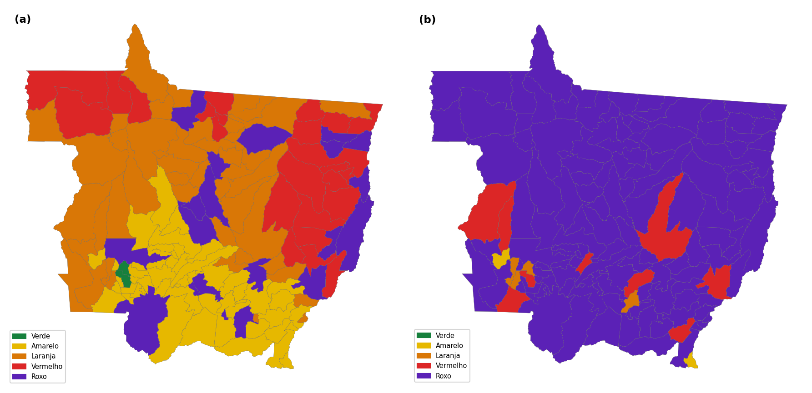
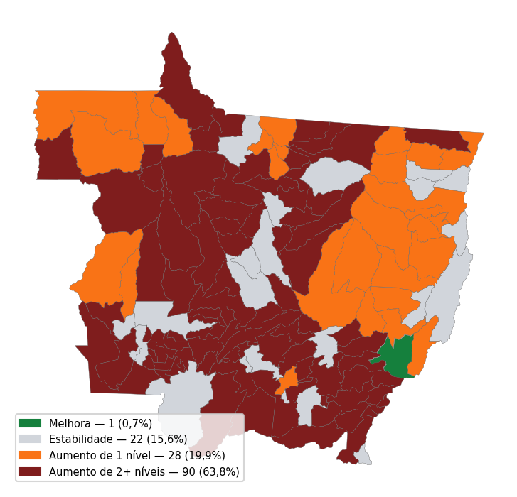
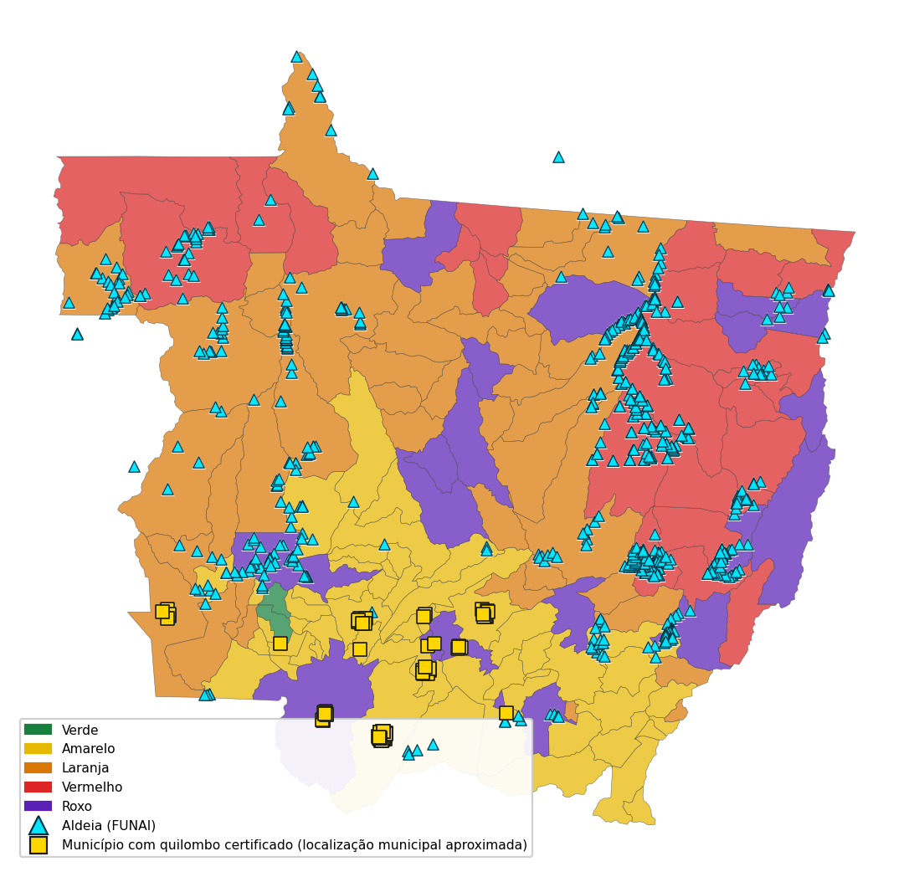

# RELATÓRIO SEMANAL EL NIÑO

**Sala de Situação do Centro Integrado de Vigilância Epidemiológica e Sanitária de Mato Grosso (CIEVS-MT) · Análise, Resposta e Acompanhamento de Riscos, Agravos e Saúde (ARARAS MT)**

Semana Epidemiológica 34/2026 · 17 a 23 de agosto de 2026  
Atualizado em 21/08/2026 às 10h01

Padrão de referência: Painel El Niño 2026–2027, boletim mensal n.º 02 (jul. 2026) · trimestre agosto–setembro–outubro (ASO)/2026 (INMET; Instituto Nacional de Pesquisas Espaciais (INPE); Agência Nacional de Águas e Saneamento Básico (ANA); CEMADEN; Serviço Geológico do Brasil (SGB); Secretaria Nacional de Proteção e Defesa Civil (SEDEC); Centro Gestor e Operacional do Sistema de Proteção da Amazônia (CENSIPAM), 2026).  
Dados operacionais: ARARAS MT · referência **21/08/2026**.
Fontes climáticas oficiais consultadas incluem o Instituto Nacional de Meteorologia (INMET) e o Centro Nacional de Monitoramento e Alertas de Desastres Naturais (CEMADEN).
Indicadores climáticos de referência: temperatura máxima (Tmáx), umidade relativa (UR) e material particulado fino com diâmetro aerodinâmico de até 2,5 µm (PM2,5).

**Base normativa:** Portaria n.º 0590/2026/GBSES, que institui a Sala de Situação em Saúde para preparação, monitoramento e resposta aos impactos do El Niño 2026–2027 e de eventos climáticos extremos no âmbito da Secretaria de Estado de Saúde de Mato Grosso (SES-MT, 2026).

> A projeção operacional de aproximadamente 7 dias **não substitui** a previsão climática sazonal. Os produtos possuem objetivos e horizontes temporais distintos.

---

## 1. Resumo executivo

| Dimensão | Situação atual | Tendência ~7 dias | Cobertura | Leitura |
| --- | --- | --- | --- | --- |
| El Niño | Ativo | persistência | — | Forte, com alta probabilidade de muito forte (anomalia Temperatura da Superfície do Mar (TSM) > 2,0 °C) na primavera/verão 2026 |
| Calor / risco térmico projetado | Atenção moderada | agravamento disseminado | 142 de 142 (100,0%) | 32,9 °C |
| Umidade | Atenção | não calculada | 142 de 142 (100,0%) | 54% |
| Fogo | Focos detectados em 118 de 142 municípios | não calculada | não caracterizada por esta estrutura da base | 53.679 focos (7 dias) |
| Qualidade do ar | Atenção localizada — 13 de 142 (9,2%) municípios ≥ 25 µg/m³ | não calculada | 142 de 142 (100,0%) | 11,9 µg/m³ |
| Recursos hídricos | Sinais heterogêneos no recorte disponível | não calculada | 10 de 142 (7,0%) | Interpretação limitada pela cobertura parcial. |
| Risco integrado projetado (~7 dias) | 43 de 142 (30,3%) | agravamento disseminado | 142 de 142 (100,0%) | Projeção: 136 de 142 (95,8%) nas classes vermelha ou roxa |

_Nota: referências operacionais — Painel El Niño/National Oceanic and Atmospheric Administration (NOAA); Tmáx e UR medianas municipais; focos INPE (7 dias); PM2,5 mediano; situação hidrológica municipal; classificação ARARAS._

**Destaques da rodada**

- **43 de 142 (30,3%)** — municípios nas classes vermelha ou roxa.
- **38,5 °C** — maior Tmáx municipal (Novo Santo Antônio).
- **53.679 focos** — acumulado de sete dias.
- **13 de 142 (9,2%)** — municípios com PM2,5 ≥ 25 µg/m³.
- **136 municípios** — permanecem nas classes vermelha ou roxa na projeção de sete dias.

**Preparação assistencial induzida pelo clima:** quando há convergência de calor, baixa umidade e fumaça, avaliar capacidade assistencial, comunicação de risco e cobertura de estoques relacionados aos agravos esperados — sem substituir decisão da gestão.

- **Cenário:** El Niño confirmado (NOAA, 11/06/2026) · intensidade Forte, com alta probabilidade de muito forte (anomalia TSM > 2,0 °C) na primavera/verão 2026
- **Território MT:** 43 de 142 (30,3%) nas classes vermelha ou roxa
- **Onde priorizar:** consultar mapas e municípios prioritários (seções 6 e 11)

---

## 2. Cenário El Niño

No dia 11 de junho de 2026, a NOAA decretou o estabelecimento de condições de El Niño no Pacífico Equatorial. Nas semanas anteriores ao boletim, os desvios de TSM atingiram 1,4 °C na região Niño 3.4, 1,8 °C no Niño 3 e 3,0 °C no Niño 1+2. Os padrões atmosféricos (ventos de oeste em baixos níveis, Índice de Oscilação Sul (SOI) negativo) são consistentes com a resposta típica de El Niño.

| Indicador | Observado | Referência |
| --- | --- | --- |
| El Niño–Oscilação Sul (ENSO) | El Niño confirmado (NOAA, 11/06/2026) | classificação oficial da fonte |
| Niño 3.4 | 1,4 °C (semanas anteriores ao boletim) | limiares NOAA / Painel El Niño |

As médias mensais de Niño 3.4 vêm positivas desde março de 2026. A APEC Climate Center (APCC) indica 100% de probabilidade de manutenção de El Niño forte até o final de 2026. A NOAA indica 81% de probabilidade de atingir a categoria muito forte no trimestre outubro–novembro–dezembro.

Fonte: Painel El Niño 2026–2027, boletim n.º 02, jul. 2026.

---

## 3. Cenário sazonal — Brasil → Amazônia Legal → Mato Grosso

A previsão do Centro de Previsão de Tempo e Estudos Climáticos (CPTEC)/INPE, INMET e Fundação Cearense de Meteorologia e Recursos Hídricos (FUNCEME) para ASO/2026 indica precipitação abaixo da faixa normal no centro-norte (Norte, Nordeste e grande parte do Centro-Oeste) e acima da normal no Sul, podendo estender-se ao sul de São Paulo e de Mato Grosso do Sul. A temperatura fica acima da normal em praticamente todo o País, favorecendo ondas de calor, baixa umidade e maior potencial de queimadas.

- **Chuva (Brasil):** Abaixo da média no centro-norte (Norte, Nordeste e grande parte do Centro-Oeste); acima da média no Sul. `PREVISÃO OFICIAL`
- **Temperatura (Brasil):** Acima da média em praticamente todo o país — ondas de calor, baixa umidade e maior potencial de queimadas. `PREVISÃO OFICIAL`

### Amazônia Legal e Mato Grosso

ASO marca o fim da estação seca e o início irregular da transição chuvosa na Amazônia Legal. Os menores acumulados concentram-se no centro-sul, especialmente em Mato Grosso, Tocantins, Maranhão, centro-sul de Rondônia e sul do Pará (agosto frequentemente < 20 mm). O CENSIPAM indica chuvas abaixo da média no centro-norte da Amazônia Legal; no extremo sul de Mato Grosso há sinal de precipitação acima da média histórica, ainda na estiagem — pancadas irregulares intercaladas por períodos secos. O El Niño tende a atrasar a estação chuvosa no sul da Amazônia e a manter temperatura acima da média.

- **Chuva em MT:** Centro-norte do Brasil abaixo da média. Extremo sul de MT com sinal de chuva acima da climatologia, ainda na estiagem (pancadas irregulares; agosto/setembro com climatologia baixa).
- **Temperatura em MT:** Acima da média na Amazônia Legal — atraso da estação chuvosa no sul da Amazônia.

---

## 4. Mato Grosso — Situação atual `OBSERVADO`

Municípios no recorte: **142**  
Níveis: classes vermelha e roxa **43** · laranja **47** · amarelo **50** · detalhe amarela: 50; laranja: 47; vermelha: 24; roxa: 19; verde: 2

**Tabela 1 – Indicadores climáticos e ambientais selecionados, Mato Grosso, SE 34/2026**

| Indicador | Observado | Unidade | Referência/parâmetro | Cobertura |
| --- | --- | --- | --- | --- |
| Temperatura máxima mediana | 32,9 | °C | calor seco se Tmáx ≥ 37 °C (operacional) | 142 de 142 (100,0%) |
| Umidade relativa mediana | 54 | % | UR ≤ 30% (parâmetro operacional ARARAS) | 142 de 142 (100,0%) |
| PM2,5 mediano | 11,9 | µg/m³ | ≥ 25 µg/m³ = atenção sanitária desta rodada | 142 de 142 (100,0%) |
| Índice Universal de Temperatura Térmica (UTCI) proxy mediano | 31,8 | °C | conforto térmico (proxy) | 142 de 142 (100,0%) |

Fonte: ARARAS MT/CIEVS-MT. Rodada 21/08/2026 às 10h01. Data de referência: 21/08/2026.

Temperatura máxima mediana: **32,9 °C**. Cobertura: 142 de 142 (100,0%) municípios com dado válido. Extremo municipal: **38,5 °C** em Novo Santo Antônio. Percentil 90 da rodada: 36,6 °C (distribuição desta rodada, não climatologia histórica). Parâmetro operacional de apoio: Tmáx ≥ 37 °C, combinada a umidade ≤ 30%, define calor seco nesta rodada. Limitação: a rodada não dispõe de climatologia municipal validada para comparação histórica deste indicador.

Umidade relativa mediana estadual: **54%**. Municípios com UR ≤ 30%: 2 de 142 (1,4%). Cobertura: 142 de 142 (100,0%). O limiar de 30% é parâmetro operacional do ARARAS para desconforto, ressecamento de vias aéreas e risco de fogo; não substitui o aviso oficial do Instituto Nacional de Meteorologia (INMET).

PM2,5 mediano: **11,9 µg/m³**. P90 da rodada: 24,4 µg/m³. 13 de 142 (9,2%) apresentaram PM2,5 igual ou superior a 25 µg/m³ (parâmetro operacional de atenção sanitária do painel, alinhado a faixas de qualidade do ar). Cobertura espacial: 142 de 142 (100,0%). Interpretação sanitária: exposição à fumaça/partículas finas, com atenção a agravos respiratórios — associação temporal, sem inferência causal.

**Interpretação da situação climática atual**

Nesta rodada, **43 de 142 (30,3%)** municípios estão nas classes vermelha ou roxa. A leitura integrada deve considerar, em conjunto, temperatura, umidade, qualidade do ar e hidrologia, sem tratar correlação espacial como causalidade.

---

## 5. Mato Grosso — Projeção operacional (~7 dias)

A projeção operacional do ARARAS MT estima a classificação municipal para aproximadamente sete dias, permitindo comparação com a situação atual.

Distribuição projetada: roxa: 127; vermelha: 9; laranja: 4; amarela: 2

---

## 6. Mapa atual × mapa ~7 dias

**Mapa 1 – Classificação integrada de risco em Mato Grosso, 17 a 23 de agosto de 2026 (atual e ~7 dias)**

Fonte: ARARAS MT/CIEVS-MT, rodada de 21/08/2026 às 10h01.
Nota: as duas faces usam a mesma escala de classes (verde a roxo) para comparação visual direta.

**Mapa 2 – Variação projetada da classificação de risco em aproximadamente sete dias**

Fonte: ARARAS MT/CIEVS-MT, rodada de 21/08/2026 às 10h01.
Municípios com dados comparáveis: 141 de 142 (99,3%).
- Melhora: 1 de 141 (0,7%)
- Estabilidade: 22 de 141 (15,6%)
- Aumento de 1 nível: 28 de 141 (19,9%)
- Aumento de 2 ou mais níveis: 90 de 141 (63,8%)
- Sem pareamento válido: 1

Na projeção de aproximadamente sete dias, entre **141** municípios com dados comparáveis: melhora em 1 de 141 (0,7%); estabilidade em 22 de 141 (15,6%); aumento de 1 nível em 28 de 141 (19,9%); aumento de 2 ou mais níveis em 90 de 141 (63,8%). Em **1 município** (1 de 142 (0,7%)) não houve pareamento válido entre situação atual e projeção nesta rodada.

### Determinantes do agravamento projetado

A projeção operacional (~7 dias) eleva o território de **43 de 142 (30,3%)** para **136 de 142 (95,8%)** municípios nas classes vermelha ou roxa, com **118 de 141 (83,7%)** municípios comparáveis em elevação de classe.

**A. Drivers que entram no modelo** (fonte `openmeteo_forecast_7d`)

| Driver do modelo (risco térmico projetado) | Municípios afetados | Direção |
| --- | --- | --- |
| Tmáx prevista (máx. 7d ≥ 37 °C) | 66 (55,5% dos que agravam) | ↑ aumento |
| UTCI previsto (máx. 7d ≥ 36) | 51 (42,9% dos que agravam) | ↑ aumento |
| Risco térmico cumulativo (máx. 7d ≥ 7) | 119 (100,0% dos que agravam) | ↑ aumento |
| Municípios com previsão de onda de calor no horizonte; mediana de dias de onda de calor por município (entre os que agravam): **2,0** | 119 (100,0% dos que agravam) | ↑ aumento |

**B. Contexto concomitante** — descreve a situação atual dos municípios que sobem de classe; **não** constitui contribuição matemática para a projeção nesta versão.

| Contexto concomitante (não entra no cálculo da classe) | Municípios afetados | Direção |
| --- | --- | --- |
| Umidade relativa atual ≤ 30% | 1 (0,8% dos que agravam) | ↓ redução (contexto) |
| PM2,5 atual ≥ 25 µg/m³ | 9 (7,6% dos que agravam) | → estabilidade (sem previsão 7d) |
| Focos de calor (7 dias) — atual | 100 (84,0% dos que agravam) | → estabilidade (sem previsão 7d) |

### Como a classe projetada é calculada

A projeção operacional de aproximadamente sete dias nesta versão é uma dimensão única de **risco térmico projetado** (0–100), composta por quatro sinais do mesmo fenômeno térmico:

| Componente | Variável | Limiares → pontos (0–100) |
|---|---|---|
| Intensidade | Tmáx máxima prevista na janela | ≥34→25; ≥37→50; ≥40→75; ≥42→100 |
| Estresse térmico | UTCI proxy máximo previsto | ≥32→25; ≥36→50; ≥40→75; ≥44→100 |
| Persistência | Risco cumulativo de calor (máx. 7d) | ≥3→25; ≥7→50; ≥12→75; ≥18→100 |
| Onda de calor | Dias com onda prevista no horizonte | ≥1→40; ≥2→60; ≥3→80; ≥4→100 |

**Composição (anti-redundância):** `RISCO_TÉRMICO_PROJETADO = máximo(intensidade, estresse, persistência, onda)`. Não há soma nem média dos componentes — evita dupla contagem de sinais correlacionados.

**Classes operacionais (score → classe):**
- 0–24 → verde
- 25–49 → amarela
- 50–69 → laranja
- 70–84 → vermelha
- 85–100 → roxa

**Outras dimensões (fumaça, fogo, hidrologia, pressão assistencial):** nesta versão **não** entram no cálculo da classe projetada, por ausência de previsão específica válida no mesmo horizonte. Constam apenas como **contexto concomitante** na seção de determinantes.

**Situação atual** `OBSERVADO`
- Amarelo: 50 municípios
- Laranja: 47 municípios
- Vermelho: 24 municípios
- Roxo: 19 municípios

**Projeção ~7 dias** `PROJEÇÃO ARARAS ~7 DIAS`
- Amarelo: 2 municípios
- Laranja: 4 municípios
- Vermelho: 9 municípios
- Roxo: 127 municípios

**Mudança esperada**
- Aumento de 2+ níveis: 90 municípios
- Aumento de 1 nível: 28 municípios
- Estabilidade: 22 municípios
- Melhora: 1 município

**Legenda:** Situação favorável — monitoramento de rotina. · Atenção — acompanhar evolução e reforçar comunicação. · Alerta — preparação proporcional e articulação regional. · Alerta elevado — revisar capacidade assistencial e estoques. · Situação excepcional — mobilização plena e validação pela gestão.

---

## 7. Alertas meteorológicos e ambientais — Mato Grosso

Parâmetro climático oficial para a semana **SE 34/2026** (17 a 23 de agosto de 2026).

_Recorte territorial: **Estado de Mato Grosso**. Alertas do INMET listam apenas trechos que abrangem MT; Mato Grosso do Sul (MS) é excluído._

**Situação climática de referência (avisos vigentes):** 2 avisos INMET com validade contendo o horário de emissão deste relatório (INMET, 2026).

**Projeção operacional (avisos futuros na semana):** 3 avisos com início posterior à data de referência — leitura de tendência imediata PREVISÃO OFICIAL (INMET, 2026).

**CEMADEN:** nenhum alerta aberto em MT na consulta (CEMADEN, 2026).

**Síntese integrada de alertas:** classificação municipal disponível (SES-MT; CIEVS-MT, 2026).

### Instituto Nacional de Meteorologia (INMET) — avisos vigentes

| Fenômeno | Severidade | Início da validade | Fim da validade | Área em Mato Grosso |
| --- | --- | --- | --- | --- |
| Baixa Umidade | Perigo | 21/08/2026 às 10h00 | 21/08/2026 às 19h00 | Nordeste Mato-grossense; Norte Mato-grossense; Centro-Sul Mato-grossense; Sudeste Mato-grossense |
| Baixa Umidade | Perigo potencial | 21/08/2026 às 00h00 | 21/08/2026 às 23h59 | Centro-Sul Mato-grossense; Nordeste Mato-grossense; Norte Mato-grossense; Sudeste Mato-grossense; Pantanais Sul Mato-grossense; Sudoeste Mato-grossense |

Consulta: 21/08/2026 às 10h05. Fonte: feed Alert-AS / portal INMET (INMET, 2026).

### INMET — avisos futuros na semana (previsão oficial)

| Fenômeno | Severidade | Início da validade | Fim da validade | Área em Mato Grosso |
| --- | --- | --- | --- | --- |
| Baixa Umidade | Perigo | 21/08/2026 às 11h00 | 21/08/2026 às 18h00 | Nordeste Mato-grossense; Norte Mato-grossense; Sudeste Mato-grossense; Centro-Sul Mato-grossense; Pantanais Sul Mato-grossense |
| Baixa Umidade | Perigo potencial | 22/08/2026 às 11h01 | 22/08/2026 às 21h00 | Centro-Sul Mato-grossense; Nordeste Mato-grossense; Norte Mato-grossense; Sudeste Mato-grossense; Pantanais Sul Mato-grossense; Sudoeste Mato-grossense |
| Baixa Umidade | Perigo | 22/08/2026 às 11h00 | 22/08/2026 às 18h00 | Centro-Sul Mato-grossense; Nordeste Mato-grossense; Norte Mato-grossense; Sudeste Mato-grossense; Pantanais Sul Mato-grossense; Sudoeste Mato-grossense |

### Centro Nacional de Monitoramento e Alertas de Desastres Naturais (CEMADEN)

_Nenhum alerta aberto do CEMADEN para Mato Grosso nesta consulta._

Fonte: Painel CEMADEN (CEMADEN, 2026). Consulta: 21/08/2026 às 10h05.

### Síntese integrada de alertas meteorológicos e ambientais

- Municípios no recorte: **142**
- Distribuição da classificação integrada: amarela: 50; laranja: 47; roxa: 19; verde: 2; vermelha: 24

_Fontes integradas: INMET, CEMADEN, saturação do solo, risco hidrológico e classificação ARARAS (SES-MT; CIEVS-MT, 2026)._

---

## 8. Recursos hídricos / seca / estiagem

Em junho de 2026 a área com seca no Centro-Oeste era quase três vezes menor que em junho de 2023 (22%; predominância de seca fraca). Mato Grosso ficou livre de seca na atualização de junho/2026 do Monitor de Secas. Isso não anula o risco de fogo no ASO nem a seca na bacia do Paraguai.

- **Limitação dos dados.** A cobertura hidrológica desta rodada corresponde a 10 de 142 (7,0%); os resultados não devem ser extrapolados para todo o estado. Distribuição hidrológica no recorte disponível: ver tabela abaixo. Os sinais de baixa disponibilidade hídrica local **não equivalem** automaticamente à classificação do Monitor de Secas (produto distinto, com outra escala e competência temporal). Índice de saturação do solo: mediana **13/100** (escala normalizada 0–100 a partir de umidade volumétrica Open-Meteo; parâmetro entre ponto de murcha 0,05 e saturação de referência 0,42 m³/m³). **13 pontos** em escala de 0 a 100; sem faixa de interpretação institucional validada nesta rodada.
- Situação hidro no recorte disponível: Sinal hidrológico de baixa disponibilidade (nível baixo): 6; Risco elevado de inundação: 4
- Precipitação mediana no **dia de referência operacional**: **0,0 mm** · municípios sem chuva nesse dia: 142 de 142 (100,0%)

**Limitação dos dados hidrológicos**

Limitação dos dados. A leitura hidrológica desta rodada está restrita aos municípios com observação válida; os resultados não devem ser extrapolados para todo o estado. Sinais hidrológicos locais de baixa disponibilidade não substituem a classificação do Monitor de Secas.

---

## 9. Fogo e qualidade do ar

A previsão de risco de fogo para ASO intensifica o alerta alto no Centro-Oeste, especialmente em Mato Grosso, e na maior parte da Região Norte. Para a Amazônia Legal, o análogo CENSIPAM 2023/2024 aponta queimadas intensas em Tocantins, Pará, Maranhão, Mato Grosso e na região AMACRO.

- **53.679 focos de calor** registrados no acumulado de sete dias (fonte INPE integrada ao ARARAS). Focos detectados em **118** de **142** municípios. Cobertura espacial: não caracterizada por esta estrutura da base (linhas apenas para municípios com detecção). Maior valor municipal: 8.849 focos em Colniza.
- Índice de Qualidade do Ar (IQA) (classes, ordem operacional): verde: 118; amarela: 11; laranja: 12; vermelha: 0; roxa: 1; cinza: 0
- PM2,5 mediano: **11,9 µg/m³**. P90 da rodada: 24,4 µg/m³. 13 de 142 (9,2%) apresentaram PM2,5 igual ou superior a 25 µg/m³ (parâmetro operacional de atenção sanitária do painel, alinhado a faixas de qualidade do ar). Cobertura espacial: 142 de 142 (100,0%). Interpretação sanitária: exposição à fumaça/partículas finas, com atenção a agravos respiratórios — associação temporal, sem inferência causal.

**Implicações para a saúde — fogo e ar**

A combinação de focos de calor e material particulado fino reforça a vigilância de agravos respiratórios nos municípios prioritários.

---

## 10. Impactos potenciais à saúde

Associação temporal/espacial — **não implica causalidade**.

| Evento | Exposição | Agravos a monitorar | Indicadores disponíveis |
| --- | --- | --- | --- |
| Seca e estiagem | Baixa umidade | Desidratação e irritações ocular e respiratória | UR, Tmáx e atendimentos |
| Incêndios e fumaça | PM2,5 | Agravamento de doenças respiratórias | PM2,5, Síndrome Respiratória Aguda Grave (SRAG) e internações |
| Calor extremo | Estresse térmico | Desidratação e agravos relacionados ao calor | Tmáx, UTCI e atendimentos |
| Chuva intensa | Inundações | Doença Diarreica Aguda (DDA), leptospirose e traumas | Chuva, alertas e notificações |
| Tempestades | Ventos fortes e descargas atmosféricas | Traumas | Avisos do INMET |

### Monitoramento epidemiológico — dados observados

- **Respiratórios/fumaça:** 13 de 142 (9,2%) com PM2,5 ≥ 25 µg/m³ em 21/08/2026.
- **Calor/desidratação:** 2 municípios em condição combinada de calor seco (Tmáx ≥ 37 °C e UR ≤ 30%).
- **Arboviroses:** 143 casos em 7 dias no recorte com dado (ausência não é zero).
- **Hidrorelacionados:** 10 municípios com sinal hidrológico de alerta no recorte disponível.

### Epidemiologia operacional (janela 7 dias)

- **Intoxicação exógena (sinal de fumaça):** 0 notificações; **0** com sinal de fumaça.
- **Internações hospitalares:** dados não estavam disponíveis para esta rodada.

**Leitura epidemiológica**

Associação temporal e espacial não implica causalidade. Sinais assistenciais e de notificação devem ser lidos com a defasagem das fontes e com a cobertura de cada indicador.

---

## 11. Municípios e regionais prioritários

### Regionais de saúde

| Regional | Amarelo+ | Laranja+ | Verm.+Roxa | Tend. ~7d | Tmáx med. |
| --- | --- | --- | --- | --- | --- |
| Água Boa | 8 | 8 | 8 | subindo: 6; estável: 2 | 36,7 °C |
| Porto Alegre do Norte | 7 | 7 | 6 | subindo: 5; estável: 2 | 36,4 °C |
| São Félix do Araguaia | 5 | 5 | 5 | subindo: 3; estável: 2 | 37,5 °C |
| Sinop | 15 | 15 | 4 | subindo: 11; estável: 4 | 34,3 °C |
| Barra do Garças | 10 | 7 | 4 | subindo: 9; descendo: 1 | 33,9 °C |
| Colíder | 6 | 6 | 3 | subindo: 5; estável: 1 | 34,5 °C |
| Alta Floresta | 6 | 6 | 3 | subindo: 5; estável: 1 | 33,8 °C |
| Juína | 7 | 7 | 3 | subindo: 7 | 32,8 °C |
| Baixada Cuiabana | 11 | 4 | 2 | subindo: 9; estável: 2 | 30,5 °C |
| Rondonópolis | 19 | 5 | 2 | subindo: 16; estável: 3 | 29,8 °C |
| Peixoto de Azevedo | 5 | 5 | 1 | subindo: 5 | 34,2 °C |
| Tangará da Serra | 10 | 2 | 1 | subindo: 9; estável: 1 | 30,6 °C |

### Municípios prioritários para resposta e preparação

| Município | Regional | Atual | ~7 dias | Tmáx | UR | PM2,5 | Focos 7d |
| --- | --- | --- | --- | --- | --- | --- | --- |
| Sinop | Sinop | Roxa | Roxa | 35,1 °C | 43% | 17,4 µg/m³ | 227 |
| Sorriso | Sinop | Roxa | Roxa | 35,4 °C | 43% | 8,7 µg/m³ | 103 |
| Lucas do Rio Verde | Sinop | Roxa | Roxa | 34,3 °C | 44% | 10,1 µg/m³ | 225 |
| Alta Floresta | Alta Floresta | Roxa | Roxa | 34,3 °C | 51% | 9,6 µg/m³ | 58 |
| Cuiabá | Baixada Cuiabana | Roxa | Roxa | 30,5 °C | 56% | 11,9 µg/m³ | 104 |
| Barra do Garças | Barra do Garças | Roxa | Vermelha | 31,7 °C | 49% | 14,7 µg/m³ | 2.056 |
| Cáceres | Cáceres | Roxa | Roxa | 28,5 °C | 58% | 9,8 µg/m³ | 207 |
| Nova Mutum | Sinop | Roxa | Roxa | 33,3 °C | 47% | 10,0 µg/m³ | 116 |
| Primavera do Leste | Rondonópolis | Roxa | Roxa | 31,5 °C | 53% | 13,2 µg/m³ | 13 |
| Porto Alegre do Norte | Porto Alegre do Norte | Roxa | Roxa | 37,9 °C | 35% | 38,6 µg/m³ | 121 |
| Tangará da Serra | Tangará da Serra | Roxa | Roxa | 27,3 °C | 65% | 9,2 µg/m³ | 385 |
| Rondonópolis | Rondonópolis | Roxa | Roxa | 31,3 °C | 50% | 14,4 µg/m³ | 52 |
| Várzea Grande | Baixada Cuiabana | Roxa | Roxa | 30,6 °C | 50% | 11,2 µg/m³ | 94 |
| Marcelândia | Colíder | Roxa | Roxa | 34,0 °C | 67% | 78,5 µg/m³ | 1.463 |
| Luciara | São Félix do Araguaia | Roxa | Roxa | 38,1 °C | 34% | 32,9 µg/m³ | 329 |

### Índice de prioridade de preparação clima–saúde

| Município | Regional | Classe atual | Prioridade de preparação (0–100) | Faixa | Determinantes (1º; 2º) |
| --- | --- | --- | --- | --- | --- |
| Carlinda | Alta Floresta | Vermelha | 79,6 | Crítica | exposição ambiental; 2º: vulnerabilidade |
| Marcelândia | Colíder | Roxa | 78,3 | Crítica | exposição ambiental; 2º: prioridade operacional |
| Cáceres | Cáceres | Roxa | 77,3 | Crítica | prioridade operacional; 2º: pressão assistencial |
| Nossa Senhora do Livramento | Baixada Cuiabana | Amarela | 76,6 | Crítica | exposição ambiental; 2º: vulnerabilidade |
| Barra do Garças | Barra do Garças | Roxa | 76,3 | Crítica | pressão assistencial; 2º: prioridade operacional |
| Cuiabá | Baixada Cuiabana | Roxa | 76,1 | Crítica | pressão assistencial; 2º: prioridade operacional |
| Novo Mundo | Peixoto de Azevedo | Vermelha | 75,9 | Crítica | vulnerabilidade; 2º: exposição ambiental |
| Terra Nova do Norte | Peixoto de Azevedo | Laranja | 74,1 | Alta | vulnerabilidade; 2º: pressão assistencial |
| Várzea Grande | Baixada Cuiabana | Roxa | 74,1 | Alta | pressão assistencial; 2º: prioridade operacional |
| Rosário Oeste | Diamantino | Amarela | 74,0 | Alta | exposição ambiental; 2º: vulnerabilidade |
| Campinápolis | Barra do Garças | Vermelha | 73,5 | Alta | vulnerabilidade; 2º: exposição ambiental |
| Colíder | Colíder | Vermelha | 72,5 | Alta | pressão assistencial; 2º: prioridade operacional |
| Porto Alegre do Norte | Porto Alegre do Norte | Roxa | 71,9 | Alta | prioridade operacional; 2º: exposição ambiental |
| Ribeirão Cascalheira | Água Boa | Vermelha | 71,6 | Alta | exposição ambiental; 2º: prioridade operacional |
| Nova Nazaré | Água Boa | Roxa | 71,4 | Alta | vulnerabilidade; 2º: exposição ambiental |

_O **índice de prioridade de preparação** (0–100) expressa a **necessidade** de preparação clima–saúde (maior valor = maior urgência). Internamente combina `score_pressao`, `score_exposicao`, `score_vulnerabilidade` e `score_prioridade_operacional`, normalizados em percentil 0–100 antes da ponderação, para evitar domínio artificial de uma escala bruta. A classe climática atual é contexto territorial e não entra no score._

---

## 11b. Síntese territorial da semana

- Regionais com maior concentração nas classes vermelha e roxa: **Água Boa, Porto Alegre do Norte, São Félix do Araguaia, Sinop, Barra do Garças**.
- Maior Tmáx municipal: **Novo Santo Antônio** (38,5 °C).
- Maior PM2,5 municipal: **Marcelândia**.
- Maior acumulado de focos (7 dias): **Colniza**.
- Persistência: estabilidade de classe em 22 de 141 (15,6%).
- Melhora projetada: 1 de 141 (0,7%).
- Limitação dos dados. Cobertura hidrológica: 10 de 142 (7,0%).
  Cobertura de focos: não caracterizada por esta estrutura da base.

---

## 11c. Povos indígenas e comunidades tradicionais em áreas prioritárias

**Mapa 3 – Classificação de risco climático, aldeias indígenas e municípios com comunidades quilombolas certificadas em Mato Grosso**

Fonte: ARARAS MT/CIEVS-MT, com dados da Fundação Nacional dos Povos Indígenas (FUNAI) e Fundação Cultural Palmares. Rodada de 21/08/2026 às 10h01.
Nota: para comunidades sem coordenadas geográficas validadas, a representação cartográfica ocorre no nível municipal e não corresponde à localização exata da comunidade. Comunidade certificada não equivale a território titulado.

### Municípios com aldeias indígenas em classes vermelha ou roxa

| Município | N.º de aldeias | Risco atual | Projeção ~7 dias | Principal exposição |
| --- | --- | --- | --- | --- |
| Campinápolis | 75 | Vermelha | Roxa | fogo |
| Gaúcha do Norte | 60 | Vermelha | Roxa | fogo |
| Querência | 54 | Vermelha | Roxa | fogo |
| Aripuanã | 41 | Vermelha | Roxa | múltiplas exposições (fogo, baixa disponibilidade hídrica) |
| Tangará da Serra | 37 | Roxa | Roxa | fogo |
| Nova Nazaré | 28 | Roxa | Roxa | múltiplas exposições (calor, fumaça/PM2,5, fogo) |
| Barra do Garças | 24 | Roxa | Vermelha | fogo |
| Canarana | 19 | Vermelha | Roxa | fogo |
| Marcelândia | 13 | Roxa | Roxa | múltiplas exposições (fumaça/PM2,5, fogo) |
| São Félix do Araguaia | 13 | Vermelha | Roxa | múltiplas exposições (calor, fogo) |
| São José do Xingu | 9 | Vermelha | Roxa | fogo |
| Alto Boa Vista | 8 | Vermelha | Roxa | fogo |
| Ribeirão Cascalheira | 5 | Vermelha | Roxa | múltiplas exposições (calor, fogo) |
| Santa Terezinha | 5 | Vermelha | Roxa | múltiplas exposições (fumaça/PM2,5, fogo) |
| Água Boa | 5 | Vermelha | Roxa | fogo |
| Rondonópolis | 4 | Roxa | Roxa | fogo |
| Porto Alegre do Norte | 3 | Roxa | Roxa | múltiplas exposições (calor, fumaça/PM2,5, fogo) |
| Confresa | 2 | Vermelha | Roxa | múltiplas exposições (calor, fogo) |
| Cotriguaçu | 2 | Vermelha | Roxa | fogo |
| Luciara | 2 | Roxa | Roxa | múltiplas exposições (calor, fumaça/PM2,5, fogo) |

_Os quantitativos correspondem a aldeias georreferenciadas associadas ao município e não representam estimativa populacional._

### Comunidades quilombolas certificadas em áreas de risco

| Comunidade | Município | Risco atual | Projeção ~7 dias | Principal exposição |
| --- | --- | --- | --- | --- |
| ABOLIÇÃO | Cuiabá | Roxa | Roxa | fogo |
| AGUASSÚ | Cuiabá | Roxa | Roxa | fogo |
| CAXIPÓ AÇÚ | Cuiabá | Roxa | Roxa | fogo |
| SÃO GERÔNIMO | Cuiabá | Roxa | Roxa | fogo |
| CHAPADINHA | Cáceres | Roxa | Roxa | fogo |
| EXÚ | Cáceres | Roxa | Roxa | fogo |
| MONJOLO | Cáceres | Roxa | Roxa | fogo |
| PITA CANUDOS | Cáceres | Roxa | Roxa | fogo |
| PONTA DO MORRO | Cáceres | Roxa | Roxa | fogo |
| SANTANA | Cáceres | Roxa | Roxa | fogo |
| SÃO GONÇALO | Cáceres | Roxa | Roxa | fogo |
| CAPÃO DO NEGRO CRISTO REI | Várzea Grande | Roxa | Roxa | fogo |
| COLONIA UNIÃO CAPÃO DE NEGRO URBANO, BAIRRO MANGA | Várzea Grande | Roxa | Roxa | fogo |

_Comunidade certificada pela Fundação Cultural Palmares não equivale necessariamente a território delimitado ou titulado._

### Populações prioritárias

| População/território | Exposição predominante | Evidência territorial | Ação prioritária |
| --- | --- | --- | --- |
| Crianças e idosos | Calor e fumaça | PM2,5 ≥ 25 µg/m³: 13 de 142 (9,2%) | Atenção básica e comunicação de risco |
| Gestantes e puérperas | Calor / desidratação | Critério de calor seco municipal quando Tmáx ≥ 37 °C e UR ≤ 30% | Continuidade do cuidado |
| Pessoas com doenças crônicas | Calor e qualidade do ar | Sobreposição com classes vermelha e roxa | APS e regulação |
| Pessoas com deficiência | Calor e qualidade do ar | Sobreposição com classes vermelha e roxa | APS, assistência social e redes de cuidado |
| Trabalhadores expostos | Calor, sol, fumaça | Cenário estadual de exposição externa | VISAT/CEREST e gestão de pessoas |
| Povos indígenas | Território e clima | Aldeias cruzadas com classificação de risco ARARAS | Distrito Sanitário Especial Indígena (DSEI)/Secretaria Especial de Saúde Indígena (SESAI) e Secretaria Municipal de Saúde (SMS) |
| Comunidades quilombolas | Território e clima | Comunidades certificadas (Palmares); certificação ≠ titulação | SMS e organizações locais |
| Populações do campo, floresta e águas | Estiagem, fogo, água | Portaria n.º 0590/2026/GBSES | Articulação intersetorial |
| População em situação de rua | Calor e fumaça | Sem quantitativo nesta rodada | Rede municipal e socioassistencial |
| Pessoas privadas de liberdade | Calor e fumaça | Sem quantitativo nesta rodada | Sistema prisional e atenção à saúde |

---

## 12. Medidor de trajetória `INDICADOR DERIVADO`

Score de trajetória: **53,3/100** (faixa: atenção moderada). Escala: 0 = nenhum município nas classes vermelha e roxa e sem reforço de tendência/PM2,5/UR; 100 = saturação dos componentes (proporção crítica, municípios em agravamento, PM2,5 e UR). Referencial crítico: 99 municípios (70,0% do estado). Situação atual: 43 municípios (30,3% do estado). Diferença em relação ao referencial: **56** municípios (39,7 pontos percentuais) abaixo. Tempo até o referencial: **não estimável com robustez nesta rodada** (exige pelo menos três rodadas temporais válidas, tendência positiva consistente e denominadores comparáveis). **Leitura conjunta:** a projeção de sete dias reforça a necessidade de acompanhamento antecipado (estima **136 de 142 (95,8%)** municípios nas classes vermelha ou roxa), embora o medidor de trajetória e a projeção utilizem metodologias e horizontes distintos.

---

## 13. Orientações operacionais por cenário climático

### Cenário: SECA / ESTIAGEM

| Campo | Conteúdo |
| --- | --- |
| Situação observada | 10 municípios com sinal hidrológico de alerta no recorte disponível. |
| Critérios/indicadores | Situação hidrológica municipal, saturação do solo, precipitação acumulada, Monitor de Secas. |
| Possíveis repercussões em saúde | Desidratação, irritação ocular/respiratória, agravamento de doenças crônicas em contexto de calor associado. |
| Populações potencialmente mais vulneráveis | Crianças, idosos, gestantes, pessoas com comorbidades, trabalhadores expostos ao ar livre. |

**Ações recomendadas ao município**
  - **Vigilância em Saúde:** Monitorar notificações de desidratação, arboviroses e qualidade da água; reforçar comunicação de risco.
  - **Atenção Primária:** Identificar população vulnerável; orientar hidratação e sinais de alerta.
  - **Urgência e Emergência:** Revisar fluxo de atendimento por desidratação e insolação.
  - **Assistência Farmacêutica:** Avaliar estoques de soluções de reidratação oral e insumos de suporte — conforme RENAME/PCDT aplicáveis.
  - **Gestão:** Articular com Defesa Civil, saneamento e abastecimento de água.

**Ações recomendadas à Secretaria de Estado de Saúde (SES-MT)**
- Consolidar municípios em estiagem; apoiar regionais; monitorar disponibilidade estratégica de insumos.

**Referências técnicas:** Ministério da Saúde — RENAME; protocolos estaduais de vigilância em desastres.

### Cenário: ONDA DE CALOR / CALOR EXTREMO

| Campo | Conteúdo |
| --- | --- |
| Situação observada | 2 municípios em condição combinada de calor seco (Tmáx ≥ 37 °C e UR ≤ 30%). |
| Critérios/indicadores | Tmáx ≥ 37 °C com UR ≤ 30%, UTCI proxy, onda de calor P95, projeção ~7 dias. |
| Possíveis repercussões em saúde | Exaustão pelo calor, desidratação, agravamento cardiovascular e respiratório. |
| Populações potencialmente mais vulneráveis | Idosos, crianças, trabalhadores expostos, moradores de habitações sem proteção térmica. |

**Ações recomendadas ao município**
  - **Vigilância em Saúde:** Monitorar atendimentos e internações por calor/desidratação.
  - **Atenção Primária:** Campanhas de hidratação e horários seguros de atividade.
  - **Urgência e Emergência:** Avaliar capacidade assistencial e necessidade de contingenciamento conforme evolução da demanda.
  - **Assistência Farmacêutica:** Avaliar soluções, materiais de suporte e insumos previstos em protocolos oficiais.
  - **Gestão:** Articulação com assistência social e comunicação municipal.

**Ações recomendadas à Secretaria de Estado de Saúde (SES-MT)**
- Priorizar municípios nas classes vermelha e roxa; apoiar regionais com maior carga térmica.

**Referências técnicas:** OMS/OPAS orientações de saúde em calor; MS — vigilância de agravos relacionados ao clima.

### Cenário: INCÊNDIOS FLORESTAIS E FUMAÇA / QUALIDADE DO AR

| Campo | Conteúdo |
| --- | --- |
| Situação observada | 13 de 142 (9,2%) municípios com PM2,5 ≥ 25 µg/m³. |
| Critérios/indicadores | PM2,5, focos INPE, IQA, internações respiratórias quando disponíveis. |
| Possíveis repercussões em saúde | Exacerbação de asma, DPOC, SRAG; irritação ocular e respiratória. |
| Populações potencialmente mais vulneráveis | Crianças, idosos, gestantes, portadores de doenças respiratórias. |

**Ações recomendadas ao município**
  - **Vigilância em Saúde:** Monitorar SRAG, internações respiratórias e intoxicação exógena.
  - **Atenção Primária:** Orientar medidas de redução da exposição e proteção respiratória conforme protocolos oficiais vigentes.
  - **Urgência e Emergência:** Avaliar disponibilidade de suporte ventilatório e capacidade de resposta conforme demanda.
  - **Assistência Farmacêutica:** Avaliar estoques de broncodilatadores e insumos respiratórios conforme protocolos oficiais.
  - **Gestão:** Articulação com meio ambiente e Defesa Civil.

**Ações recomendadas à Secretaria de Estado de Saúde (SES-MT)**
- Consolidar municípios com PM2,5 elevado; comunicação de risco estadual.

**Referências técnicas:** MS — vigilância de SRAG; SINAN intoxicação exógena.

### Cenário: CHUVA INTENSA / ENXURRADAS / INUNDAÇÕES

| Campo | Conteúdo |
| --- | --- |
| Situação observada | 10 municípios com sinal hidrológico de alerta no recorte disponível. |
| Critérios/indicadores | Precipitação acumulada, alertas INMET/CEMADEN, situação hidro de inundação. |
| Possíveis repercussões em saúde | Doenças relacionadas à água, traumas, DDA. |
| Populações potencialmente mais vulneráveis | Moradores em áreas de risco, crianças, população ribeirinha. |

**Ações recomendadas ao município**
  - **Vigilância em Saúde:** Monitorar DDA, leptospirose e notificações pós-evento.
  - **Atenção Primária:** Orientar higiene e segurança hídrica.
  - **Urgência e Emergência:** Preparar fluxo para traumas e hipotermia.
  - **Assistência Farmacêutica:** Avaliar insumos de suporte conforme protocolos oficiais.
  - **Gestão:** Articulação com Defesa Civil e saneamento.

**Ações recomendadas à Secretaria de Estado de Saúde (SES-MT)**
- Apoiar municípios com alerta hidro; consolidar notificações regionais.

**Referências técnicas:** MS — vigilância de agravos relacionados a desastres; CEMADEN.

---

## 14. Preparação assistencial e farmacêutica

Avaliar capacidade e autonomia de insumos da Assistência Farmacêutica (SAF) conforme protocolos oficiais (RENAME, PCDT, notas técnicas MS/SES), orientando redução de exposição conforme protocolos vigentes. **Não prescreve medicamentos.**

### Estoques estratégicos SES — autonomia de insumos

> **Atenção — última atualização da base de estoque: 18/06/2026 às 00h00.**
> Os valores devem ser confirmados no sistema oficial antes de qualquer decisão operacional.
> **Status atual: NÃO AVALIÁVEL POR DEFASAGEM** (carga com 64 dias; limite institucional 14 dias).

Última informação disponível: **18/06/2026 às 00h00** — dado desatualizado para avaliação da situação corrente (SES-MT, 2026). Cobertura cadastral na carga: **12** municípios · **4** itens. **48** registros que apresentavam autonomia crítica na última carga disponível e requerem validação no sistema oficial. Não se classifica ruptura atual nem ranking operacional com esta carga. O detalhamento municipal/item permanece no **painel operacional** e em anexo interno, fora do corpo principal deste boletim.

_Detalhamento de registros históricos omitido do corpo principal (consultar painel / anexo interno após validação no sistema oficial)._

### Matriz clima × saúde × estoque × ação

**Calor extremo**
- Nível atual: classes vermelha e roxa
- Impactos potenciais: desidratação e agravamento cardiorrespiratório
- Insumos a revisar: soluções de reidratação oral e insumos de suporte conforme protocolos
- Ação municipal: avaliar capacidade assistencial e comunicação de risco
- Ação SES-MT: apoiar regionais prioritárias

**Fumaça e qualidade do ar**
- Situação: 13 de 142 (9,2%) municípios com PM2,5 ≥ 25 µg/m³
- Impactos potenciais: agravamento de doenças respiratórias
- Insumos a revisar: insumos respiratórios conforme protocolo
- Ação municipal: orientar redução de exposição e monitorar SRAG conforme protocolos
- Ação SES-MT: consolidar casos e orientar regionais

---

## Recomendações oficiais aos estados e municípios `CENÁRIO SAZONAL`

Fonte: Painel El Niño n.º 02 — não são gatilhos automáticos do ARARAS.

- Revisar e atualizar os Planos de Contingência para cenários associados ao El Niño.
- Fortalecer monitoramento, alerta e comunicação de riscos com previsões e avisos oficiais.
- Intensificar a articulação entre Defesa Civil, recursos hídricos, meio ambiente, saúde e assistência.
- Identificar previamente capacidades e recursos, priorizando populações mais vulneráveis.

## 15. Matriz de encaminhamentos da semana (áreas da SES-MT)

**UNIEVS/CIEVS-MT** — território: Estado · prazo: Imediato
- Ação: Integrar o cenário, avaliar o risco e comunicar eventos à Sala de Situação.
- Evidência: Convergência de calor, fumaça e classes vermelha e roxa

**Vigilância Epidemiológica** — território: Regionais com maior Tmáx/PM2,5 · prazo: Até a próxima Sala
- Ação: Monitorar SRAG, DDA e sinais de desidratação no recorte prioritário.
- Evidência: Agravos respiratórios e relacionados ao calor

**Atenção à Saúde** — território: Municípios prioritários · prazo: Curto prazo
- Ação: Organizar APS e continuidade do cuidado a grupos vulnerabilizados.
- Evidência: Atual: 43 de 142 (30,3%); projeção ~7 dias: 136 de 142 (95,8%)

**Assistência Farmacêutica** — território: Municípios da base operacional, quando houver carga · prazo: Imediato
- Ação: Conferir a autonomia dos itens com cálculo válido e validar a situação no sistema oficial de estoques.
- Evidência: Autonomia de insumos críticos na base SAF

**Gestão Regional** — território: Regionais listadas · prazo: 24/48 h
- Ação: Contatar municípios prioritários da seção territorial.
- Evidência: Atual: 43 de 142 (30,3%); agravamento projetado conforme delta ~7 dias

**Vigilância em Saúde Ambiental / Vigidesastres** — território: Municípios nas classes vermelha e roxa (atual e projetada) · prazo: Imediato
- Ação: Acompanhar fumaça, água e articulações territoriais; considerar projeção de risco térmico integrado.
- Evidência: PM2,5 ≥ 25 µg/m³ em 13 municípios

**Vigilância em Saúde do Trabalhador** — território: Estado · prazo: Curto prazo
- Ação: Orientar ações de vigilância e proteção aos grupos ocupacionais potencialmente expostos.
- Evidência: Trabalhadores externos urbanos e rurais em calor e fumaça

**Comunicação** — território: Estado · prazo: Imediato
- Ação: Alinhar mensagens de risco à população, sem antecipar decisão de gestão.
- Evidência: Cenário de calor, baixa umidade e fumaça

### Articulações intersetoriais recomendadas

- **SEMA-MT** — compartilhar o cenário de qualidade do ar, focos de calor e territórios prioritários para avaliação ambiental integrada (PM2,5 elevado em 13 municípios).
- **Defesa Civil Estadual** — compartilhar municípios classificados em níveis elevados e a projeção para os próximos sete dias Atual: 43 de 142 (30,3%); projeção ~7 dias: 136 de 142 (95,8%); agravamento: 118 de 141 (83,7%) comparáveis.
- **Corpo de Bombeiros Militar** — articular informações sobre incêndios florestais nos territórios prioritários (acumulado de 53.679 focos em sete dias).
- **COSEMS-MT / municípios** — pactuar acompanhamento dos planos de ação nos municípios estratégicos.
- **DSEI / SESAI e FUNAI** — articular continuidade do cuidado em territórios indígenas com risco climático elevado.
- **INMET / CEMADEN / INPE / ANA / SGB** — utilizar apenas produtos oficiais já consultados nesta rodada.

### Saúde do Trabalhador e da Trabalhadora

O Ministério da Saúde reconhece trabalhadores externos urbanos e rurais como particularmente expostos a ondas de calor e eventos climáticos extremos.

> **Limitação:** o boletim ainda não dispõe de estimativa do número de trabalhadores potencialmente expostos.

**Exposições ocupacionais coerentes com o cenário da semana:** calor extremo, radiação solar, baixa umidade, fumaça, PM2,5, incêndios e esforço físico ao ar livre.

**Grupos ocupacionais a considerar:** trabalhadores rurais e da construção; serviços urbanos externos; coleta de resíduos e saneamento; transporte e entregadores; agentes comunitários e de endemias; brigadistas, bombeiros e Defesa Civil; equipes de unidades de saúde e ambientais.

**Ações:** CEREST/VISAT — monitorar agravos e orientar setores; Gestão de Pessoas — revisar proteção dos trabalhadores da própria SES-MT; municípios — orientar ações de vigilância e proteção aos grupos ocupacionais potencialmente expostos, conforme protocolos vigentes.

## Encaminhamentos recomendados

Organizados em três horizontes. Nem todo sinal implica acionamento operacional.

### Imediatos — 24 a 48 horas

**UNIEVS/CIEVS-MT**
- Território: Estado / municípios prioritários
- Ação: Validar a priorização territorial e consolidar o cenário para a Sala de Situação.
- Evidência: Atual: 43 de 142 (30,3%) classes vermelha e roxa; projeção ~7 dias: 136 de 142 (95,8%); agravamento: 118 de 141 (83,7%) comparáveis.
- Prazo: 24–48 h

**Atenção à Saúde**
- Território: Municípios prioritários
- Ação: Avaliar capacidade assistencial e necessidade de contingenciamento conforme evolução da demanda.
- Evidência: Atual: 43 de 142 (30,3%) classes vermelha e roxa; projeção ~7 dias: 136 de 142 (95,8%); agravamento: 118 de 141 (83,7%) comparáveis.
- Prazo: 24–48 h

**Assistência Farmacêutica (SAF)**
- Território: Municípios da base SAF
- Ação: Conferir a autonomia dos itens com cálculo válido e validar a situação no sistema oficial de estoques.
- Evidência: Combinações com estoque crítico calculável (observar defasagem da carga).
- Prazo: 24–48 h

**Comunicação / Vigilância Ambiental**
- Território: Estado
- Ação: Alinhar mensagem de calor e fumaça.
- Evidência: Atual: 43 de 142 (30,3%) classes vermelha e roxa; projeção ~7 dias: 136 de 142 (95,8%); agravamento: 118 de 141 (83,7%) comparáveis.
- Prazo: 24–48 h

### Curto prazo — até a próxima Sala de Situação

**Vigilância Epidemiológica / Laboratório Central de Saúde Pública de Mato Grosso (LACEN-MT)**
- Território: Regionais prioritárias
- Ação: Monitorar SRAG e agravos relacionados ao calor.
- Evidência: Atual: 43 de 142 (30,3%) classes vermelha e roxa; projeção ~7 dias: 136 de 142 (95,8%); agravamento: 118 de 141 (83,7%) comparáveis.
- Prazo: Até a próxima Sala

**Vigilância em Saúde do Trabalhador (VISAT) / Centro de Referência em Saúde do Trabalhador (CEREST) / Gestão de Pessoas**
- Território: Estado
- Ação: Orientar proteção de trabalhadores expostos conforme protocolos vigentes.
- Evidência: Exposição ambiental ocupacional.
- Prazo: Até a próxima Sala

**Gestão Regional / Conselho de Secretarias Municipais de Saúde de Mato Grosso (COSEMS-MT)**
- Território: Municípios estratégicos
- Ação: Articular planos de ação municipais.
- Evidência: Atual: 43 de 142 (30,3%) classes vermelha e roxa; projeção ~7 dias: 136 de 142 (95,8%); agravamento: 118 de 141 (83,7%) comparáveis.
- Prazo: Até a próxima Sala

### Preparação — próximas semanas

**Vigidesastres / SEMA / Defesa Civil**
- Território: Estado
- Ação: Manter leitura conjunta clima–desastre–saúde.
- Evidência: Atual: 43 de 142 (30,3%) classes vermelha e roxa; projeção ~7 dias: 136 de 142 (95,8%); agravamento: 118 de 141 (83,7%) comparáveis.
- Prazo: Próximas semanas

---

## 16. Notas metodológicas

- **Horizontes:** cenário sazonal (semanas/meses), situação atual (observado), projeção operacional de aproximadamente sete dias (ARARAS).
- **Tratamento de dados ausentes:** valores não disponíveis não são convertidos em zero.
- **Índice de prioridade de preparação:** expressa necessidade de preparação (maior = maior urgência); metodologia na seção correspondente.
- **Figuras e tabelas:** identificação acima e fonte abaixo (NBR 14724 / NBR 10719); referências bibliográficas em NBR 6023.

---

## 17. Glossário

| Termo | Definição |
| --- | --- |
| Anomalia | Diferença entre valor observado e climatologia de referência. |
| Climatologia | Comportamento médio esperado para região e época. |
| PM2,5 | Partículas com diâmetro aerodinâmico até 2,5 µm. |
| Percentil 95 (P95) | Valor acima do qual estão cerca de 5% das observações históricas comparáveis. |
| Índice de prioridade de preparação | Score 0–100 de necessidade de preparação clima–saúde (maior = maior urgência). |
| Índice de prioridade global | Score 0–100 do painel (vigilância, pressão, adaptação, fragilidade, alerta). |

---

## Conclusão e tendência para a próxima semana

A Semana Epidemiológica mantém cenário de **elevada atenção** em Mato Grosso, com **43 de 142 (30,3%)** municípios nas classes vermelha ou roxa no momento da emissão. O padrão territorial é marcado principalmente pela combinação de calor, baixa umidade e exposição à fumaça.

As maiores concentrações de risco encontram-se em **Água Boa, Porto Alegre do Norte, São Félix do Araguaia**, entre outras regionais. A sobreposição com aldeias indígenas e municípios com comunidades quilombolas certificadas reforça a necessidade de abordagem territorial e articulação específica.

Para a saúde, a prioridade é a vigilância de agravos respiratórios e relacionados ao calor, a organização da atenção nos municípios prioritários e a conferência de insumos estratégicos pela Assistência Farmacêutica no sistema oficial de estoques.

Para os próximos sete dias, a projeção indica **agravamento disseminado**: **118 de 141 (83,7%)** municípios comparáveis apresentam elevação da classificação, sendo 28 com aumento de um nível e 90 com aumento de dois ou mais níveis. Apenas um município apresenta melhora e 22 permanecem estáveis. Ao final do horizonte projetado, **136 de 142 (95,8%)** estarão nas classes vermelha ou roxa, caso o cenário estimado se confirme.
 Um município sem pareamento válido entre situação atual e projeção nesta rodada.

A magnitude da mudança projetada exige acompanhamento das próximas rodadas e interpretação dos determinantes do modelo, especialmente porque a situação observada no momento da emissão apresenta **43 de 142 (30,3%)** nas classes vermelha ou roxa. Alertas oficiais vigentes do Instituto Nacional de Meteorologia (INMET) nesta emissão: 2.

**Tendência: agravamento disseminado.**

Entre as principais limitações desta rodada estão a cobertura parcial dos indicadores hidrológicos, a diferença de competência temporal entre bases epidemiológicas e a indisponibilidade de alguns indicadores municipais.

Encaminhamento prioritário: validar a lista territorial e os determinantes da projeção na Sala de Situação e articular Regionais, Assistência Farmacêutica e Vigilância Ambiental nas próximas 24–48 horas.

## 18. Referências

ASSOCIAÇÃO BRASILEIRA DE NORMAS TÉCNICAS. ABNT NBR 10719: informação e documentação — relatório técnico e/ou científico — apresentação. 2. ed. Rio de Janeiro: ABNT, 2015.
ASSOCIAÇÃO BRASILEIRA DE NORMAS TÉCNICAS. ABNT NBR 14724: informação e documentação — trabalhos acadêmicos — apresentação. 3. ed. Rio de Janeiro: ABNT, 2011.
ASSOCIAÇÃO BRASILEIRA DE NORMAS TÉCNICAS. ABNT NBR 6023: informação e documentação — referências — elaboração. 2. ed. Rio de Janeiro: ABNT, 2018.
CENTRO NACIONAL DE MONITORAMENTO E ALERTAS DE DESASTRES NATURAIS. Painel de alertas. Cachoeira Paulista: CEMADEN, 2026. Disponível em: https://painelalertas.cemaden.gov.br/. Acesso em: 21 ago. 2026.
FUNDAÇÃO NACIONAL DOS POVOS INDÍGENAS; FUNDAÇÃO CULTURAL PALMARES; SECRETARIA DE ESTADO DE SAÚDE DE MATO GROSSO. ARARAS MT: base integrada de povos e comunidades tradicionais (aldeias indígenas e comunidades quilombolas certificadas). Cuiabá: SES-MT, 2026.
INSTITUTO NACIONAL DE METEOROLOGIA. Avisos meteorológicos — feed RSS Alert-AS. Brasília: INMET, 2026. Disponível em: https://apiprevmet3.inmet.gov.br/avisos/rss. Acesso em: 21 ago. 2026.
INSTITUTO NACIONAL DE METEOROLOGIA; INSTITUTO NACIONAL DE PESQUISAS ESPACIAIS; AGÊNCIA NACIONAL DE ÁGUAS E SANEAMENTO BÁSICO; CENTRO NACIONAL DE MONITORAMENTO E ALERTAS DE DESASTRES NATURAIS; SERVIÇO GEOLÓGICO DO BRASIL; SECRETARIA NACIONAL DE PROTEÇÃO E DEFESA CIVIL; CENTRO GESTOR E OPERACIONAL DO SISTEMA DE PROTEÇÃO DA AMAZÔNIA. Painel El Niño 2026–2027: boletim mensal n.º 02 — julho de 2026. Brasília: INMET/INPE, jul. 2026.
MATO GROSSO. Secretaria de Estado de Saúde. Portaria n.º 0590/2026/GBSES: dispõe sobre a instituição da Sala de Situação em Saúde para preparação, monitoramento e resposta aos impactos do El Niño 2026-2027 e de eventos climáticos extremos no âmbito da Secretaria de Estado de Saúde de Mato Grosso e define sua composição, governança, competências e produtos. Cuiabá: SES-MT, 2026. Protocolo 1843437.
NATIONAL OCEANIC AND ATMOSPHERIC ADMINISTRATION. Climate Prediction Center. ENSO Diagnostic Discussion. Silver Spring: NOAA, 2026. Disponível em: https://www.cpc.ncep.noaa.gov/products/analysis_monitoring/enso_advisory/ensodisc.shtml. Acesso em: 21 ago. 2026.
OPEN-METEO. Weather Forecast API: documentação técnica. 2026. Disponível em: https://open-meteo.com/en/docs. Acesso em: 21 ago. 2026.
SECRETARIA DE ESTADO DE SAÚDE DE MATO GROSSO. Assistência Farmacêutica — estoques estratégicos e autonomia de insumos (base operacional ARARAS MT). Cuiabá: SES-MT, 2026.
SECRETARIA DE ESTADO DE SAÚDE DE MATO GROSSO; CENTRO INTEGRADO DE VIGILÂNCIA EPIDEMIOLÓGICA E SANITÁRIA DE MATO GROSSO. ARARAS MT — Análise, Resposta e Acompanhamento de Riscos, Agravos e Saúde. Cuiabá: SES-MT, 2026.
