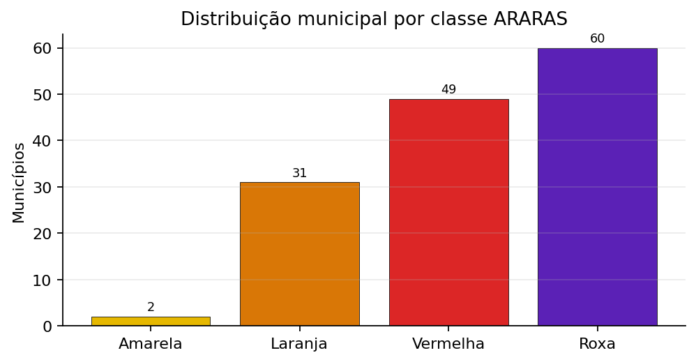
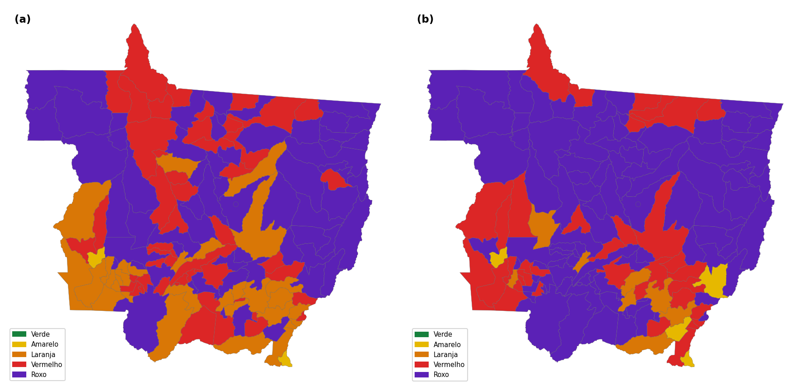
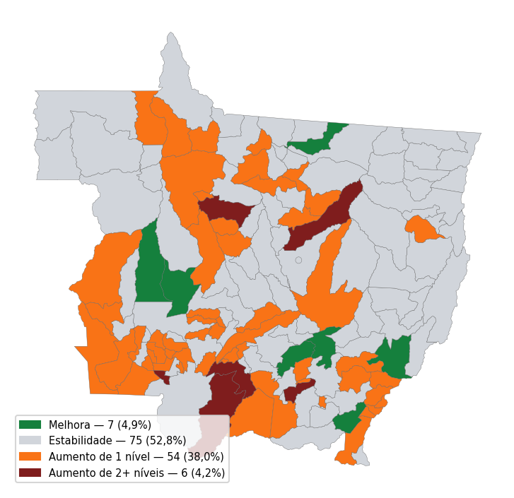
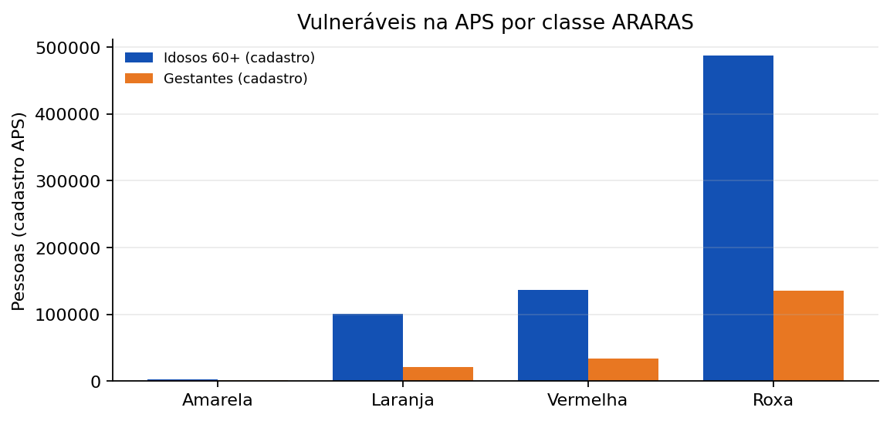
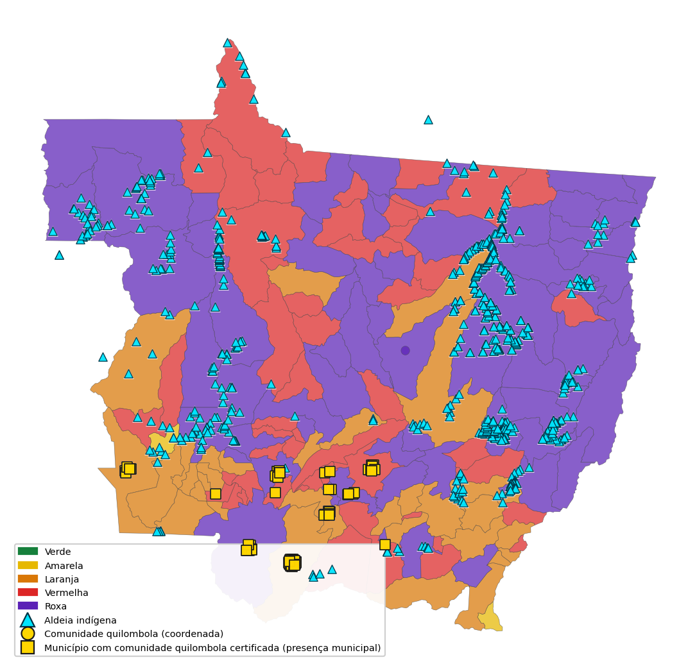
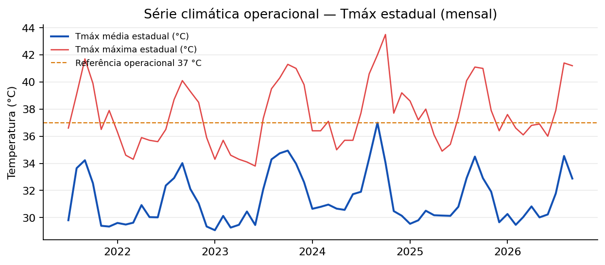
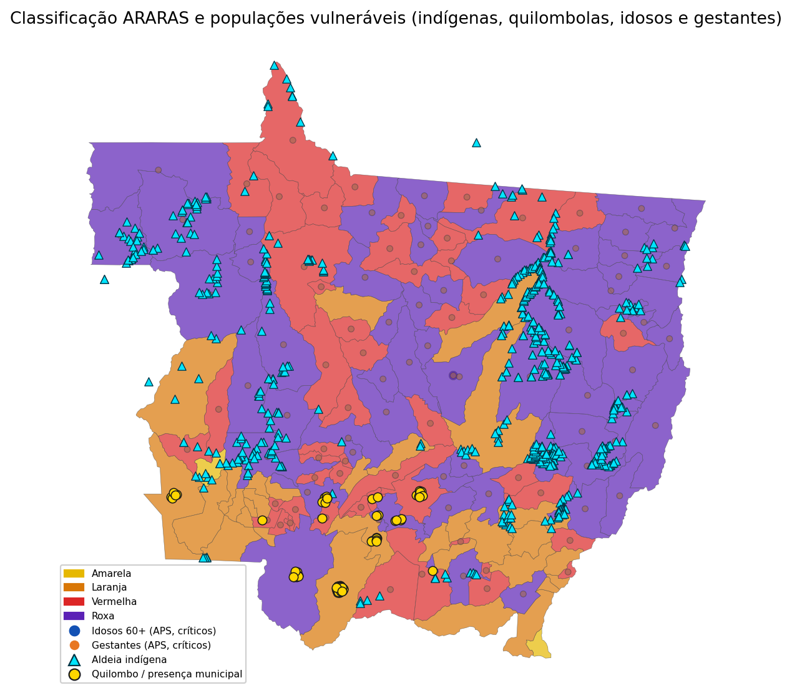

# RELATÓRIO SEMANAL EL NIÑO

**Sala de Situação do Centro de Informações Estratégicas em Vigilância em Saúde de Mato Grosso (CIEVS-MT) · Análise, Resposta e Acompanhamento de Riscos, Agravos e Saúde (ARARAS MT)**

Semana Epidemiológica 35/2026 · 30 de agosto a 05 de setembro de 2026  
Atualizado em 04/09/2026 às 12h16

Referência climática: Painel El Niño 2026–2027, Boletim Mensal n.º 02, julho de 2026, e produtos oficiais de monitoramento climático, meteorológico, ambiental e hidrológico.  
Referência operacional: ARARAS MT, rodada de 04/09/2026 às 12h16.  
Base normativa: Portaria n.º 0590/2026/GBSES.

### Atos oficiais correlatos (decretos e portarias)

*A existência de ato oficial não implica ativação automática do Plano El Niño nem substitui a classificação operacional clima–saúde.*

- **[Decreto n.º 2.015/2026 (28/04/2026)](https://www.iomat.mt.gov.br/portal/edicoes/download/19059)**: Emergência ambiental, período proibitivo de queimadas e Sala de Situação ambiental.
- **[Portaria n.º 0590/2026/GBSES](https://www.iomat.mt.gov.br/portal/edicoes/download/19279)**: Institui a Sala de Situação em Saúde (El Niño 2026–2027 e extremos climáticos).
- **[IN conjunta SEMA/CBM-MT n.º 03/2026](https://www.iomat.mt.gov.br/portal/edicoes/download/19279)**: Aceiros no Pantanal durante a emergência ambiental do Decreto 2.015/2026.
- **[Várzea Grande — Decreto n.º 76/2026](https://amm.diariomunicipal.org/publicacao/1881872/)** (Várzea Grande): SE por estiagem (COBRADE 1.4.1.1.0), 180 dias.
- **[Jangada — Decreto n.º 010/2026](https://amm.diariomunicipal.org/publicacao/1894424/)** (Jangada): SE por incêndios florestais/queimadas (COBRADE 1.4.1.3.2).

> A projeção operacional de aproximadamente 7 dias **não substitui** a previsão climática sazonal. Os produtos possuem objetivos e horizontes temporais distintos.

| RISCO ATUAL | PROJEÇÃO ~7 DIAS | CALOR |
| --- | --- | --- |
| **120/142** vermelho ou roxo | **126/142** vermelho ou roxo | pico semana **41,4 °C** |
| 84,5% do estado | agravamento disseminado | **2** ≥ 41 °C · **11** ≥ 40 °C · **75 de 142 (52,8%)** ≥ 37 °C (janela) |

| UMIDADE | FOGO | QUALIDADE DO AR |
| --- | --- | --- |
| **0 de 142 (0,0%)** ≤ 30% | **684** focos de calor | **1 de 142 (0,7%)** ≥ 25 µg/m³ |
| mediana 63% | Satélite de referência do Programa Queimadas · 7 dias · 60 municípios · 30.735 detecções multi-satélite | máximo 29,3 µg/m³ |

---

## 1. Leitura executiva da semana

**Situação:** 120 de 142 (84,5%) nas classes vermelha e roxa (verde 0; amarela 2; laranja 20; vermelha 48; roxa 72). **Projeção ~7 dias:** 126 de 142 (88,7%) nas classes vermelha e roxa — agravamento disseminado. **Exposição na rodada:** temperatura máxima (Tmáx) ≥ 37 °C em 19 de 142 (13,4%) · material particulado fino com diâmetro aerodinâmico de até 2,5 micrômetros (PM2,5) ≥ 25 µg/m³ em 1 de 142 (0,7%). **Chuva de 01/09:** alívio térmico temporário — municípios com Tmáx ≥ 37 °C caíram de 63 de 142 (44,4%) (31/08) para 18 de 142 (12,7%) (01/09); a projeção ~7d volta a pressionar. Priorizar preparação assistencial nos vermelhos/roxos, com atenção a povos indígenas, quilombolas, idosos, gestantes e trabalhadores expostos.

**Implicação.** Manter vigilância e capacidade assistencial nos prioritários (calor + fumaça/PM2,5). A chuva de 01/09 não encerra a exposição térmica projetada.

**Prioridades imediatas**

- Vigilância de agravos por calor/fumaça nos vermelhos/roxos.
- Capacidade assistencial e insumos onde Tmáx ≥ 37 °C ou PM2,5 ≥ 25 µg/m³.
- Articular regionais, Distrito Sanitário Especial Indígena (DSEI)/Secretaria Especial de Saúde Indígena (SESAI) e Saúde do Trabalhador nos prioritários.
- Tratar a chuva de 01/09 como alívio temporário — manter prontidão na projeção ~7d.

---

## 2. Cenário El Niño

**El Niño confirmado desde 11/06/2026.** Niño 3.4: 1,4 °C (semanas anteriores). Persistência forte até o fim de 2026 (APEC Climate Center (APCC)/National Oceanic and Atmospheric Administration (NOAA) — Painel El Niño n.º 02).

Fonte: Painel El Niño 2026–2027, boletim n.º 02, jul. 2026.

---

## 3. Cenário sazonal — Brasil → Amazônia Legal → Mato Grosso

Trimestre agosto–setembro–outubro (ASO)/2026 (Centro de Previsão de Tempo e Estudos Climáticos (CPTEC)/Instituto Nacional de Pesquisas Espaciais (INPE)–Instituto Nacional de Meteorologia (INMET)–Fundação Cearense de Meteorologia e Recursos Hídricos (FUNCEME)): chuva abaixo da normal no centro-norte do País; temperatura acima da normal, com risco de ondas de calor, ar seco e queimadas.

- **Chuva (Brasil):** Abaixo da média no centro-norte (Norte, Nordeste e grande parte do Centro-Oeste); acima da média no Sul. `PREVISÃO OFICIAL`
- **Temperatura (Brasil):** Acima da média em praticamente todo o país — ondas de calor, baixa umidade e maior potencial de queimadas. `PREVISÃO OFICIAL`
- **Chuva em MT:** Centro-norte do Brasil abaixo da média. Extremo sul de MT com sinal de chuva acima da climatologia, ainda na estiagem (pancadas irregulares; agosto/setembro com climatologia baixa).
- **Temperatura em MT:** Acima da média na Amazônia Legal — atraso da estação chuvosa no sul da Amazônia.

### Comparação operacional — situação atual × série ambiental

Comparação sazonal de setembro/2026 com o mesmo mês na série (2021, 2022, 2023, 2024, 2025): Tmáx média (°C): 34.4 vs média 34.9 do mesmo mês em anos anteriores (z=-0.24). Interpretação: valor de Tmáx média próximo ao padrão dos setembros disponíveis na série operacional (sem anomalia sazonal relevante nesta rodada). Comparação descritiva não ajustada por sazonalidade (janela 28/08/2026 a 03/09/2026 frente à média do restante da série 24/07/2021 a 27/08/2026): Tmáx média (°C) 35.4 vs série completa 31.4 (Δ +4.0); Tmáx máxima (°C) 41.4 vs série completa 35.3 (Δ +6.1); *Universal Thermal Climate Index* (UTCI) médio 34.3 vs série completa 34.2 (Δ +0.1); Umidade média (%) 56.7 vs série completa 70.7 (Δ -14.0); Risco cumulativo 3d 16.6 vs série completa 5.0 (Δ +11.6). Leitura exploratória — não substitui comparação sazonal nem climatologia oficial. Qualidade do ar (série estadual): PM2,5 média 15.5 µg/m³ (máx. 19.1; 8 dias).

_Fonte: painel ARARAS MT. A série operacional não substitui climatologia oficial de longo prazo._

---

## 4. Mato Grosso — Situação atual `OBSERVADO`

Distribuição atual: verde 0; amarela 2; laranja 20; vermelha 48; roxa 72.

Fonte: ARARAS MT/CIEVS-MT — contagem municipal por classe na rodada.

**Tabela 1 – Indicadores da rodada e municípios em atenção**

| Indicador | Situação da rodada | Municípios em atenção |
| --- | --- | --- |
| Temperatura | mediana 35,3 °C · máximo 38,4 °C | 19 de 142 (13,4%) ≥ 37 °C |
| Umidade | mediana 63% · mínimo 41% | 0 de 142 (0,0%) ≤ 30% |
| PM2,5 | mediana 13,7 µg/m³ · máximo 29,3 µg/m³ | 1 de 142 (0,7%) ≥ 25 µg/m³ |
| *Universal Thermal Climate Index* (UTCI) | mediana 34,4 °C | 129 de 142 (90,8%) ≥ 32 °C |

Fonte: ARARAS MT/CIEVS-MT, rodada de 04/09/2026 às 12h16.

Cobertura dos indicadores: 142 de 142 (100,0%) municípios. Preparação deve seguir o recorte mais exposto, não a mediana.

---

## 5. Mato Grosso — Projeção operacional (~7 dias)

Distribuição projetada: verde 1; amarela 3; laranja 12; vermelha 35; roxa 91.

---

## 6. Mapa atual × mapa ~7 dias

**Mapa 1 – Classificação integrada de risco em Mato Grosso, 30 de agosto a 05 de setembro de 2026 (atual e ~7 dias)**

Fonte: ARARAS MT/CIEVS-MT, rodada de 04/09/2026 às 12h16.
Nota: as duas faces usam a mesma escala de classes (verde a roxo) para comparação visual direta.

**Atual.** 120 de 142 (84,5%) vermelho ou roxo.  
**Projeção.** 126 de 142 (88,7%) vermelho ou roxo.  
**Agravamento.** 32 de 142 (22,5%) sobem de classe.

**Mapa 2 – Variação projetada da classificação de risco em aproximadamente sete dias**

Fonte: ARARAS MT/CIEVS-MT, rodada de 04/09/2026 às 12h16.
Municípios com dados comparáveis: 142 de 142 (100,0%).
- Melhora: 6 de 142 (4,2%)
- Estabilidade: 104 de 142 (73,2%)
- Aumento de 1 nível: 32 de 142 (22,5%)
- Aumento de 2 ou mais níveis: 0 de 142 (0,0%)

### Determinantes do agravamento projetado

A projeção operacional (~7 dias) eleva o território de **120 de 142 (84,5%)** para **126 de 142 (88,7%)** municípios nas classes vermelha ou roxa, com **32 de 142 (22,5%)** municípios comparáveis em elevação de classe.

### A. Drivers que entram no modelo

**Tabela 2 – Determinantes do agravamento projetado em aproximadamente sete dias**

| Driver do modelo | Municípios afetados | Direção |
| --- | --- | --- |
| Tmáx prevista (máx. 7d ≥ 37 °C) | 1 (3,1% dos que agravam) | ↑ aumento |
| UTCI previsto (máx. 7d ≥ 36 °C) | 0 (0,0% dos que agravam) | ↑ aumento |
| Risco térmico cumulativo (máx. 7d ≥ 7 pontos) | 32 (100,0% dos que agravam) | ↑ aumento |
| Onda de calor prevista no horizonte (mediana 0,0 dias) | 3 (9,4% dos que agravam) | ↑ aumento |

Fonte: previsão meteorológica integrada ao ARARAS MT, rodada de 04/09/2026 às 12h16.

### B. Contexto concomitante

Descreve a situação atual dos municípios que sobem de classe; **não** constitui contribuição matemática para a projeção nesta versão.

**Tabela 3 – Contexto ambiental concomitante nos municípios com elevação projetada da classificação**

| Contexto concomitante | Municípios afetados | Leitura |
| --- | --- | --- |
| Umidade relativa ≤ 30% | 0 (0,0% dos que agravam) | Limiar não observado entre os municípios em agravamento nesta rodada. |
| PM2,5 ≥ 25 µg/m³ | 0 (0,0% dos que agravam) | Limiar não observado entre os municípios em agravamento nesta rodada. |
| Focos de calor (7 dias) | 11 (34,4% dos que agravam) | Detecção atual; sem projeção específica de 7 dias |

Fonte: ARARAS MT/CIEVS-MT, rodada de 04/09/2026 às 12h16.

Nota: Ausência de previsão específica não equivale a estabilidade.

A classe projetada utiliza o maior nível entre intensidade térmica, estresse térmico, persistência e onda de calor, evitando a soma de sinais correlacionados. Classes: 0–24 verde; 25–49 amarela; 50–69 laranja; 70–84 vermelha; 85–100 roxa. Detalhamento dos limiares na seção de notas metodológicas.

**Atual:** verde 0; amarela 2; laranja 20; vermelha 48; roxa 72. `OBSERVADO`

**Projeção ~7 dias:** verde 1; amarela 3; laranja 12; vermelha 35; roxa 91. `PROJEÇÃO ARARAS ~7 DIAS`

**Mudança esperada**
- Aumento de 2+ níveis: 0 municípios
- Aumento de 1 nível: 32 municípios
- Estabilidade: 104 municípios
- Melhora: 6 municípios

**Legenda:** Verde — situação favorável; monitoramento de rotina. · Amarela — atenção; acompanhar evolução e reforçar comunicação. · Laranja — alerta; preparação proporcional e articulação regional. · Vermelha — alerta elevado; revisar capacidade assistencial e estoques. · Roxa — situação excepcional; mobilização proporcional e validação pela gestão.

---

## 7. Alertas meteorológicos e ambientais — Mato Grosso

Semana **SE 35/2026** (30 de agosto a 05 de setembro de 2026). Recorte: **Mato Grosso** (avisos INMET exclusivos de MS excluídos).

**Situação climática de referência (avisos vigentes):** 3 avisos INMET com validade contendo o horário de emissão deste relatório (INMET, 2026).

**Projeção operacional (avisos futuros na semana):** 2 avisos com início posterior à data de referência — leitura de tendência imediata PREVISÃO OFICIAL (INMET, 2026).

**Centro Nacional de Monitoramento e Alertas de Desastres Naturais (CEMADEN):** nenhum alerta aberto em MT na consulta (CEMADEN, 2026).

**Síntese integrada de alertas:** classificação municipal disponível (Secretaria de Estado de Saúde de Mato Grosso (SES-MT); CIEVS-MT, 2026).

### INMET — síntese por fenômeno

**AVISOS VIGENTES NA EMISSÃO**

- **Baixa Umidade** — 1 aviso; severidade Perigo potencial; abrangência em Mato Grosso.
- **Chuvas Intensas** — 1 aviso; severidade Perigo potencial; abrangência em Mato Grosso.
- **Tempestade** — 1 aviso; severidade Perigo potencial; abrangência em Mato Grosso.

**AVISOS COM INÍCIO POSTERIOR NA SEMANA**

- **Tempestade** — 2 avisos; severidade Perigo potencial; abrangência em Mato Grosso.

Consulta: 04/09/2026 às 12h16. Fonte: Alert-AS / INMET (INMET, 2026). Detalhe no painel.

### CEMADEN

_Nenhum alerta aberto do CEMADEN para Mato Grosso nesta consulta._

Fonte: CEMADEN (CEMADEN, 2026). Consulta: 04/09/2026 às 12h16.

### Síntese integrada

- Municípios no recorte: **142**
- Distribuição da classificação ARARAS desta rodada: verde: 0; amarela: 2; laranja: 20; vermelha: 48; roxa: 72

_Fontes: INMET, CEMADEN, solo, hidro e classificação ARARAS (SES-MT; CIEVS-MT, 2026)._

---

## 8. Recursos hídricos / seca / estiagem

- **Limitação dos dados.** A cobertura hidrológica desta rodada corresponde a 10 de 142 (7,0%); os resultados não devem ser extrapolados para todo o estado. No recorte hidrológico disponível, 3 municípios apresentam sinal de baixa disponibilidade hídrica, 6 apresentam risco elevado de inundação e 1 está em situação hidrológica habitual. Os sinais de baixa disponibilidade hídrica local **não equivalem** automaticamente à classificação do Monitor de Secas (produto distinto, com outra escala e competência temporal). Índice de saturação do solo: mediana **38/100** (escala normalizada 0–100 a partir de umidade volumétrica Open-Meteo; parâmetro entre ponto de murcha 0,05 e saturação de referência 0,42 m³/m³). **38 pontos** em escala de 0 a 100; sem faixa de interpretação institucional validada nesta rodada.
- Precipitação mediana no dia de referência: **1,2 mm** · sem chuva: 14 de 142 (9,9%).
- Monitor de Secas (jun/2026): MT sem áreas classificadas com seca — produto defasado; cruzar com sinais locais.

### Impacto da chuva de 01/09/2026 (alívio térmico temporário)

Pancadas de segunda (01/09) reduziram o calor extremo no estado; a projeção ~7 dias volta a pressionar. Foi **oscilação**, não encerramento da exposição térmica.

- **Antes (31/08):** 63 de 142 (44,4%) com Tmáx ≥ 37 °C · Tmáx média **36,6 °C** · chuva ≥1 mm em 7 de 142 (4,9%).
- **Com chuva (01/09):** 18 de 142 (12,7%) com Tmáx ≥ 37 °C · Tmáx média **34,7 °C** · chuva ≥1 mm em 97 de 142 (68,3%) (mediana **2,4 mm**, máx. **20,2 mm**).
- **Cuiabá:** Tmáx **40,4 °C** (31/08) → **34,6 °C** (01/09, precip. **5,0 mm**).

| Data | Mun. chuva ≥1 mm | Mun. Tmáx ≥37 °C | Tmáx média (°C) | Precip. mediana (mm) |
| --- | --- | --- | --- | --- |
| 2026-08-31 | 7 de 142 (4,9%) | 63 de 142 (44,4%) | 36,6 | 0,1 |
| 2026-09-01 | 97 de 142 (68,3%) | 18 de 142 (12,7%) | 34,7 | 2,4 |
| 2026-09-02 | 49 de 142 (34,5%) | 1 de 142 (0,7%) | 33,1 | 0,4 |

Fonte: grade operacional ARARAS MT / Open-Meteo (um município por dia).

---

## 9. Fogo e qualidade do ar

A previsão de risco de fogo para ASO intensifica o alerta alto no Centro-Oeste, especialmente em Mato Grosso, e na maior parte da Região Norte. Para a Amazônia Legal, o análogo Centro Gestor e Operacional do Sistema de Proteção da Amazônia (CENSIPAM) 2023/2024 aponta queimadas intensas em Tocantins, Pará, Maranhão, Mato Grosso e na região AMACRO (Acre, Amazonas e Rondônia).

- Foram registrados 684 focos de calor pelo satélite de referência do Programa Queimadas/INPE (sensor MODIS), utilizado para comparação temporal da série histórica, em 60 de 142 municípios (42,3%) no acumulado de sete dias. O conjunto multi-satélite registrou 30.735 detecções no período; essas detecções não equivalem a 30.735 incêndios ou focos distintos. Colniza concentrou o maior número, com 100 focos no satélite de referência.
- Índice de Qualidade do Ar (IQA): verde: 105; amarela: 36; laranja: 1; vermelha: 0; roxa: 0; cinza: 0
- PM2,5 mediano: **13,7 µg/m³** (mín. 7,3; máx. 29,3 µg/m³). P90 da rodada: 18,1 µg/m³. 1 de 142 (0,7%) apresentaram PM2,5 igual ou superior a 25 µg/m³ (parâmetro operacional de atenção sanitária do painel, alinhado a faixas de qualidade do ar). Cobertura espacial: 142 de 142 (100,0%). Interpretação sanitária: exposição à fumaça/partículas finas, com atenção a agravos respiratórios — associação temporal, sem inferência causal.

Focos + PM2,5 reforçam vigilância respiratória nos prioritários.

---

## 10. Impactos potenciais à saúde

Associação temporal/espacial — **não implica causalidade**.

**Tabela 4 – Impactos potenciais à saúde segundo cenário de exposição**

| Cenário / exposição | Agravos a monitorar | Indicadores |
| --- | --- | --- |
| Seca e estiagem / Baixa disponibilidade hídrica | Desidratação e irritações oculares e respiratórias | umidade relativa (UR), Tmáx e atendimentos |
| Incêndios e fumaça / PM2,5 | Agravamento de doenças respiratórias | PM2,5, Síndrome Respiratória Aguda Grave (SRAG) e internações |
| Calor extremo / Estresse térmico | Desidratação e agravos relacionados ao calor | Tmáx, UTCI e atendimentos |
| Chuva intensa / Inundações | Doença Diarreica Aguda (DDA), leptospirose e traumas | Chuva, alertas e notificações |
| Tempestades / Ventos fortes e descargas atmosféricas | Traumas | Avisos do INMET |

Fonte: ARARAS MT/CIEVS-MT, rodada de 04/09/2026 às 12h16.

> **Cenário hidrológico de inundação:** sinal localizado em 6 municípios no recorte hidrológico disponível (cobertura 10 de 142 (7,0%)). Não caracteriza cenário estadual. Se o evento for confirmado, monitorar DDA, leptospirose e traumas.

### Monitoramento epidemiológico — dados observados

- **Respiratórios/fumaça:** 1 de 142 (0,7%) com PM2,5 ≥ 25 µg/m³ em 04/09/2026.
- **Calor/desidratação:** Calor: 19 municípios apresentaram Tmáx ≥ 37 °C; 129 apresentaram UTCI ≥ 32 °C. O indicador combinado de calor seco (Tmáx ≥ 37 °C e UR ≤ 30%) não foi observado nesta rodada.
- **Arboviroses:** 149 casos em 7 dias no recorte com dado (ausência não é zero).
- **Baixa disponibilidade hídrica:** 3 municípios no recorte hidrológico disponível.
- **Risco elevado de inundação:** 6 municípios no recorte hidrológico disponível.

### Epidemiologia operacional (janela 7 dias)

- **Intoxicação exógena (sinal de fumaça):** 0 notificações; **0** com sinal de fumaça.
- **Internações IndicaSUS (competência 2026-06):** total **10.267** · respiratório/alérgico **24** · desidratação/calor **5**. _Janela de 7 dias sem registros na base; exibido o mês competência disponível._

> **DADO ASSISTENCIAL DEFASADO**  
> Última atualização: **07/08/2026**  
> Não representa a situação corrente da SE em curso.

- **Atenção primária (Centralizador PEC/eSUS):** cadastro **5.402.079** · asma **26.847** · idosos 60+ **727.991** · gestantes **192.553** · **120** municípios classes vermelha e roxa com cadastro.
- Status temporal: **DEFASADO** (última carga **07/08/2026**, atraso **28** dia(s)). Usado só como contexto de vulnerabilidade/cobertura, **não** como pressão assistencial corrente.
- Tabelas detalhadas de atendimento: **anexo técnico / painel**. Ausência de envio = **N/D** (≠ zero clínico).

### Atenção primária (e-Sistema Único de Saúde (SUS) Atenção Primária à Saúde (APS)) — contexto

> **DADO ASSISTENCIAL DEFASADO**  
> Última atualização: **07/08/2026**  
> Não representa a situação corrente da semana epidemiológica em curso (defasagem de **28** dia(s)).

Centralizador e-SUS APS: última carga válida **07/08/2026**, defasagem **28** dias. Dados utilizados apenas como contexto de vulnerabilidade/cobertura, **não** como pressão assistencial atual.

- Cadastro (contexto): asma **26.847** · idosos 60+ **727.991** · gestantes **192.553** · **120** municípios classes vermelha e roxa com cadastro.

Tabelas detalhadas, correlações e top municípios: **anexo técnico / painel**.
Ausência de envio ≠ zero clínico (municípios sem carga na janela: **N/D**).

**Figura 1 – Vulneráveis na APS por classe ARARAS**

Fonte: e-SUS APS (cadastro) × classe ARARAS da rodada. Status: contexto/DEFASADO se carga atrasada.

### Ondas de calor

Três conceitos distintos: (A) **calor seco combinado** (Tmáx ≥ 37 °C e UR ≤ 30%); (B) **onda de calor EHF observada** (EHF > 0 por ≥ 3 dias); (C) **projeção ARARAS ~7 dias** (componente térmico projetado). **Não substitui** avisos do INMET.

#### GeoCalor / EHF (Fiocruz)

**Método:** GeoCalor / EHF (Fiocruz–LAGAS / Nairn & Fawcett) — evento = ≥ 3 dias consecutivos com EHF > 0; intensidade pela distribuição local dos EHF positivos (EHF85).

- **Janela:** 2026-08-20 a 2026-09-02 · **142** municípios com série EHF.
- **Último dia da série (2026-09-02):** **28** municípios em dia de onda (baixa **28** · severa **0** · extrema **0**).
- **Na janela:** **88** municípios com ≥ 1 dia de onda · **89** eventos (≥ 3 dias) em **88** municípios (baixa **32** · severa **56** · extrema **1**).
- **Cuiabá (EHF):** 5 dia(s) de onda na janela · EHF máx. **3.50** · pico de intensidade **severa** · em onda no último dia da série: **não**.

**Eventos com maiores valores máximos de EHF na janela**

| Município | Período | Dias | EHF máx. | Intensidade |
| --- | --- | --- | --- | --- |
| Santo Afonso | 2026-08-27–2026-09-01 | 6 | 8,80 | severa |
| Novo São Joaquim | 2026-08-25–2026-09-02 | 9 | 7,52 | severa |
| Nova Marilândia | 2026-08-27–2026-09-01 | 6 | 7,46 | severa |
| Acorizal | 2026-08-27–2026-09-01 | 6 | 7,21 | severa |
| Alto Garças | 2026-08-29–2026-09-02 | 5 | 7,18 | severa |
| Nova Olímpia | 2026-08-28–2026-09-01 | 5 | 7,13 | severa |
| General Carneiro | 2026-08-29–2026-09-02 | 5 | 7,07 | severa |
| Nova Xavantina | 2026-08-26–2026-09-02 | 8 | 6,96 | extrema |

A categoria de intensidade é relativa ao limiar local de cada município; valores brutos de EHF não devem ser utilizados isoladamente para ordenar severidade entre municípios. Tabela ordenada pelo EHF máximo bruto.

Fonte: cálculo EHF estadual ARARAS (definição GeoCalor / Nairn & Fawcett). Não substitui avisos do INMET.

Nota: Cálculo estadual ARARAS com a mesma definição EHF do GeoCalor. O portal GeoCalor não publica Cuiabá/MT; a série local é derivada da grade municipal.

**Figura 2 – Municípios em dia de onda (EHF / GeoCalor Fiocruz)**

Fonte: cálculo EHF estadual ARARAS (definição GeoCalor / Nairn & Fawcett). Janela observada 2026-08-20 a 2026-09-02.

#### Operação ARARAS (grade e classes)

- **Picos da janela (2026-08-22 a 2026-09-04):** Tmáx máxima estadual **41,4 °C** · **2 de 142 (1,4%)** ≥ 41 °C · **11 de 142 (7,7%)** ≥ 40 °C · **75 de 142 (52,8%)** ≥ 37 °C.
- **Contexto da grade do dia (rodada):** Tmáx máx. **38,4 °C** em Nossa Senhora do Livramento · **19 de 142 (13,4%)** ≥ 37 °C hoje · persistência P95≥2d em **4 de 142 (2,8%)** — distinto do EHF (≥ 3 dias).

**Picos de Tmáx municipal na janela (≥ 40 °C quando houver; senão ≥ 37 °C)**

| Município | Tmáx pico | Data |
| --- | --- | --- |
| Araguaiana | 41,4 °C | 2026-08-30 |
| Cocalinho | 41,2 °C | 2026-09-01 |
| São José do Povo | 40,7 °C | 2026-08-31 |
| Novo Santo Antônio | 40,4 °C | 2026-08-25 |
| Cuiabá | 40,4 °C | 2026-08-31 |
| São Pedro da Cipa | 40,3 °C | 2026-08-31 |
| Nova Nazaré | 40,2 °C | 2026-08-26 |
| Campinápolis | 40,1 °C | 2026-08-31 |
| Nossa Senhora do Livramento | 40,0 °C | 2026-08-30 |
| Porto Alegre do Norte | 40,0 °C | 2026-08-25 |
| Canabrava do Norte | 40,0 °C | 2026-08-25 |

Fonte: histórico municipal diário ARARAS (grade Open-Meteo). Pico = máxima diária por município na janela.

**Figura 3 – Ranking de picos de Tmáx na janela**

Fonte: ARARAS MT — histórico municipal diário da janela (observado).
- **Cuiabá:** INMET **41,2 °C** (30/08) e **41,3 °C** (31/08); Open-Meteo na semana ~**40,4 °C** (modelo < estação).
- **classes vermelha e roxa:** **120 de 142 (84,5%)** agora · projeção ~7d **126 de 142 (88,7%)**.
- **Chuva 01/09:** alívio térmico temporário (seção de recursos hídricos); não encerra a pressão projetada.

Fonte: ARARAS MT/CIEVS-MT; Open-Meteo Archive; INMET (máximas oficiais de estação). Séries longas (Cuiabá e Tmáx mensal estadual): **anexo técnico**.

### Monitoramento de mortalidade (SIM) — módulo exploratório

Módulo em **validação metodológica**; **não utilizado como gatilho operacional** nesta rodada.

- **Período analisado:** 2024-01–2026-08.
- Contagem exploratória em grupos de causas **potencialmente sensíveis a extremos térmicos** (capítulos amplos I/J/N/E e calor direto): volume estadual consolidado na série — leitura ecológica, **sem** estimativa de mortalidade atribuível ao clima.
- Recorte municipal com código IBGE de MT válido: **142** municípios (universo operacional do boletim: 142) · além disso: 1 código(s) de residência desconhecida/agregada.
- Detalhamento de CID, filtros e série completa: **anexo técnico / painel**.

Fonte: SIM/DATASUS via consolidação SES-MT. Associação temporal/espacial ≠ causalidade.

**Leitura epidemiológica**

Associação temporal/espacial ≠ causalidade. Ler sinais com defasagem e cobertura de cada fonte.

---

## 11. Priorização territorial e acesso assistencial

### 11.1 Regionais de Saúde

**Tabela 5 – Regionais de saúde com maior concentração de municípios nas classes vermelha e roxa**

| Regional | Municípios nas classes vermelha e roxa (atual) | Mudança ~7 dias | Tmáx mediana |
| --- | --- | --- | --- |
| Sinop | 15 | ↑ 4 · → 11 | 35,8 °C |
| Baixada Cuiabana | 11 | ↑ 1 · → 10 | 37,2 °C |
| Rondonópolis | 11 | ↑ 3 · → 12 · ↓ 4 | 35,4 °C |
| Tangará da Serra | 10 | ↑ 0 · → 9 · ↓ 1 | 36,2 °C |
| Cáceres | 10 | ↑ 5 · → 7 | 35,9 °C |
| Barra do Garças | 9 | ↑ 1 · → 8 · ↓ 1 | 36,1 °C |
| Água Boa | 8 | ↑ 2 · → 6 | 35,4 °C |
| Porto Alegre do Norte | 7 | ↑ 0 · → 7 | 34,0 °C |

Fonte: ARARAS MT/CIEVS-MT, classificação municipal agregada por regional de saúde.

Nota: ↑ indica aumento da classificação; → estabilidade; ↓ redução, considerando todos os municípios da Regional.

**Leitura regional.** A maior concentração nas classes vermelha e roxa está em **Sinop** (15 municípios). O maior número de municípios em aumento de classe na projeção de sete dias concentra-se em **Cáceres** (5 em elevação). A maior mediana regional de Tmáx no recorte é **37,2 °C** (Baixada Cuiabana).

### 11.2 Índice de prioridade de preparação clima–saúde

Municípios no extremo de atenção. Municípios prioritários para acompanhamento.

**Tabela 6 – Índice de prioridade de preparação clima–saúde (dez municípios)**

| Município | Regional | Atual → ~7 dias | Índice | Faixa | Determinante principal |
| --- | --- | --- | --- | --- | --- |
| Acorizal | Baixada Cuiabana | Roxa → Roxa | 94,1 | Crítica | exposição ambiental |
| São José do Povo | Rondonópolis | Vermelha → Roxa | 90,4 | Crítica | exposição ambiental |
| Barão de Melgaço | Baixada Cuiabana | Roxa → Roxa | 88,2 | Crítica | prioridade operacional |
| Nova Brasilândia | Baixada Cuiabana | Roxa → Roxa | 86,6 | Crítica | exposição ambiental |
| Lambari D'Oeste | Cáceres | Roxa → Roxa | 85,6 | Crítica | pressão assistencial |
| Jangada | Baixada Cuiabana | Roxa → Roxa | 85,6 | Crítica | prioridade operacional |
| Santo Antônio de Leverger | Baixada Cuiabana | Vermelha → Roxa | 85,2 | Crítica | pressão assistencial |
| Chapada dos Guimarães | Baixada Cuiabana | Vermelha → Vermelha | 85,1 | Crítica | pressão assistencial |
| Porto Estrela | Tangará da Serra | Vermelha → Vermelha | 84,5 | Crítica | vulnerabilidade |
| Planalto da Serra | Baixada Cuiabana | Roxa → Roxa | 83,4 | Crítica | prioridade operacional |

Fonte: ARARAS MT/CIEVS-MT, rodada de 04/09/2026 às 12h16.

_O índice combina pressão assistencial, exposição ambiental, vulnerabilidade e prioridade operacional em escala normalizada de 0 a 100. A classe climática atual é contexto territorial e não entra no cálculo. Faixas qualitativas: Acompanhamento (<35); Moderada (35 a <55); Alta (55 a <75); Crítica (≥75). Para os municípios do Top 10, recomenda-se preparação assistencial e intensificação da vigilância, moduladas pelo principal determinante identificado._

---

### 11.2b Ocupação hospitalar (IndicaSUS) × pressão hospitalar (SISREG)

Dois sinais distintos na operação CIEVS:

| Conceito | Fonte | Interpretação |
|---|---|---|
| **Ocupação hospitalar** | IndicaSUS / BdSES (filtros SIEGES) | % de leitos ocupados — só municípios com leitos elegíveis |
| **Pressão hospitalar / regulação** | SISREG | Fila e solicitações — demanda territorial (com ou sem hospital próprio) |

**Rodada atual (ocupação ponderada por leitos)**

- Ocupação estadual: **59,6%** (3488 ocupados / 5849 elegíveis)
- Cobertura: **85** municípios com taxa · **57** sem leitos elegíveis no recorte · 117 unidades
- Pressão SISREG (solicitações no recorte da rodada): **140** municípios · média municipal 6030 · máximo municipal 221571 (métrica de fila/demanda regulada — temporalidade conforme carga da Sala).
- Ocupação calculada segundo filtros assistenciais institucionais do SIEGES/IndicaSUS (detalhamento técnico no painel/anexo).

_Ocupação hospitalar (IndicaSUS, filtros SIEGES) ≠ pressão hospitalar (SISREG). Sem leitos elegíveis no recorte não inventamos %; use SISREG para demanda territorial._

**Ocupação IndicaSUS por regional de saúde**

| Regional | Ocup. ponderada | Leitos ocup./elegíveis | Mun. c/ taxa | Sem leitos | Total mun. |
| --- | --- | --- | --- | --- | --- |
| Baixada Cuiabana | 74,5% | 1537/2062 | 4 | 7 | 11 |
| Sinop | 73,8% | 436/591 | 7 | 8 | 15 |
| São Félix do Araguaia | 73,7% | 28/38 | 1 | 4 | 5 |
| Alta Floresta | 59,1% | 104/176 | 4 | 2 | 6 |
| Tangará da Serra | 55,6% | 164/295 | 7 | 3 | 10 |
| Água Boa | 54,1% | 86/159 | 6 | 2 | 8 |
| Cáceres | 52,8% | 201/381 | 6 | 6 | 12 |
| Rondonópolis | 51,3% | 405/789 | 13 | 6 | 19 |
| Porto Alegre do Norte | 48,5% | 47/97 | 3 | 4 | 7 |
| Peixoto de Azevedo | 48,3% | 84/174 | 4 | 1 | 5 |
| Colíder | 46,7% | 57/122 | 3 | 3 | 6 |
| Juína | 45,0% | 113/251 | 6 | 1 | 7 |
| Juara | 34,1% | 29/85 | 4 | 0 | 4 |
| Pontes e Lacerda | 34,0% | 71/209 | 5 | 5 | 10 |
| Barra do Garças | 33,7% | 92/273 | 8 | 2 | 10 |
| Diamantino | 23,1% | 34/147 | 4 | 3 | 7 |

_Termômetro assistencial: % ponderado por leitos elegíveis (SIEGES). Municípios sem leitos no recorte não entram no denominador do %._

**Municípios com maior ocupação IndicaSUS**

| Município | Ocup. IndicaSUS | SISREG sol. |
| --- | --- | --- |
| Alta Floresta | 91,4% | 31368 |
| Sinop | 89,5% | 108048 |
| Sorriso | 81,0% | 51193 |
| Cáceres | 79,8% | 7484 |
| Nova Mutum | 79,7% | 4739 |
| Cuiabá | 78,4% | 221571 |
| Pontes e Lacerda | 76,1% | 5330 |
| Rondonópolis | 75,6% | 9210 |
| Tangará da Serra | 74,3% | 37841 |
| São Félix do Araguaia | 73,7% | 725 |

**Sem leitos elegíveis IndicaSUS — maior pressão SISREG (Sala)**

| Município | Regional | SISREG sol. |
| --- | --- | --- |
| Chapada dos Guimarães | Baixada Cuiabana | 11310 |
| Acorizal | Baixada Cuiabana | 1887 |
| Jangada | Baixada Cuiabana | 1837 |
| Nova Canaã do Norte | Colíder | 1675 |
| Carlinda | Alta Floresta | 1669 |
| Alto Paraguai | Diamantino | 1540 |
| Novo Mundo | Peixoto de Azevedo | 1488 |
| Barão de Melgaço | Baixada Cuiabana | 1352 |
| Denise | Tangará da Serra | 1313 |
| Porto Esperidião | Cáceres | 1248 |

---

### 11.3 Síntese territorial da semana

- Regionais com maior concentração nas classes vermelha e roxa: **Sinop, Baixada Cuiabana, Rondonópolis, Tangará da Serra, Cáceres**.
- Maior Tmáx municipal: **Nossa Senhora do Livramento** (38,4 °C).
- Maior PM2,5 municipal: **Marcelândia** — 29,3 µg/m³.
- Maior acumulado no satélite de referência: **Colniza** — 100 focos.
- Persistência: estabilidade de classe em 104 de 142 (73,2%).
- Melhora projetada: 6 de 142 (4,2%).
- Limitação dos dados. Cobertura hidrológica: 10 de 142 (7,0%).

---

### 11.4 Povos indígenas, comunidades quilombolas, idosos, gestantes e acesso assistencial

**Mapa 3 – Classificação de risco climático, aldeias indígenas e municípios com comunidades quilombolas certificadas em Mato Grosso**

Fonte: ARARAS MT/CIEVS-MT, com dados da Fundação Nacional dos Povos Indígenas (FUNAI) e Fundação Cultural Palmares. Rodada de 04/09/2026 às 12h16.
Nota: Aldeias são representadas por coordenadas georreferenciadas disponíveis. Para comunidades quilombolas sem coordenadas oficiais validadas, a representação indica presença municipal e não localização exata.

**Municípios com aldeias indígenas em classes vermelha ou roxa**

- **Campinápolis** — 75 aldeias — Roxa → Roxa — fogo.
- **Gaúcha do Norte** — 60 aldeias — Roxa → Roxa — sem exposição específica destacada além do risco integrado.
- **Querência** — 54 aldeias — Roxa → Roxa — sem exposição específica destacada além do risco integrado.
- **Feliz Natal** — 43 aldeias — Vermelha → Roxa — fogo.
- **Aripuanã** — 41 aldeias — Roxa → Roxa — fogo.
- **Tangará da Serra** — 37 aldeias — Roxa → Roxa — fogo.
- **Brasnorte** — 32 aldeias — Roxa → Roxa — fogo.

_Os quantitativos correspondem a aldeias georreferenciadas associadas ao município e não representam estimativa populacional._
A lista completa permanece no painel operacional.

**Comunidades quilombolas certificadas em áreas de risco**

- **Barra do Bugres** — 7 comunidades certificadas em área de risco.
- **Chapada dos Guimarães** — 7 comunidades certificadas em área de risco.
- **Cáceres** — 5 comunidades certificadas em área de risco.
- **Cuiabá** — 4 comunidades certificadas em área de risco.
- **Acorizal** — 2 comunidades certificadas em área de risco.

_Comunidade certificada pela Fundação Cultural Palmares não equivale necessariamente a território delimitado ou titulado._

**Geolocalização, classificação e distância da rede**

O Mapa 3 localiza aldeias (coordenada da aldeia) e municípios com quilombo certificado sobre a classe ARARAS. A tabela de acesso assistencial restringe o recorte a municípios **vermelhos ou roxos** com território longe da Atenção Primária à Saúde (APS) (> 30 km) ou do hospital (> 50 km).

**Tabela 7 – Municípios com maior prioridade combinada de risco e dificuldade de acesso assistencial**

| Município | Classe | Territórios distantes | P90 APS (km) | Máx. APS (km) | Máx. hospital (km) |
| --- | --- | --- | --- | --- | --- |
| Querência | Roxa | 58 | 90 | 96 | 148 |
| Campinápolis | Roxa | 51 | 50 | 54 | 71 |
| Gaúcha do Norte | Roxa | 50 | 94 | 99 | 142 |
| Aripuanã | Roxa | 38 | 99 | 116 | 234 |
| Tangará da Serra | Roxa | 38 | 77 | 82 | 86 |
| Brasnorte | Roxa | 31 | 54 | 58 | 84 |
| São Félix do Araguaia | Roxa | 15 | 67 | 69 | 71 |
| Rondolândia | Roxa | 14 | 92 | 94 | 181 |

Fonte: ARARAS MT/CIEVS-MT, com dados do Cadastro Nacional de Estabelecimentos de Saúde (CNES).

Nota: Distância em km até o estabelecimento do CNES com coordenada oficial (trajeto viário quando a rota existe; linha reta se a rota falhar e for validada). Distâncias extremas são submetidas a validação antes de serem utilizadas na priorização. Minutos de viagem não foram validados nesta rodada.

**Leitura combinada.** A tabela do corpo não é o ranking das maiores distâncias. A priorização usa classe atual e projetada, número de territórios distantes, P90 APS e distância hospitalar, somente com rotas já validadas. A lista completa permanece no painel.

7 municípios (rotas validadas) possuem ao menos um território com distância máxima ≥90 km da APS.

**Recomendações desta rodada**
- Secretarias municipais e regionais: articular deslocamento, transporte sanitário e apoio da APS aos territórios listados; não interpretar as classes vermelha e roxa como indicação de proximidade de uma Unidade Básica de Saúde (UBS).
- DSEI/SESAI e SES-MT: priorizar apoio às aldeias em vermelho ou roxo com maior distância até a APS.
- Vigilância em Saúde do Trabalhador: incluir equipes de campo e brigadistas desses municípios no recorte de exposição a calor e fumaça.

### 11.5 Populações prioritárias e Saúde do Trabalhador

**Vulnerabilidade clínica.** Crianças, idosos, gestantes, puérperas e pessoas com doenças crônicas.
- APS: hidratação, sinais de alerta e busca ativa.
- Urgência: fluxos para desidratação, insolação e agravamento respiratório.

**Exposição ocupacional.** Trabalhadores externos, rurais, da construção, saneamento, brigadistas e equipes de campo.
- Centro de Referência em Saúde do Trabalhador (CEREST) e Vigilância em Saúde do Trabalhador (VISAT): orientar setores e monitorar agravos.
- Gestão de pessoas da SES-MT: proteger equipes próprias em campo.

**Vulnerabilidade territorial.** Povos indígenas, comunidades quilombolas e populações do campo, floresta e águas.
- Articular DSEI/SESAI, Secretaria Municipal de Saúde (SMS) e organizações locais.
- Priorizar territórios já classificados em vermelho ou roxo.

**Vulnerabilidade social e institucional.** Pessoas com deficiência, população em situação de rua e pessoas privadas de liberdade.
- Articular assistência social, rede municipal e sistema prisional.
- Manter continuidade do cuidado mesmo sem quantitativo nesta rodada.

**Saúde do Trabalhador e da Trabalhadora**

O Ministério da Saúde reconhece trabalhadores externos urbanos e rurais como particularmente expostos a ondas de calor e eventos climáticos extremos.

> **Limitação:** o boletim ainda não dispõe de estimativa do número de trabalhadores potencialmente expostos.

**Exposições ocupacionais coerentes com o cenário da semana:** calor, radiação solar, fumaça, PM2,5, incêndios e esforço físico ao ar livre. Baixa umidade permanece como risco sazonal a acompanhar.

**Grupos ocupacionais a considerar:** trabalhadores rurais e da construção; serviços urbanos externos; coleta de resíduos e saneamento; transporte e entregadores; agentes comunitários e de endemias; brigadistas, bombeiros e Defesa Civil; equipes de unidades de saúde e ambientais.

**Orientação técnica:** CEREST e VISAT monitoram agravos e orientam setores; Gestão de Pessoas revisa proteção das equipes da SES-MT. Encaminhamento administrativo consta na seção 15.

---

## 12. Orientações operacionais por cenário climático

**CENÁRIO: SECA / ESTIAGEM**
- Situação: 3 municípios com sinal hidrológico de baixa disponibilidade no recorte disponível.
- Impactos à saúde: Desidratação, irritação ocular/respiratória, agravamento de doenças crônicas em contexto de calor associado.
- Ação municipal: Monitorar notificações de desidratação e arboviroses; acompanhar qualidade da água; reforçar comunicação de risco.
- Ação SES-MT: Consolidar e acompanhar os municípios com sinal de baixa disponibilidade hídrica; apoiar regionais; monitorar disponibilidade estratégica de insumos.

**CENÁRIO: ONDA DE CALOR / CALOR EXTREMO**
- **OBSERVADO — CALOR SECO COMBINADO** — 0 municípios em calor seco combinado (Tmáx ≥ 37 °C e UR ≤ 30%).
- **OBSERVADO — EHF** — EHF observado: 28 municípios em evento/dia de onda (EHF > 0; intensidade relativa ao limiar local).
- **PROJEÇÃO ARARAS ~7 DIAS** — entre os 32 municípios com elevação projetada da classificação, 3 municípios apresentam previsão de componente de onda de calor no horizonte analisado.
- Impactos à saúde: Exaustão pelo calor, desidratação, agravamento cardiovascular e respiratório.
- Ação municipal: Monitorar atendimentos e internações por calor/desidratação.
- Ação SES-MT: Priorizar municípios nas classes vermelha e roxa; apoiar regionais com maior carga térmica.

**CENÁRIO: INCÊNDIOS FLORESTAIS E FUMAÇA / QUALIDADE DO AR**
- Situação: 1 de 142 (0,7%) municípios com PM2,5 ≥ 25 µg/m³.
- Impactos à saúde: Exacerbação de asma, Doença Pulmonar Obstrutiva Crônica (DPOC), SRAG; irritação ocular e respiratória.
- Ação municipal: Monitorar SRAG, internações respiratórias e intoxicação exógena.
- Ação SES-MT: Consolidar municípios com PM2,5 elevado; comunicação de risco estadual.

**CENÁRIO: CHUVA INTENSA / ENXURRADAS / INUNDAÇÕES**
- Situação: foi identificado sinal de risco elevado de inundação em 6 municípios no recorte hidrológico disponível. A cobertura hidrológica corresponde a apenas 10 de 142 (7,0%); portanto, o achado deve ser interpretado como sinal localizado e não permite caracterização do cenário estadual.
- Ação: monitorar o alerta local; articular o município e a Regional de Saúde; se o evento for confirmado, acionar a vigilância de DDA, leptospirose e traumas.

---

## 13. Orientações gerais sobre estoques e insumos

Dados específicos de estoque ainda não validados para esta rodada — as orientações abaixo são de preparação e **não** substituem programação farmacêutica nem prescrição clínica.

Até validação dos dados de estoques estratégicos estaduais, este boletim **não** publica quadro de estoques nem autonomia por item.

Orientações gerais para regionais e municípios sob pressão térmica/fumaça:
- Conferir autonomia de reidratação oral (SRO), soro endovenoso, broncodilatadores e hipoclorito conforme protocolos oficiais (Relação Nacional de Medicamentos Essenciais (RENAME), Protocolos Clínicos e Diretrizes Terapêuticas (PCDT) e notas técnicas do Ministério da Saúde / SES-MT).
- Reportar rupturas e risco de desabastecimento à Regional de Saúde com antecedência.
- Priorizar redistribuição e logística de última milha nos municípios em classes vermelha e roxa.
- **Não substitui** a programação farmacêutica municipal nem a prescrição clínica.

---

## 14. Recomendações oficiais aos estados e municípios `CENÁRIO SAZONAL`

Fonte: Painel El Niño n.º 02 — não são gatilhos automáticos do ARARAS.

- Revisar e atualizar os Planos de Contingência para cenários associados ao El Niño.
- Fortalecer monitoramento, alerta e comunicação de riscos com previsões e avisos oficiais.
- Intensificar a articulação entre Defesa Civil, recursos hídricos, meio ambiente, saúde e assistência.
- Identificar previamente capacidades e recursos, priorizando populações mais vulneráveis.

## 15. Encaminhamentos

Evidência transversal desta rodada: situação atual 120 de 142 (84,5%) nas classes vermelha e roxa; projeção 126 de 142 (88,7%); 32 de 142 (22,5%) em agravamento.

Organizados em três horizontes. Nem todo sinal implica acionamento operacional.

### 24 a 48 horas

**Centro de Informações Estratégicas em Vigilância em Saúde de Mato Grosso (CIEVS-MT)**
- Território: Estado / municípios prioritários
- Ação: Validar a priorização territorial e consolidar o cenário para a Sala de Situação.
- Evidência: Priorização territorial desta rodada.
- Prazo: 24–48 h

**Atenção à Saúde**
- Território: Municípios prioritários
- Ação: Avaliar capacidade assistencial e necessidade de contingenciamento conforme evolução da demanda.
- Evidência: Carga assistencial nos municípios em vermelho e roxo.
- Prazo: 24–48 h

**Assistência Farmacêutica**
- Território: Municípios da base de Assistência Farmacêutica
- Ação: Conferir a autonomia dos itens com cálculo válido e validar a situação no sistema oficial de estoques.
- Evidência: Registros que apresentavam autonomia crítica na última carga disponível, sujeitos à validação no sistema oficial.
- Prazo: 24–48 h

**Comunicação / Vigilância Ambiental**
- Território: Estado
- Ação: Alinhar mensagem de calor e fumaça. Monitorar o alerta hidrológico local; articular município e Regional; se o evento de inundação for confirmado, acionar vigilância de DDA, leptospirose e traumas.
- Evidência: Calor, fumaça e sinal hidrológico localizado no recorte disponível.
- Prazo: 24–48 h

### Até a próxima Sala de Situação

**Vigilância Epidemiológica / Laboratório Central de Saúde Pública de Mato Grosso (LACEN-MT)**
- Território: Regionais prioritárias
- Ação: Monitorar SRAG e agravos relacionados ao calor.
- Evidência: SRAG e agravos relacionados ao calor no recorte prioritário.
- Prazo: Até a próxima Sala

**Vigilância em Saúde do Trabalhador (VISAT) / Centro de Referência em Saúde do Trabalhador (CEREST) / Gestão de Pessoas**
- Território: Estado
- Ação: Orientar proteção de trabalhadores expostos conforme protocolos vigentes.
- Evidência: Exposição ambiental ocupacional.
- Prazo: Até a próxima Sala

**Gestão Regional / Conselho de Secretarias Municipais de Saúde de Mato Grosso (COSEMS-MT)**
- Território: Municípios estratégicos
- Ação: Articular planos de ação municipais.
- Evidência: Regionais com maior concentração territorial.
- Prazo: Até a próxima Sala

### Próximas semanas

**Vigidesastres / Secretaria de Estado de Meio Ambiente de Mato Grosso (SEMA-MT) / Defesa Civil**
- Território: Estado
- Ação: Manter leitura conjunta clima–desastre–saúde.
- Evidência: Leitura conjunta clima–desastre–saúde.
- Prazo: Próximas semanas

### Articulações intersetoriais recomendadas

- **SEMA-MT** — compartilhar o cenário de qualidade do ar, focos de calor e territórios prioritários para avaliação ambiental integrada (PM2,5 elevado em 1 município).
- **Defesa Civil Estadual** — compartilhar municípios classificados em níveis elevados e a projeção para os próximos sete dias.
- **Corpo de Bombeiros Militar** — articular informações sobre incêndios florestais nos territórios prioritários (acumulado de 684 focos no satélite de referência INPE em sete dias; 30.735 detecções multi-satélite).
- **COSEMS-MT / municípios** — pactuar acompanhamento dos planos de ação nos municípios estratégicos.
- **DSEI / SESAI e FUNAI** — articular continuidade do cuidado em territórios indígenas com risco climático elevado.
- **INMET / CEMADEN / INPE / Agência Nacional de Águas e Saneamento Básico (ANA) / Serviço Geológico do Brasil (SGB)** — utilizar apenas produtos oficiais já consultados nesta rodada.

---

## 16. Notas metodológicas e glossário

- **Horizontes:** cenário sazonal (semanas/meses), situação atual (observado), projeção operacional de aproximadamente sete dias (ARARAS).
- **Tratamento de dados ausentes:** valores não disponíveis não são convertidos em zero.
- **Índice de prioridade de preparação:** expressa necessidade de preparação (maior = maior urgência); metodologia resumida abaixo.

**Índice de prioridade de preparação clima–saúde (metodologia resumida)**

- **Componentes:** pressão assistencial, exposição ambiental, vulnerabilidade e prioridade operacional global.
- **Normalização:** cada componente é convertido para escala 0–100 por percentil empírico municipal.
- **Pesos:** prioridade operacional (30%), exposição (25%), pressão assistencial (25%), vulnerabilidade (20%).
- **Índice composto:** média ponderada renormalizada dos componentes disponíveis por município.
- **Faixas:** Acompanhamento (<35); Moderada (35 a <55); Alta (55 a <75); Crítica (≥75).
- **Dados ausentes:** não entram no numerador; pesos são renormalizados entre os componentes válidos.
- **Classe climática ARARAS:** contexto territorial; não entra no cálculo do índice.
- **Medidor de trajetória:** não calculado nesta rodada por insuficiência de série temporal.
- **Série ambiental operacional:** média estadual diária (Open-Meteo / consolidação ARARAS) e qualidade do ar estadual; a comparação “janela atual × restante da série” é descritiva e não substitui climatologia oficial.
- **GeoCalor / EHF (Fiocruz–LAGAS):** EHIsig = T3d − P95 local; EHIaccl = T3d − T30d; EHF = EHIsig × max(1, EHIaccl); evento ≥ 3 dias consecutivos com EHF > 0; intensidade pela distribuição local dos EHF positivos (EHF85). Cálculo estadual ARARAS para os 142 municípios (o portal GeoCalor não publica Cuiabá/MT).
- **Óbitos SIM sensíveis ao calor/clima:** ver metodologia abaixo e a aba homônima do painel.
- **Figuras e tabelas:** identificação acima e fonte abaixo (NBR 14724 / NBR 10719); referências bibliográficas em NBR 6023.

### Metodologia — mortalidade (SIM) potencialmente sensível a extremos térmicos

**Natureza da análise.** Contagem exploratória de óbitos do Sistema de Informações sobre
Mortalidade (SIM) em grupos de CID-10 amplos, associados na literatura a extremos térmicos.
**Não** constitui estimativa de mortalidade atribuível ao clima nem prova de causalidade
individual.

**Grupos CID (referência operacional)**
- Calor direto: T67, X30
- Desidratação / distúrbio hidroeletrolítico: E86, E87
- Cardiovascular: I00–I99
- Respiratório: J00–J99
- Renal / geniturinário: N00–N99
- Endócrino-metabólico: E10–E14 (quando aplicável)

**Limitações**
- Capítulos I/J/N/E são amplos; o total bruto **não** deve ser lido como óbitos “por calor”.
- Defasagem do SIM é esperada (semanas a meses). Ausência de registro ≠ ausência de óbito.
- Uso na Sala: tendência e vigilância; **não** como gatilho operacional isolado nesta rodada.

### Análise e-SUS APS × clima e classes ARARAS (anexo)

> **DADO ASSISTENCIAL DEFASADO**  
> Última atualização: **07/08/2026**  
> Não representa a situação corrente da semana epidemiológica em curso (defasagem de **28** dia(s)).

Cruzamento ecológico municipal (cadastro/atendimentos da APS com Tmáx, PM2,5 e classe). **Não implica causalidade individual.** Data de referência dos atendimentos: **07/08/2026**.

- **Universo:** 142 municípios · **120** nas classes vermelha e roxa.
- **Cadastro:** asma **26.847** · DPOC **7.375** · idosos 60+ **727.991** · gestantes **192.553** · acamados **17.616**.

**Correlações (Spearman):**
- **Atend. 28d × Tmáx:** não calculada — motivo: erro numérico (No module named 'scipy').
- **CID respiratório 28d × PM2,5:** não calculada — motivo: erro numérico (No module named 'scipy').
- **Idosos 60+ × Tmáx:** não calculada — motivo: erro numérico (No module named 'scipy').

**Top 5 – CID respiratório (28d) na APS**

_Data de referência dos atendimentos: 07/08/2026_

| Município | Classe | CID resp. 28d | PM2,5 | Tmáx (°C) | Atend. 28d |
| --- | --- | --- | --- | --- | --- |
| CUIABÁ | roxa | 551 | 11,0 | 37,2 | 68.748 |
| SINOP | roxa | 286 | 11,2 | 35,5 | 29.899 |
| CÁCERES | roxa | 255 | 13,6 | 37,8 | 14.908 |
| LUCAS DO RIO VERDE | roxa | 191 | 13,6 | 36,5 | 16.525 |
| RONDONÓPOLIS | roxa | 177 | 15,1 | 37,1 | 24.989 |

Fonte: Centralizador PEC/eSUS (agregado municipal) × ARARAS. Ausência de atendimento = **N/D** (não zero clínico).

### Séries climáticas de suporte (anexo técnico)

**Figura 4 – Temperaturas diárias em Cuiabá (1981–2026) — observado**

Fonte: Open-Meteo Archive (ponto Cuiabá). Pontos pretos: máximas oficiais INMET em 30–31/08/2026 (41,2 e 41,3 °C). Período observado 1981-01-01 a 2026-09-03.

**Figura 5 – Amplitude térmica diária em Cuiabá — observado**

Fonte: Open-Meteo Archive (máxima − mínima diária) com média móvel de 30 dias. Série observada.

**Figura 6 – Série climática operacional estadual (Tmáx mensal, 2021-07-24 a 2026-09-03) — observado**

Fonte: grade operacional ARARAS MT. Período observado 2021-07-24 a 2026-09-03.

### Mapa complementar — populações vulneráveis (anexo)

**Mapa 4 – Classificação ARARAS e populações vulneráveis (idosos e gestantes na APS)**

Fonte: ARARAS MT/CIEVS-MT; e-SUS APS. Rodada de 04/09/2026 às 12h16.

### Como a classe projetada é calculada

A projeção operacional de aproximadamente sete dias nesta versão é uma dimensão única de **risco térmico projetado** (0–100), composta por quatro sinais do mesmo fenômeno térmico:

**Tabela 8 – Componentes do risco térmico projetado**

| Componente | Variável | Limiar e pontuação atribuída |
| --- | --- | --- |
| Intensidade | Tmáx máxima prevista na janela | ≥34 °C → 25 pontos; ≥37 °C → 50 pontos; ≥40 °C → 75 pontos; ≥42 °C → 100 pontos |
| Estresse térmico | UTCI máximo previsto | ≥32 °C → 25 pontos; ≥36 °C → 50 pontos; ≥40 °C → 75 pontos; ≥44 °C → 100 pontos |
| Persistência | Risco cumulativo de calor (máx. 7d) | ≥3 pontos → 25 pontos; ≥7 pontos → 50 pontos; ≥12 pontos → 75 pontos; ≥18 pontos → 100 pontos |
| Onda de calor | Dias com onda prevista no horizonte | ≥1 dia → 40 pontos; ≥2 dias → 60 pontos; ≥3 dias → 80 pontos; ≥4 dias → 100 pontos |

Fonte: Elaboração CIEVS-MT/ARARAS MT.

**Composição (anti-redundância):** o risco térmico projetado é o máximo entre intensidade, estresse térmico, persistência e onda de calor — sem soma nem média, para evitar dupla contagem.

**Classes:** 0–24 verde; 25–49 amarela; 50–69 laranja; 70–84 vermelha; 85–100 roxa.

**Fora do cálculo da classe nesta versão:** fumaça, fogo, hidrologia e pressão assistencial (sem previsão específica no mesmo horizonte); constam como contexto concomitante.

**Glossário**

**Tabela 9 – Termos utilizados neste boletim**

| Termo | Definição |
| --- | --- |
| Anomalia | Diferença entre o valor observado e a climatologia de referência. |
| Climatologia | Comportamento médio esperado para a região e a época. |
| PM2,5 | Partículas com diâmetro aerodinâmico de até 2,5 µm. |
| Percentil 95 | Valor acima do qual estão cerca de 5% das observações comparáveis. |
| EHF | Excess Heat Factor (Nairn & Fawcett) — índice de onda de calor do GeoCalor/Fiocruz. |
| EHIsig / EHIaccl | Componentes do EHF: significância térmica e aclimatização recente. |
| Índice de prioridade de preparação | Score 0–100 (maior = maior urgência de preparação clima–saúde). |
| Índice de prioridade global | Score 0–100 do painel (vigilância, pressão, adaptação, fragilidade, alerta). |

Fonte: Elaboração CIEVS-MT/ARARAS MT.

---

## 17. Conclusão e tendência para a próxima semana

A Semana Epidemiológica mantém cenário de **elevada atenção** em Mato Grosso, com **120 de 142 (84,5%)** municípios nas classes vermelha ou roxa no momento da emissão. O padrão territorial da rodada é marcado por calor e exposição à fumaça/material particulado, em contexto de avisos meteorológicos de baixa umidade emitidos pelo INMET.

Para os próximos sete dias, a projeção indica **agravamento localizado**: **32 de 142 (22,5%)** municípios comparáveis apresentam elevação da classificação, sendo 32 com aumento de um nível e 0 com aumento de dois ou mais níveis. 6 municípios apresentam melhora projetada e 104 permanecem estáveis. Ao final do horizonte projetado, **126 de 142 (88,7%)** estarão nas classes vermelha ou roxa, caso o cenário estimado se confirme. A projeção apresenta elevada concentração nas classes superiores e deve ser reavaliada nas rodadas subsequentes, especialmente diante da ampla influência dos componentes de persistência térmica e onda de calor.

Fator modificador da semana: pancadas de 01/09 produziram **alívio térmico temporário**, sem encerrar a exposição projetada nos próximos dias. Priorizar povos indígenas, quilombolas, idosos, gestantes e trabalhadores expostos nos municípios vermelhos/roxos.

Alertas oficiais vigentes do Instituto Nacional de Meteorologia (INMET) nesta emissão: 3.

**Tendência: agravamento localizado.**

Limitação: cobertura parcial de hidrologia e defasagem de bases epidemiológicas/assistenciais — não misturar competências sem rotulagem.

Encaminhamento prioritário: validar a lista territorial e os determinantes da projeção na Sala de Situação e articular Assistência Farmacêutica e Vigilância Ambiental nas próximas 24–48 horas.

## 18. Referências

ASSOCIAÇÃO BRASILEIRA DE NORMAS TÉCNICAS. ABNT NBR 10719: informação e documentação — relatório técnico e/ou científico — apresentação. 2. ed. Rio de Janeiro: ABNT, 2015.
ASSOCIAÇÃO BRASILEIRA DE NORMAS TÉCNICAS. ABNT NBR 14724: informação e documentação — trabalhos acadêmicos — apresentação. 3. ed. Rio de Janeiro: ABNT, 2011.
ASSOCIAÇÃO BRASILEIRA DE NORMAS TÉCNICAS. ABNT NBR 6023: informação e documentação — referências — elaboração. 2. ed. Rio de Janeiro: ABNT, 2018.
CENTRO NACIONAL DE MONITORAMENTO E ALERTAS DE DESASTRES NATURAIS. Painel de alertas. Cachoeira Paulista: CEMADEN, 2026. Disponível em: https://painelalertas.cemaden.gov.br/. Acesso em: 4 set. 2026.
FUNDAÇÃO NACIONAL DOS POVOS INDÍGENAS; FUNDAÇÃO CULTURAL PALMARES; SECRETARIA DE ESTADO DE SAÚDE DE MATO GROSSO. ARARAS MT: base integrada de povos e comunidades tradicionais (aldeias indígenas e comunidades quilombolas certificadas). Cuiabá: SES-MT, 2026.
INSTITUTO NACIONAL DE METEOROLOGIA. Avisos meteorológicos — feed RSS Alert-AS. Brasília: INMET, 2026. Disponível em: https://apiprevmet3.inmet.gov.br/avisos/rss. Acesso em: 4 set. 2026.
INSTITUTO NACIONAL DE METEOROLOGIA; INSTITUTO NACIONAL DE PESQUISAS ESPACIAIS; AGÊNCIA NACIONAL DE ÁGUAS E SANEAMENTO BÁSICO; CENTRO NACIONAL DE MONITORAMENTO E ALERTAS DE DESASTRES NATURAIS; SERVIÇO GEOLÓGICO DO BRASIL; SECRETARIA NACIONAL DE PROTEÇÃO E DEFESA CIVIL; CENTRO GESTOR E OPERACIONAL DO SISTEMA DE PROTEÇÃO DA AMAZÔNIA. Painel El Niño 2026–2027: boletim mensal n.º 02 — julho de 2026. Brasília: INMET/INPE, jul. 2026.
INSTITUTO NACIONAL DE PESQUISAS ESPACIAIS. Programa Queimadas / BDQueimadas. Portal de monitoramento de focos de calor. São José dos Campos: INPE, 2026. Disponível em: https://terrabrasilis.dpi.inpe.br/queimadas/portal/. Acesso em: 4 set. 2026.
MATO GROSSO. Secretaria de Estado de Saúde. Portaria n.º 0590/2026/GBSES: dispõe sobre a instituição da Sala de Situação em Saúde para preparação, monitoramento e resposta aos impactos do El Niño 2026-2027 e de eventos climáticos extremos no âmbito da Secretaria de Estado de Saúde de Mato Grosso e define sua composição, governança, competências e produtos. Cuiabá: SES-MT, 2026. Protocolo 1843437.
NATIONAL OCEANIC AND ATMOSPHERIC ADMINISTRATION. Climate Prediction Center. El Niño–Oscilação Sul (ENSO) Diagnostic Discussion. Silver Spring: NOAA, 2026. Disponível em: https://www.cpc.ncep.noaa.gov/products/analysis_monitoring/enso_advisory/ensodisc.shtml. Acesso em: 4 set. 2026.
OPEN-METEO. Weather Forecast API: documentação técnica. 2026. Disponível em: https://open-meteo.com/en/docs. Acesso em: 4 set. 2026.
SECRETARIA DE ESTADO DE SAÚDE DE MATO GROSSO. Assistência Farmacêutica — estoques estratégicos e autonomia de insumos (base operacional ARARAS MT). Cuiabá: SES-MT, 2026.
SECRETARIA DE ESTADO DE SAÚDE DE MATO GROSSO; CENTRO DE INFORMAÇÕES ESTRATÉGICAS EM VIGILÂNCIA EM SAÚDE DE MATO GROSSO. ARARAS MT — Análise, Resposta e Acompanhamento de Riscos, Agravos e Saúde. Cuiabá: SES-MT, 2026.
