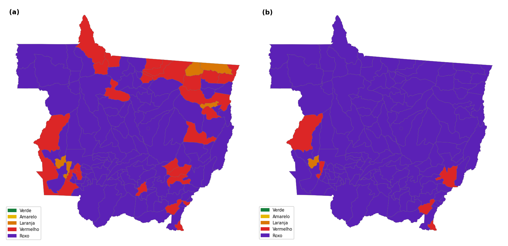
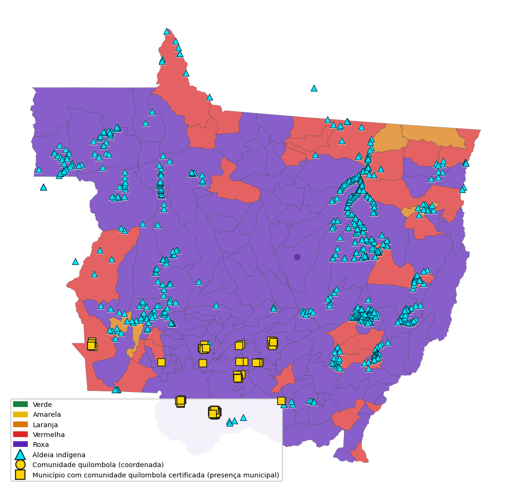

# RELATÓRIO SEMANAL EL NIÑO

**Sala de Situação do Centro de Informações Estratégicas em Vigilância em Saúde de Mato Grosso (CIEVS-MT)**

**Semana:** SE 37/2026 · **Gerado em:** 19/09/2026 às 10h15
**Perfil:** executivo (Secretário e gestores) · **Anexo técnico da SE 37/2026** (boletim completo da Sala)

**Base normativa:** Portaria nº 0590/2026/GBSES.

**Novos atos relevantes desde a última rodada**

Sem novos atos climáticos relevantes nesta rodada.

_Siglas (primeira ocorrência): Análise, Resposta e Acompanhamento de Riscos, Agravos e Saúde (ARARAS); El Niño–Oscilação Sul (ENSO); agosto–setembro–outubro (ASO); temperatura máxima (Tmáx); material particulado fino com diâmetro aerodinâmico de até 2,5 micrômetros (PM2,5); Atenção Primária à Saúde (APS); Secretaria de Estado de Saúde de Mato Grosso (SES-MT); Sistema Único de Saúde (SUS); Instituto Nacional de Pesquisas Espaciais (INPE); Centro Nacional de Monitoramento e Alertas de Desastres Naturais (CEMADEN); Centro de Informações Estratégicas em Vigilância em Saúde de Mato Grosso (CIEVS-MT)._

---

## 1. Síntese executiva

**Quadro 1 – Síntese dos riscos e sinais monitorados na SE 37/2026**

| RISCO ATUAL | PROJEÇÃO ~7 DIAS | CALOR |
| --- | --- | --- |
| **12/142** vermelho ou roxo | **141/142** vermelho ou roxo | pico da janela observada **40,2 °C** |
| 8,5% do estado | 83 em agravamento · 83 com +2 níveis ou mais | hoje/rodada **12 de 142 (8,5%)** ≥ 37 °C · janela **77 de 142 (54,2%)** ≥ 37 °C |

| UMIDADE | FOGO | QUALIDADE DO AR |
| --- | --- | --- |
| **1 de 142 (0,7%)** ≤ 30% | **378** focos de calor | **12 de 142 (8,5%)** ≥ 25 µg/m³ |
| mediana 36% | 7 dias · 51 municípios | máximo 42,7 µg/m³ |

Fontes: ARARAS MT/CIEVS-MT; Instituto Nacional de Meteorologia (INMET); Instituto Nacional de Pesquisas Espaciais (INPE)/Programa Queimadas; Centro Nacional de Monitoramento e Alertas de Desastres Naturais (CEMADEN); IndicaSUS/SIEGES, conforme respectivas datas de corte da rodada.

**Atual:** 12 de 142 (8,5%) municípios em vermelho ou roxo.

**Projeção ~7 dias:** 141 de 142 (99,3%) em vermelho ou roxo.

**Agravamento de classe:** 83 de 142 municípios (0 +1 nível; 83 +2 ou mais).

**Estabilidade / melhora:** 12 estáveis · 0 em melhora.

**Principal driver:** térmico (temperatura máxima projetada e persistência de calor).

**Exposições/alertas concomitantes:** hoje/rodada Tmáx ≥ 37 °C em 12 de 142 (8,5%); janela observada ≥ 37 °C em 77 de 142 (54,2%); PM2,5 ≥ 25 µg/m³ em 12 de 142 (8,5%); 378 focos de calor em 7 dias.

Fonte: ARARAS MT/CIEVS-MT, rodada de 19/09/2026 às 10h15.

---

## 2. Situação atual e projeção ~7 dias

- **ENSO / ASO (contexto):** conforme painel oficial · calor e estiagem no radar operacional.
- Distribuição atual: verde 79; amarela 3; laranja 1; vermelha 0; roxa 12 (142 municípios).
- Críticos agora: **12 de 142 (8,5%)** vermelho ou roxo.
- Projetado ~7 dias: **141 de 142 (99,3%)** vermelho ou roxo (verde 0; amarela 0; laranja 1; vermelha 2; roxa 139).
- Agravamento: **83** (0 +1 nível; **83** +2 ou mais) · estabilidade **12** · melhora **0**.
- Classe projetada: **térmica** (com freio se tendência de esfriamento). RIT é produto paralelo observado.

**Mapa 1 – Classificação ARARAS atual e projeção operacional de aproximadamente sete dias em Mato Grosso**

Fonte: ARARAS MT/CIEVS-MT, rodada de 19/09/2026 às 10h15.

Nota: A classe projetada é térmica (com freio sob tendência de esfriamento). O RIT é produto paralelo observado e não alimenta esta projeção.

### Como a classe projetada é calculada

A projeção operacional (~7 dias) usa score térmico 0–100 (máximo entre intensidade, *Universal Thermal Climate Index* (UTCI), risco cumulativo e onda P95), com freio se a tendência de Tmáx indicar esfriamento.

**A. Drivers que entram no modelo:** Tmáx prevista, UTCI previsto, risco cumulativo de calor e onda P95 no horizonte — sem EHF, fumaça/PM2,5 ou pressão assistencial como entrada matemática nesta versão.

### RIT (síntese)

**RIT (Risco Integrado Territorial)** — leitura observada multidomínio; **não** equivale à classificação operacional ARARAS enquanto não houver regra validada de completude mínima.

- Faixa vermelha ou roxa no RIT: **13 de 142 (9,2%)**.
- Completude mediana dos domínios: **50%**.
- **Ar/PM2,5** como domínio dominante: **0 de 142 (0,0%)**.
- **Fragilidade de rede** (100−IRM) como domínio dominante: **129 de 142 (90,8%)** (destes em vermelha ou roxa: **0 de 129 (0,0%)**). IRM alto não eleva o RIT.
- **Domínio pressão assistencial omitido do RIT por defasagem** em **142** municípios (limite 14 dias) — métrica distinta do indicador composto pressão × resiliência/IRM (capacidade de rede).
- Top 10 municipal, quadro por domínio dominante e metodologia: **Anexo técnico**.

Fonte: classificação ARARAS MT / RIT, rodada de 19/09/2026 às 10h15.

---

## 3. Exposições ambientais e alertas oficiais

### Cenários da rodada (situação e impacto)

**Calor**
- Situação — **hoje/rodada:** 12 de 142 (8,5%) ≥ 37 °C; **janela observada:** 77 de 142 (54,2%) atingiram ≥ 37 °C; pico da janela observada **40,2 °C**.
- Impacto à saúde: risco de desidratação, agravos relacionados ao calor e sobrecarga em vulneráveis.
- Áreas de atenção: municípios vermelho ou roxo e com agravamento projetado.

**Seca / estiagem**
- Situação: umidade ≤ 30% em 1 de 142 (0,7%) (mediana 36%).
- Impacto à saúde: agravamento de doenças respiratórias e estresse térmico.
- Áreas de atenção: regionais com maior concentração VR.

**Fumaça / qualidade do ar**
- Situação: PM2,5 ≥ 25 µg/m³ em 12 de 142 (8,5%); 378 focos em 7 dias.
- Impacto à saúde: irritação respiratória, Síndrome Respiratória Aguda Grave (SRAG) e agravos cardiorrespiratórios em sensíveis.
- Áreas de atenção: municípios com PM2,5 elevado e/ou focos concomitantes.

**Inundação**
- Situação: sem evidência municipal suficiente de inundação como gatilho nesta rodada.
- Impacto / áreas: não aplicável como prioridade da semana.

**Situação climática de referência (avisos vigentes):** 3 avisos INMET com validade contendo o horário de emissão deste relatório (INMET, 2026).

**CEMADEN:** nenhum alerta aberto em MT na consulta (CEMADEN, 2026).

**Síntese integrada de alertas:** classificação municipal disponível (SES-MT; CIEVS-MT, 2026).

### EHF / GeoCalor (observado)

- **Último dia da série (2026-09-15):** **0** municípios em dia de onda.
- **Na janela:** **0** municípios com evento de onda (≥ 3 dias consecutivos) · **0** eventos.
- Interpretação: monitoramento observado de onda de calor; **não** entra no cálculo da classe projetada ~7 dias. Tabela detalhada: Anexo técnico.

### Sazonalidade / associações

Análise exploratória identificou associação ecológica entre exposição térmica e indicadores de pressão; resultados não implicam causalidade e permanecem em validação. Detalhe (Odds Ratio/lags): Anexo técnico.

Fonte: alertas oficiais (INMET/CEMADEN) e bases ambientais ARARAS, rodada de 19/09/2026 às 10h15.

---

## 4. Repercussões em saúde e assistência

> **e-SUS APS — contexto estrutural**
>
> Última carga: **07/08/2026**. Defasagem: **42** dias. Não utilizado como pressão assistencial corrente.
>
> Cadastro (contexto): idosos 60+ **727.991** · gestantes **192.553** · asma **26.847**. Tabelas detalhadas: Anexo técnico.

- **SIM (exploratório):** módulo de mortalidade disponível no Anexo técnico; não utilizado como gatilho operacional nesta rodada.

### Assistência hospitalar e regulação

- **Ocupação estadual (IndicaSUS):** **60,0%** (3555 ocupados / 5929 elegíveis).

**Tabela 1 – Ocupação hospitalar ponderada por Regional de Saúde**

| Regional | Ocup. ponderada | Municípios |
| --- | --- | --- |
| Sinop | 76,4% | 15 |
| Baixada Cuiabana | 74,0% | 11 |
| Água Boa | 65,2% | 8 |
| Cáceres | 57,1% | 12 |
| Porto Alegre do Norte | 53,6% | 7 |

Fonte: IndicaSUS/SIEGES; ARARAS MT/CIEVS-MT, rodada de 19/09/2026 às 10h15.

**Tabela 2 – Municípios com maior ocupação hospitalar**

| Município | Ocupação |
| --- | --- |
| Sorriso | 90,1% |
| nan | 89,5% |
| Sinop | 89,0% |
| Cáceres | 87,9% |
| nan | 84,8% |
| nan | 81,7% |
| Nova Mutum | 78,2% |
| Rondonópolis | 78,1% |

Fonte: IndicaSUS/SIEGES; ARARAS MT/CIEVS-MT, rodada de 19/09/2026 às 10h15.

- **SISREG:** ranking omitido do corpo executivo — temporalidade da carga não explícita nesta rodada (detalhe no Anexo técnico).

### Convergência climática × assistência

Municípios em que **agravamento climático projetado** converge com **ocupação/pressão assistencial válida** e/ou **capacidade local limitada** devem ser priorizados pela Atenção à Saúde (lista operacional no painel; sem limiar novo sem validação institucional).

Fonte: bases operacionais SES-MT / SUS, quando disponíveis e com temporalidade explícita.

---

## 5. Priorização territorial e populações prioritárias

**Tabela 3 – Regionais de Saúde com maior concentração de municípios nas classes vermelha e roxa**

| Regional | VR | Total | Tendência ~7d |
| --- | --- | --- | --- |
| Sinop | 4 | 15 | ↑ 4 · → 4 |
| Baixada Cuiabana | 2 | 11 | ↑ 4 · → 2 |
| Rondonópolis | 2 | 19 | ↑ 12 · → 2 |
| Tangará da Serra | 1 | 10 | ↑ 7 · → 1 |
| Barra do Garças | 1 | 10 | ↑ 8 · → 1 |
| Cáceres | 1 | 12 | ↑ 5 · → 1 |

Fonte: ARARAS MT/CIEVS-MT, rodada de 19/09/2026 às 10h15.

**Destaques da rodada**

- **Rondonópolis:** maior quantidade de municípios com elevação projetada (**12**), conforme dataset da rodada.

**Tabela 4 – Municípios prioritários da rodada**

| Município | Classe | Regional |
| --- | --- | --- |
| Alta Floresta | roxa | Alta Floresta |
| Várzea Grande | roxa | Baixada Cuiabana |
| Lucas do Rio Verde | roxa | Sinop |
| Tangará da Serra | roxa | Tangará da Serra |
| Rondonópolis | roxa | Rondonópolis |
| Sinop | roxa | Sinop |
| Nova Mutum | roxa | Sinop |
| Primavera do Leste | roxa | Rondonópolis |

Fonte: ARARAS MT/CIEVS-MT, rodada de 19/09/2026 às 10h15.

Nota: Ordenação operacional da rodada; o índice numérico completo permanece no painel/Anexo técnico.

**Mapa 2 – Classificação ARARAS e territórios indígenas e quilombolas prioritários em Mato Grosso**

Fonte: elaboração CIEVS-MT/ARARAS MT, com dados da Fundação Nacional dos Povos Indígenas (FUNAI) e da Fundação Cultural Palmares. Rodada de 19/09/2026 às 10h15.

Nota: Aldeias são representadas por coordenadas georreferenciadas disponíveis. Para comunidades quilombolas sem coordenadas oficiais validadas, a representação indica presença municipal e não localização exata.

### Populações indígenas e tradicionais

- **Distrito Sanitário Especial Indígena (DSEI)/Secretaria Especial de Saúde Indígena (SESAI):** validar continuidade assistencial, transporte, referência e capacidade de resposta das aldeias em áreas com classe vermelha ou roxa + agravamento projetado + distância assistencial elevada.
- **FUNAI:** articulação territorial/institucional e apoio ao acesso — sem função de assistência clínica.
- Listas extensas: painel / Anexo técnico da SE.

Fonte: painel territorial ARARAS MT / CIEVS-MT.

---

## 6. Plano de ação da rodada

**Tabela 5 – Plano de ação da Sala de Situação para a SE 37/2026**

Matriz operacional única desta rodada (substitui orientações por cenário, recomendações sazonais, encaminhamentos e articulações dispersas).

| Responsável | Evidência / gatilho | Ação da rodada | Prazo | Produto esperado | Status |
| --- | --- | --- | --- | --- | --- |
| CIEVS-MT | 12 de 142 (8,5%) vermelho ou roxo; projeção 141 de 142 (99,3%); 83 em agravamento de classe | Consolidar lista única de municípios prioritários; validar determinantes; articular áreas responsáveis; acompanhar execução; atualizar cenário da Sala. Não executa assistência municipal. | 24–48 h | Matriz territorial + status das ações | Em andamento |
| Vigilância Epidemiológica / Laboratório Central de Saúde Pública (LACEN) | Exposições: calor, fumaça/PM2,5, fogo | Monitorar agravos compatíveis (calor/desidratação; SRAG/respiratórios se fumaça; Doença Diarreica Aguda (DDA)/leptospirose se inundação confirmada). Investigar sinais acima do padrão, não apenas contagens absolutas. | Até próxima Sala | Síntese epidemiológica dos sinais que requerem investigação | Pendente |
| Vigilância Ambiental / Vigidesastres | Alertas oficiais + fogo (378 focos/7d) + PM2,5 | Integrar alertas INMET/CEMADEN; validar sinais hidrológicos; acompanhar fumaça/PM2,5 e fogo; apoiar comunicação de risco ambiental; articular SEMA e Defesa Civil. | 24–72 h | Lista/mapa dos sinais ambientais validados | Pendente |
| Atenção à Saúde | Agravamento climático ∩ ocupação/pressão válida ∩ capacidade local | Cruzar prioridade territorial com ocupação, regulação, capacidade da rede e distância assistencial; indicar contingenciamento, referência, fluxos, transporte e suporte às Regionais/municípios onde os fatores convergem. | 24–48 h | Lista dos serviços/territórios que demandam ação | Pendente |
| Assistência Farmacêutica | Estoques críticos ainda sem validação institucional nesta rodada | VALIDAR situação dos insumos críticos. Somente após validação: identificar risco de ruptura, pactuar reposição/redistribuição/logística. Não redistribuir só por classe vermelha ou roxa. | Até próxima Sala | Situação validada dos insumos críticos | Validação |
| Regionais de Saúde | 12 de 142 (8,5%) vermelho ou roxo; projeção 141 de 142 (99,3%); 83 em agravamento de classe | Comunicar municípios prioritários; apoiar planos locais; verificar capacidade; consolidar necessidades; devolver status ao CIEVS. | 48 h | Retorno regional padronizado | Pendente |
| Secretarias Municipais de Saúde | Municípios em vermelho ou roxo e/ou agravamento projetado | Validar situação territorial; revisar fluxos APS/urgência; monitorar agravos; transporte sanitário; comunicação de risco; registrar medidas executadas. | 48–72 h | Status municipal / Plano de Ação atualizado | Pendente |
| Conselho de Secretarias Municipais de Saúde de Mato Grosso (COSEMS-MT) | Rodada da Sala / Portaria 0590 | Apoiar disseminação das recomendações; pactuar retorno dos municípios; identificar barreiras comuns. Não executa assistência direta. | Até próxima Sala | Retorno consolidado das barreiras municipais | Pendente |
| Secretaria de Estado de Meio Ambiente de Mato Grosso (SEMA-MT) | Qualidade do ar / fogo / dados ambientais | Compartilhar/validar qualidade do ar, dados ambientais e situação de fogo/incêndios; apoiar leitura ambiental integrada. | 24–72 h | Informação ambiental validada para a Sala | Pendente |
| Defesa Civil | Sinais de estiagem, tempestade ou inundação | Validar ocorrências e cenários de desastre; apoiar preparação/resposta municipal; informar ativações e necessidades operacionais. | Contínuo na rodada | Situação operacional de desastre / ativações | Pendente |
| Corpo de Bombeiros | Focos/incêndios (378 focos/7d) | Compartilhar incêndios ativos e resposta operacional; priorizar articulação nos territórios críticos; alimentar a Sala com situação de fogo. | 24–48 h | Situação operacional de fogo | Pendente |
| DSEI / SESAI | Territórios indígenas em VR + agravamento + distância assistencial elevada | Validar continuidade assistencial, transporte, referência e capacidade de resposta das aldeias em áreas prioritárias; comunicação adaptada. | 48 h | Status dos territórios indígenas prioritários | Pendente |
| FUNAI | Territórios indígenas prioritários da rodada | Articulação territorial/institucional e apoio ao acesso. Não atribui função de assistência clínica. | Até próxima Sala | Apoio territorial/institucional registrado | Pendente |
| Centro de Referência em Saúde do Trabalhador (CEREST) / Vigilância em Saúde do Trabalhador (VISAT) | Calor/fumaça em territórios críticos (calor, fumaça/PM2,5, fogo) | Identificar setores/trabalhadores expostos; monitorar agravos relacionados ao trabalho; emitir orientação técnica conforme protocolos. | Até próxima Sala | Orientação técnica / setores expostos mapeados | Pendente |
| Gestão de Pessoas SES-MT | Equipes próprias em campo sob calor/fumaça | Revisar proteção das equipes próprias em campo; acompanhar implementação das medidas. | Até próxima Sala | Status das medidas de proteção às equipes | Pendente |

Fonte: Portaria SES-MT nº 0590/2026/GBSES e governança da Sala de Situação.

Nota: Órgãos de monitoramento (INMET, CEMADEN, INPE, Agência Nacional de Águas e Saneamento Básico (ANA), Serviço Geológico do Brasil (SGB)) são fontes oficiais de informação/alerta e não executam tarefas internas da SES.

---

## 7. Conclusão

- Atual: **12 de 142 (8,5%)** em vermelho ou roxo.
- Projeção ~7 dias: **141 de 142 (99,3%)** em vermelho ou roxo.
- Agravamento de classe: **83** municípios (0 +1; 83 +2 ou mais).
- Estabilidade: **12** · melhora: **0**.
- Driver predominante: **térmico**.
- Ação prioritária 24–48 h: CIEVS consolidar lista única de prioritários, validar determinantes e articular o Plano de ação da rodada.

---

## REFERÊNCIAS

ASSOCIAÇÃO BRASILEIRA DE NORMAS TÉCNICAS. ABNT NBR 10719: informação e documentação — relatório técnico e/ou científico — apresentação. 2. ed. Rio de Janeiro: ABNT, 2015.

ASSOCIAÇÃO BRASILEIRA DE NORMAS TÉCNICAS. ABNT NBR 14724:2024: informação e documentação — trabalhos acadêmicos — apresentação. Rio de Janeiro: ABNT, 2024.

ASSOCIAÇÃO BRASILEIRA DE NORMAS TÉCNICAS. ABNT NBR 6023:2025: informação e documentação — referências — elaboração. Rio de Janeiro: ABNT, 2025.

CENTRO NACIONAL DE MONITORAMENTO E ALERTAS DE DESASTRES NATURAIS. Painel de alertas. Cachoeira Paulista: CEMADEN, 2026. Disponível em: https://painelalertas.cemaden.gov.br/. Acesso em: 19 set. 2026.

FUNDAÇÃO NACIONAL DOS POVOS INDÍGENAS; FUNDAÇÃO CULTURAL PALMARES; SECRETARIA DE ESTADO DE SAÚDE DE MATO GROSSO. ARARAS MT: base integrada de povos e comunidades tradicionais (aldeias indígenas e comunidades quilombolas certificadas). Cuiabá: SES-MT, 2026. Base de dados institucional.

FUNDAÇÃO OSWALDO CRUZ; SECRETARIA DE ESTADO DE SAÚDE DE MATO GROSSO. Monitoramento de ondas de calor — metodologia GeoCalor / Excess Heat Factor (EHF). Cálculo estadual ARARAS MT. Cuiabá: SES-MT, 2026. Base de dados institucional.

INSTITUTO NACIONAL DE METEOROLOGIA. Avisos meteorológicos — feed RSS Alert-AS. Brasília: INMET, 2026. Disponível em: https://apiprevmet3.inmet.gov.br/avisos/rss. Acesso em: 19 set. 2026.

INSTITUTO NACIONAL DE METEOROLOGIA; INSTITUTO NACIONAL DE PESQUISAS ESPACIAIS; AGÊNCIA NACIONAL DE ÁGUAS E SANEAMENTO BÁSICO; CENTRO NACIONAL DE MONITORAMENTO E ALERTAS DE DESASTRES NATURAIS; SERVIÇO GEOLÓGICO DO BRASIL; SECRETARIA NACIONAL DE PROTEÇÃO E DEFESA CIVIL; CENTRO GESTOR E OPERACIONAL DO SISTEMA DE PROTEÇÃO DA AMAZÔNIA. Painel El Niño 2026–2027: boletim mensal n.º 02 — julho de 2026. Brasília: INMET/INPE, jul. 2026.

INSTITUTO NACIONAL DE PESQUISAS ESPACIAIS. Programa Queimadas / BDQueimadas. Portal de monitoramento de focos de calor. São José dos Campos: INPE, 2026. Disponível em: https://terrabrasilis.dpi.inpe.br/queimadas/portal/. Acesso em: 19 set. 2026.

MATO GROSSO. Secretaria de Estado de Saúde. Portaria n.º 0590/2026/GBSES: dispõe sobre a instituição da Sala de Situação em Saúde para preparação, monitoramento e resposta aos impactos do El Niño 2026-2027 e de eventos climáticos extremos no âmbito da Secretaria de Estado de Saúde de Mato Grosso e define sua composição, governança, competências e produtos. Cuiabá: SES-MT, 2026. Protocolo 1843437.

SECRETARIA DE ESTADO DE SAÚDE DE MATO GROSSO. e-SUS Atenção Primária à Saúde (APS) — centralizador PEC/eSUS. Cuiabá: SES-MT, 2026. Base de dados institucional.

SECRETARIA DE ESTADO DE SAÚDE DE MATO GROSSO. IndicaSUS / SIEGES — ocupação hospitalar e indicadores assistenciais. Cuiabá: SES-MT, 2026. Base de dados institucional.

SECRETARIA DE ESTADO DE SAÚDE DE MATO GROSSO; CENTRO DE INFORMAÇÕES ESTRATÉGICAS EM VIGILÂNCIA EM SAÚDE DE MATO GROSSO. ARARAS MT — Análise, Resposta e Acompanhamento de Riscos, Agravos e Saúde. Cuiabá: SES-MT, 2026. Base de dados institucional.

---

## Anexo técnico

Documento completo da mesma semana: **Anexo técnico da SE 37/2026**.

Inclui, entre outros: metodologia completa; RIT (Top 10 e composição); EHF detalhado; Odds Ratio/lags; SIM; e-SUS detalhado; séries históricas; tabelas ampliadas; mapas adicionais; atos normativos completos.