# RELATÓRIO SEMANAL EL NIÑO

**Sala de Situação do Centro de Informações Estratégicas em Vigilância em Saúde de Mato Grosso (CIEVS-MT) · Análise, Resposta e Acompanhamento de Riscos, Agravos e Saúde (ARARAS MT)**

Semana Epidemiológica 38/2026 · 20 a 26 de setembro de 2026  
Atualizado em 20/09/2026 às 10h51

Referência climática: Painel El Niño 2026–2027, Boletim Mensal n.º 02, julho de 2026, e produtos oficiais de monitoramento climático, meteorológico, ambiental e hidrológico.  
Referência operacional: ARARAS MT, rodada de 20/09/2026 às 10h51.  
Base normativa: Portaria n.º 0590/2026/GBSES.

### Atos oficiais correlatos (decretos e portarias)

*A existência de ato oficial não implica ativação automática do Plano El Niño nem substitui a classificação operacional clima–saúde.*

**Atos climáticos validados (estiagem, fogo, El Niño / Sala de Situação)**

- **[Decreto n.º 2.015/2026 (28/04/2026)](https://www.iomat.mt.gov.br/portal/edicoes/download/19059)**: Emergência ambiental, período proibitivo de queimadas e Sala de Situação ambiental.
- **[Portaria n.º 0590/2026/GBSES](https://www.iomat.mt.gov.br/portal/edicoes/download/19279)**: Institui a Sala de Situação em Saúde (El Niño 2026–2027 e extremos climáticos).
- **[IN conjunta SEMA/CBM-MT n.º 03/2026](https://www.iomat.mt.gov.br/portal/edicoes/download/19279)**: Aceiros no Pantanal durante a emergência ambiental do Decreto 2.015/2026.
- **[Várzea Grande — Decreto n.º 76/2026](https://amm.diariomunicipal.org/publicacao/1881872/)** (Várzea Grande): SE por estiagem (COBRADE 1.4.1.1.0), 180 dias.
- **[Jangada — Decreto n.º 009/2026](https://amm.diariomunicipal.org/publicacao/1893422/)** (Jangada): SE por incêndios florestais e queimadas (ato inicial).
- **[Jangada — Decreto n.º 010/2026](https://amm.diariomunicipal.org/publicacao/1894424/)** (Jangada): SE por incêndios florestais/queimadas (COBRADE 1.4.1.3.2).

**Homologações estaduais por extremos hídricos (clima — eixo secundário)**

_Chuvas intensas / alagamento. Não substituem o decreto municipal nem o eixo seco/fogo._

- **[Mirassol d’Oeste — Decreto estadual n.º 2.163/2026](https://www.iomat.mt.gov.br/portal/edicoes/download/19132)** (Mirassol d’Oeste): Homologação de SE municipal por chuvas intensas.
- **[Chapada dos Guimarães — Decreto estadual n.º 1.988/2026](https://www.iomat.mt.gov.br/portal/edicoes/download/19044)** (Chapada dos Guimarães): Homologação de SE municipal por chuvas intensas.
- **[Primavera do Leste — Decreto estadual n.º 1.987/2026](https://www.iomat.mt.gov.br/portal/edicoes/download/19044)** (Primavera do Leste): Homologação de SE municipal por alagamento.
- **[Rosário Oeste — Decreto estadual n.º 1.945/2026](https://www.iomat.mt.gov.br/portal/edicoes/download/18981)** (Rosário Oeste): Homologação de SE municipal por chuvas intensas.

_Busca IOMAT consultada nesta rodada; nenhum ato climático adicional distinto da lista validada entrou no recorte de exibição._

Nota: a projeção operacional de aproximadamente 7 dias **não substitui** a previsão climática sazonal. Os produtos possuem objetivos e horizontes temporais distintos.

| RISCO ATUAL | PROJEÇÃO ~7 DIAS | CALOR |
| --- | --- | --- |
| **138/142** vermelho ou roxo | **141/142** vermelho ou roxo | pico semana **40,2 °C** |
| 97,2% do estado | agravamento disseminado | **0** ≥ 41 °C · **1** ≥ 40 °C · **43 de 142 (30,3%)** ≥ 37 °C (janela) |

| UMIDADE | FOGO | QUALIDADE DO AR |
| --- | --- | --- |
| **2 de 142 (1,4%)** ≤ 30% | **370** focos de calor | **9 de 142 (6,3%)** ≥ 25 µg/m³ |
| mediana 56% | Satélite de referência do Programa Queimadas · 7 dias · 48 municípios · 28.409 detecções multi-satélite | máximo 65,5 µg/m³ |

| RIT MULTIRISCO | MODELO ~7 DIAS |
| --- | --- |
| **139/142** faixa vermelha ou roxa · completude mediana 67% | classe projetada **térmica** |
| Observado (máx. entre domínios válidos) · ar dominante **0** · rede/fragilidade **0** | Não incorpora IRM como elevador — só fragilidade |

---

## 1. Leitura executiva da semana

**Situação:** 138 de 142 (97,2%) nas classes vermelha e roxa (verde 0; amarela 1; laranja 3; vermelha 24; roxa 114). **Projeção ~7 dias:** 141 de 142 (99,3%) nas classes vermelha e roxa — agravamento disseminado. **Drivers da escalada (modelo):** temperatura máxima (Tmáx) prevista, *Universal Thermal Climate Index* (UTCI), risco cumulativo e onda P95 (persistência térmica projetada) — **não** o EHF. **EHF/GeoCalor não entra no cálculo da classe projetada**; é monitoramento observado separado. **RIT (Risco Integrado Territorial):** leitura observada multidomínio (máx. entre térmico, ar, hidro, EHF, pressão fresca e fragilidade de rede/IRM) — **paralelo** à projeção ~7d térmica; ver bloco na seção 4. **Exposição térmica na rodada:** Tmáx ≥ 37 °C em 25 de 142 (17,6%). **Qualidade do ar (contexto concomitante, não driver do modelo):** material particulado fino com diâmetro aerodinâmico de até 2,5 micrômetros (PM2,5) ≥ 25 µg/m³ em 9 de 142 (6,3%) (máx. 65,5 µg/m³). **Vulneráveis (e-SUS Atenção Primária à Saúde (APS)):** idosos 60+ **727.991** · gestantes **192.553** · asma **26.847** · **130** municípios classes vermelha e roxa com cadastro. Priorizar também povos indígenas e quilombolas nos territórios críticos.

**Implicação.** Manter vigilância e capacidade assistencial nos prioritários (calor + fumaça/PM2,5 + ar seco). Manter prontidão na projeção ~7d e priorizar vulneráveis (idosos, gestantes, asma, povos indígenas e quilombolas) nos vermelhos/roxos.

**Prioridades imediatas**

- Vigilância de agravos por calor/fumaça nos vermelhos/roxos.
- Capacidade assistencial e insumos onde Tmáx ≥ 37 °C ou PM2,5 ≥ 25 µg/m³.
- Articular regionais, Distrito Sanitário Especial Indígena (DSEI)/Secretaria Especial de Saúde Indígena (SESAI) e Saúde do Trabalhador nos prioritários.
- Priorizar APS e vulneráveis (idosos 60+, gestantes, asma, povos indígenas e quilombolas) nos municípios classes vermelha e roxa; manter prontidão na projeção ~7d.

---

## 2. Cenário El Niño

**El Niño confirmado desde 11/06/2026.** Niño 3.4: 1,4 °C (semanas anteriores). Persistência forte até o fim de 2026 (APEC Climate Center (APCC)/National Oceanic and Atmospheric Administration (NOAA) — Painel El Niño n.º 02).

Fonte: Painel El Niño 2026–2027, boletim n.º 02, jul. 2026.

---

## 3. Cenário sazonal — previsão oficial e comparação operacional

Trimestre agosto–setembro–outubro (ASO)/2026 (Centro de Previsão de Tempo e Estudos Climáticos (CPTEC)/Instituto Nacional de Pesquisas Espaciais (INPE)–Instituto Nacional de Meteorologia (INMET)–Fundação Cearense de Meteorologia e Recursos Hídricos (FUNCEME)). Escalas distintas: **previsão sazonal** ≠ **observação semanal** ARARAS.

### Cenário nacional / regional `PREVISÃO OFICIAL`

- **Precipitação:** Abaixo da média no centro-norte (Norte, Nordeste e grande parte do Centro-Oeste); acima da média no Sul.
- **Temperatura:** Acima da média em praticamente todo o país — ondas de calor, baixa umidade e maior potencial de queimadas.

### Implicações para Mato Grosso

- **Chuva em MT:** Centro-norte abaixo da média climatológica; extremo sul com sinal de pancadas irregulares ainda na estiagem (acumulados baixos típicos de ago–set).
- **Temperatura em MT:** Acima da média no estado, com atraso da estação chuvosa no norte/centro e persistência de calor no trimestre ASO.

_Leitura: norte/centro com sinal de estiagem e atraso da transição chuvosa; extremo sul com pancadas irregulares possíveis — ver narrativa Amazônia Legal no Painel El Niño oficial._

### Comparação operacional — situação atual × baseline recente

### Cenário climático e comparação histórica — 13/09 a 19/09/2026

**Mensagem operacional:** no período de 13/09 a 19/09/2026, os indicadores ambientais avaliados permaneceram, em conjunto, dentro da variabilidade histórica esperada para esta época do ano (**|z| < 1** no critério operacional de calor/estiagem). Apesar disso, permanece relevante a previsão sazonal de temperaturas acima da média e irregularidade das chuvas, exigindo manutenção da vigilância para calor, baixa umidade, queimadas e seus impactos sobre a saúde. Nota: UTCI médio (z=-1.78) ficou mais ameno que o baseline — desvio estatístico, sem sinal de anomalia de calor na semana.

Baseline operacional recente **2021–2025**: **30** de **35** observações diárias disponíveis (7 dias × 5 anos) após controle de qualidade/completude.

> A comparação operacional semanal **não substitui** a previsão climática sazonal.

**Indicadores-chave (baseline operacional recente)**

| Indicador | Atual | Baseline | Δ | z |
|---|---:|---:|---:|---:|
| Tmáx média (°C) | 33.9 | 34.7 | -0.8 | -0.40 |
| UTCI médio | 33.0 | 36.0 | -3.0 | -1.78 |
| Umidade média (%) | 61.0 | 55.8 | +5.3 | +0.56 |
| Precipitação média (mm) | 0.8 | 1.4 | -0.6 | -0.38 |

**Semáforo:** [VERDE] temperatura · [VERDE] UTCI · [VERDE] umidade · [VERDE] chuva · [AMARELO] perspectiva sazonal · [AMARELO] risco sanitário (PM2,5/focos/epi)

**Saúde:** sem anomalia expressiva de calor no agregado semanal; manter vigilância integrada (respiratório, cardiovascular, fumaça/PM2,5, urgência/internações).

Detalhamento técnico (todos os indicadores, mês, YTD, Q&amp;A)

**Comparação operacional — janela 13/09–19/09/2026**

**Mensagem operacional:** no período de 13/09 a 19/09/2026, os indicadores ambientais avaliados permaneceram, em conjunto, dentro da variabilidade histórica esperada para esta época do ano (**|z| < 1** no critério operacional de calor/estiagem). Apesar disso, permanece relevante a previsão sazonal de temperaturas acima da média e irregularidade das chuvas, exigindo manutenção da vigilância para calor, baixa umidade, queimadas e seus impactos sobre a saúde. Nota: UTCI médio (z=-1.78) ficou mais ameno que o baseline — desvio estatístico, sem sinal de anomalia de calor na semana.

Janela observada (13/09/2026 a 19/09/2026) frente aos **mesmos dias do calendário** no baseline operacional recente (**2021, 2022, 2023, 2024, 2025**).
Baseline operacional recente **2021–2025**: **30** de **35** observações diárias disponíveis (7 dias × 5 anos) após controle de qualidade/completude.

_Critério: |z| ≥ 1 = desvio relevante frente ao baseline operacional recente (série ~5 anos). Não mistura meses diferentes. **Não substitui** climatologia oficial de longo prazo (INMET/INPE)._

> **Atenção à interpretação:** a comparação operacional semanal **não substitui** nem invalida a previsão climática sazonal. Uma semana dentro ou abaixo do padrão pode ocorrer dentro de um mês/trimestre com tendência de temperaturas acima da média.

- **Tmáx média (°C):** 33.9 agora vs 34.7 no baseline operacional recente (Δ -0.8; z=-0.40).
- **Tmáx máxima (°C):** 40.2 agora vs 40.4 no baseline operacional recente (Δ -0.2; z=-0.27).
- **Tmín média (°C):** 21.7 agora vs 22.2 no baseline operacional recente (Δ -0.5; z=-0.49).
- **Amplitude térmica média (°C):** 12.2 agora vs 12.6 no baseline operacional recente (Δ -0.3; z=-0.22).
- **UTCI médio:** 33.0 agora vs 36.0 no baseline operacional recente (Δ -3.0; z=-1.78).
- **Umidade média (%):** 61.0 agora vs 55.8 no baseline operacional recente (Δ +5.3; z=+0.56).
- **Precipitação média (mm):** 0.8 agora vs 1.4 no baseline operacional recente (Δ -0.6; z=-0.38).

**Anexo técnico — indicadores complementares**
- **Precipitação acumulada (mm):** 5.5 agora vs 8.3 (Δ -2.8; z=-0.47).
- **Risco cumulativo 3d:** 14.1 agora vs 3.1 (Δ +10.9; z=+9.60).
_Desvios no anexo (|z|≥1):_ Risco cumulativo 3d.

_Nota umidade relativa (UR):_ a umidade **média** diária é pouco sensível ao risco sanitário da tarde. Para vigilância, preferir UR mínima, horas com UR < 30%/20%, dias consecutivos abaixo do limiar e combinação temperatura × UR × fumaça/PM2,5.

_Nota chuva:_ média diária isolada diz pouco sobre estiagem/queimadas. Priorizar acumulados 7/14/30/60/90d, dias sem chuva, percentil histórico e SPI/SPEI quando disponíveis (KPIs P1 do ARARAS).

**Semáforo analítico — 13/09 a 19/09/2026**

- **[VERDE] Temperatura:** dentro do padrão recente (sem anomalia de calor no agregado)
- **[VERDE] Estresse térmico (UTCI):** dentro do padrão recente ou mais ameno que o baseline
- **[VERDE] Umidade média:** sem anomalia crítica de ar seco no agregado semanal
- **[VERDE] Precipitação semanal:** dentro da variabilidade recente ou acima do baseline
- **[AMARELO] Perspectiva:** manutenção da vigilância pela previsão sazonal (calor, irregularidade das chuvas, potencial de queimadas)
- **[AMARELO] Risco sanitário:** integrar PM2,5, focos de calor e indicadores epidemiológicos/assistenciais (Síndrome Respiratória Aguda Grave (SRAG), urgência, internações)

**O que este cenário representa para a saúde?**

- **Situação ambiental atual:** temperatura e estresse térmico sem anomalia expressiva de calor no agregado semanal; umidade média relativamente superior ao baseline recente; precipitação ainda baixa/irregular no contexto de estiagem.
- **Impactos sob vigilância:** SRAG/sintomas respiratórios; exacerbação de asma/Doença Pulmonar Obstrutiva Crônica (DPOC); desidratação; agravos cardiovasculares; atendimentos de urgência; internações; exposição à fumaça/PM2,5; pressão assistencial.
- **Conclusão:** a distinção entre **situação observada agora** e **risco prospectivo** (previsão sazonal) deve orientar a Sala de Situação — monitoramento ativo e integração clima–saúde no ARARAS MT.

**Leitura sazonal — setembro/2026 (mesmo mês em anos anteriores)**

Comparamos o que já se observou em setembro/2026 com o **mesmo mês** nos anos anteriores da série operacional (2021, 2022, 2023, 2024, 2025).

**Houve desvio de sazonalidade?** **Sim** — houve desvio sazonal relevante em **2** variável(eis): UTCI médio; Risco cumulativo 3d.

_Critério: |z| ≥ 1 = desvio relevante frente ao padrão do mesmo mês. Série operacional ARARAS — não substitui climatologia oficial (INMET/INPE)._

**Variáveis com desvio:**
- **UTCI médio:** 34.0 agora vs média 36.2 nos setembros anteriores (mais ameno que o padrão do período; z=-1.35).
- **Risco cumulativo 3d:** 7.5 agora vs média 3.2 nos setembros anteriores (risco térmico acima do padrão do período; z=+2.64).

**Variáveis no padrão esperado do mês:**
- **Tmáx média (°C):** 33.5 vs média 34.9 (z=-0.74).
- **Tmáx máxima (°C):** 41.2 vs média 41.0 (z=+0.21).
- **Tmín média (°C):** 21.8 vs média 22.3 (z=-0.44).
- **Amplitude térmica média (°C):** 11.7 vs média 12.7 (z=-0.50).
- **Umidade média (%):** 64.3 vs média 53.8 (z=+0.86).
- **Precipitação média (mm):** 1.6 vs média 1.1 (z=+0.32).
- **Precipitação acumulada (mm):** 30.4 vs média 29.9 (z=+0.03).

**Acumulado do ano (YTD) — 01/01/2026 a 19/09/2026**

Mesmo intervalo calendário (1º jan → 19/09) nos anos **2022, 2023, 2024, 2025** (1049 dias históricos).

_Critério: |z| ≥ 1 = desvio relevante. Não mistura meses fora do intervalo._

- **Tmáx média (°C):** 31.1 em 2026 vs 31.1 no mesmo YTD histórico (Δ -0.0; z=-0.05).
- **Tmáx máxima (°C):** 41.4 em 2026 vs 40.6 no mesmo YTD histórico (Δ +0.8; z=+0.94).
- **Tmín média (°C):** 21.0 em 2026 vs 20.5 no mesmo YTD histórico (Δ +0.5; z=+1.54).
- **Amplitude térmica média (°C):** 10.1 em 2026 vs 10.6 no mesmo YTD histórico (Δ -0.5; z=-1.88).
- **UTCI médio:** 32.9 em 2026 vs 32.9 no mesmo YTD histórico (Δ +0.0; z=+0.11).
- **Umidade média (%):** 73.2 em 2026 vs 69.1 no mesmo YTD histórico (Δ +4.1; z=+1.61).
- **Precipitação média (mm):** 3.6 em 2026 vs 3.3 no mesmo YTD histórico (Δ +0.3; z=+1.00).
- **Precipitação acumulada (mm):** 938.6 em 2026 vs 864.4 no mesmo YTD histórico (Δ +74.2; z=+1.00).
- **Risco cumulativo 3d:** 1.6 em 2026 vs 1.0 no mesmo YTD histórico (Δ +0.6; z=+1.83).

**Variáveis com desvio no YTD (|z|≥1):**
- **Tmín média (°C):** acima do padrão do período.
- **Amplitude térmica média (°C):** menor amplitude térmica (dia/noite) que o padrão do período.
- **Umidade média (%):** mais úmido que o esperado para o período.
- **Precipitação média (mm):** mais chuvoso que o padrão do período.
- **Precipitação acumulada (mm):** mais chuvoso que o padrão do período.
- **Risco cumulativo 3d:** risco térmico acima do padrão do período.

**Perguntas frequentes — El Niño × clima operacional (MT)**

_Comparação com o **mesmo período do calendário** na série operacional ARARAS (~5 anos). Não prova que o El Niño *causou* o desvio; situa 2026 no cenário El Niño–Oscilação Sul (ENSO) da rodada. Não substitui climatologia oficial (INMET/INPE). Critério: |z| ≥ 1._

**1. Este ano está mais quente?** **Não** — a temperatura fica no padrão do mesmo período (32.9 vs 32.9 no mesmo período; Δ +0.0; z=+0.11).

**2. Este ano choveu mais?** **Sim** — o acumulado de chuva no YTD está acima do padrão do mesmo intervalo em anos anteriores (938.6 vs 864.4; Δ +74.2; z=+1.00).

**3. As chuvas desta época do ano são comuns?** **Não** — a chuva desta época está dentro do padrão esperado para o período (30.4 vs 29.9 no mesmo período; Δ +0.5; z=+0.03).

**Amplitude térmica (dia/noite):** **Sim** — amplitude menor que o padrão (10.1 vs 10.6; Δ -0.5; z=-1.88).

**4. Como isso se situa no cenário ENSO / El Niño?** No ano sob cenário **El Niño confirmado (NOAA, 11/06/2026) · 1,4 °C (semanas anteriores ao boletim) · Forte, com alta probabilidade de muito forte (anomalia Temperatura da Superfície do Mar (TSM) > 2,0 °C) na primavera/verão 2026**, a série operacional acima descreve o comportamento de calor e chuva frente aos mesmos períodos em anos anteriores. A atribuição causal ao El Niño exige análise climática oficial (INMET/INPE/CPTEC) — o ARARAS apenas contextualiza a vigilância em saúde.

**Qualidade do ar (série estadual)**

PM2,5 média 9.9 µg/m³ (máximo 13.8 µg/m³; 8 dias na série).

**KPIs da sala (Prioridade 1) — estiagem, calor acumulado, excesso epi, fumaça**

_SPI proxy = z-score do acumulado 30/90 dias vs mesmos dias do calendário na série operacional (~5 anos). Não substitui Monitor de Secas / INMET. Farrington simplificado = casos da SE acima de média+1,96·dp da mesma SE em anos anteriores._

- **Estiagem (SPI proxy 30d, ref. 2026-09-19):** 0.0% municípios com SPI≤−1,0 (0 mun.); SPI≤−1,5: 0.0% (0 mun.); mediana SPI 0.72.
- **Estiagem (SPI proxy 90d):** 0.0% com SPI≤−1,0 (0 mun.); SPI≤−1,5: 0.0%.
- **Dias de calor extremo YTD** (Tmáx≥37.0 °C ou UTCI≥38.0): média municipal 6.5 dias vs média histórica YTD 7.0 dias (Δ -0.5); 18.3% dos municípios com ≥15 dias; 32.4% acima do próprio histórico YTD.
- **Excesso epidemiológico SRAG** (SE 38/2026 [baseline_8se_mesmo_ano]): 0 municípios acima do limiar 95% (0.0%); 0 em alerta por 2 semanas; casos: 25.
- **Excesso epidemiológico Dengue** (SE 38/2026 [baseline_8se_mesmo_ano]): 7 municípios acima do limiar 95% (35.0%); 0 em alerta por 2 semanas; casos: 197.
- **Exposição à fumaça (0–100):** mediana 11.4; 4.2% municípios com score ≥50 (6 mun.); gap nebulização nos prioritários: 100.0%.

_Fonte: painel ARARAS MT. Baseline operacional recente (~5 anos) **não substitui** climatologia oficial de longo prazo._

### Sazonalidade e Odds Ratio (ARARAS)

Análise **ecológica** (município como unidade): padrão histórico e chance relativa entre grupos mais vs menos expostos. **Não prova causalidade individual.**

- **Mês de pico sazonal (histórico):** Out (índice 1.33; >1 = acima da média do período).
- **Mês de menor carga histórica:** Jan (índice 0.89).
- **OR significativos (p<0,05):** 0 de 104 pares · **lags significativos:** 0.
- **Cobertura climática na análise:** 25/26 variáveis (Open-Meteo + Copernicus/CAMS + derivados), quando disponíveis.

Nenhum OR com p<0,05 nesta rodada (ou amostra insuficiente para teste de Fisher).

#### Lags clima→desfecho (Pearson R e Spearman ρ; top por |ρ|)

_Nenhum lag com p<0,05 nesta rodada; abaixo os pares de maior |ρ| (exploratório)._

- **Tmín (°C) → casos srag** (lag 7 d): Pearson R=+0.19 · Spearman ρ=+0.21 · p=0.057 · n=78
- **Risco cumulativo 3d → casos srag** (lag 6 d): Pearson R=+0.12 · Spearman ρ=+0.21 · p=0.0596 · n=78
- **Tmáx (°C) → casos srag** (lag 14 d): Pearson R=-0.17 · Spearman ρ=-0.20 · p=0.0767 · n=78
- **UTCI proxy → casos srag** (lag 8 d): Pearson R=+0.17 · Spearman ρ=+0.20 · p=0.0778 · n=78
- **Tmáx (°C) → casos srag** (lag 13 d): Pearson R=-0.11 · Spearman ρ=-0.19 · p=0.0889 · n=78
- **Tmáx (°C) → casos srag** (lag 8 d): Pearson R=+0.13 · Spearman ρ=+0.19 · p=0.0925 · n=78
- **Amplitude térmica → casos srag** (lag 14 d): Pearson R=-0.16 · Spearman ρ=-0.19 · p=0.099 · n=78
- **Umidade relativa (%) → casos srag** (lag 14 d): Pearson R=+0.16 · Spearman ρ=+0.18 · p=0.119 · n=78

_Fonte: aba Sazonalidade / OR do ARARAS MT (OR ecológico + índices sazonais + lags). Resultados exploratórios para priorização de vigilância — não prova causalidade individual._

**Figura 1 – Sazonalidade operacional — histórico × atual e correlações (R e ρ)**

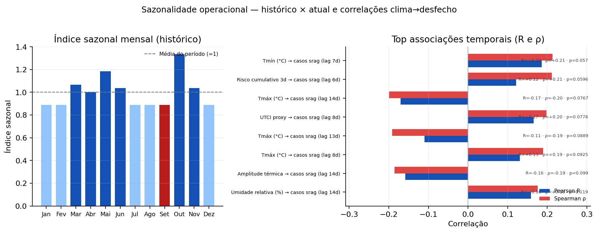

Fonte: ARARAS MT — índice sazonal mensal e lags clima→desfecho (Pearson R e Spearman ρ). Análise ecológica exploratória; não prova causalidade individual. * indica p<0,05 no painel de correlações.

---

## 4. Mato Grosso — Situação atual `OBSERVADO`

Distribuição atual: verde 0; amarela 1; laranja 3; vermelha 24; roxa 114.

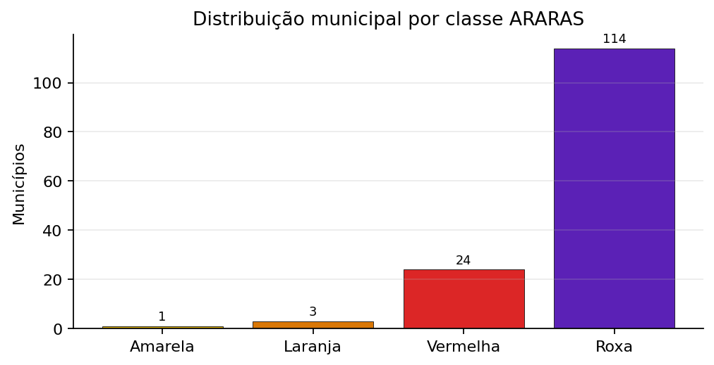

Fonte: ARARAS MT/CIEVS-MT — contagem municipal por classe na rodada.

**Tabela 1 – Indicadores da rodada e municípios em atenção**

| Indicador | Situação da rodada | Municípios em atenção |
| --- | --- | --- |
| Temperatura | mediana 35,6 °C · máximo 39,4 °C | 25 de 142 (17,6%) ≥ 37 °C |
| Umidade | mediana 56% · mínimo 28% | 2 de 142 (1,4%) ≤ 30% |
| PM2,5 | mediana 11,3 µg/m³ · máximo 65,5 µg/m³ | 9 de 142 (6,3%) ≥ 25 µg/m³ |
| *Universal Thermal Climate Index* (UTCI) | mediana 34,5 °C | 129 de 142 (90,8%) ≥ 32 °C |

Fonte: ARARAS MT/CIEVS-MT, rodada de 20/09/2026 às 10h51.

Cobertura dos indicadores: 142 de 142 (100,0%) municípios. Preparação deve seguir o recorte mais exposto, não a mediana.

### RIT multirisco (observado)

**RIT** = Risco Integrado Territorial (0–100): leitura **observada multidomínio** na rodada.  
**Não** substitui a projeção ~7 dias (térmica) nem a classe ARARAS operacional.

| RIT (faixa vermelha e roxa) | Completude mediana | Domínios |
| --- | --- | --- |
| **139 de 142 (97,9%)** | 67% | térmico · ar/PM2,5 · hidro · EHF · pressão (se fresca) · fragilidade de rede |

**Tabela 2 – Municípios com maior RIT (Risco Integrado Territorial)**

| Município | Regional | RIT | Faixa | Domínio dominante |
| --- | --- | --- | --- | --- |
| Acorizal | Baixada Cuiabana | 100 | Roxa | termico |
| Alta Floresta | Alta Floresta | 100 | Roxa | termico |
| Alto Araguaia | Rondonópolis | 100 | Roxa | termico |
| Alto Paraguai | Diamantino | 100 | Roxa | termico |
| Araguaiana | Barra do Garças | 100 | Roxa | termico |
| Apiacás | Alta Floresta | 100 | Roxa | termico |
| Barra do Bugres | Tangará da Serra | 100 | Roxa | termico |
| Aripuanã | Juína | 100 | Roxa | termico |
| Araguainha | Rondonópolis | 100 | Roxa | termico |
| Arenápolis | Tangará da Serra | 100 | Roxa | termico |

Fonte: ARARAS MT/CIEVS-MT — RIT = máximo entre domínios válidos (térmico, ar, hidro, EHF, pressão fresca, fragilidade de rede).

**Tabela 3 – Quem puxa o RIT — domínio dominante**

| Domínio dominante | Municípios | Destes em vermelha e roxa |
| --- | --- | --- |
| Ar/PM2,5 | 0 | — |
| Fragilidade de rede (100−IRM) | 0 | — |
| Térmico | 141 | 138 de 141 (97,9%) |
| EHF | 1 | 1 de 1 (100,0%) |

Fonte: ARARAS MT/CIEVS-MT — domínio dominante = escore máximo entre domínios válidos. Rede = fragilidade (100−IRM); IRM alto não eleva o RIT.

> RIT = observado multidomínio; projeção ~7d = térmica. Composição: máximo entre domínios válidos. Pressão assistencial omitida por defasagem em 142 municípios (limite 14 dias) — não eleva o RIT. IRM mediano (capacidade Cadastro Nacional de Estabelecimentos de Saúde (CNES)): 80 — no RIT entra só a fragilidade (100−IRM).
>
> **Atenção:** «domínio pressão omitido do RIT por defasagem» (142 mun.) **não** é o mesmo indicador que «pressão × resiliência/IRM» (composto de capacidade de rede). Domínio **rede** = fragilidade (100−IRM).

### Capacidade de rede (IRM) e compostos

- **IRM mediano (capacidade CNES):** 80 (alto = melhor rede; no RIT entra só a fragilidade 100−IRM).
- **Gap fumaça × nebulização:** 6 de 142 (4,2%) municípios com sinal de fumaça e nebulizadores = 0.
- **Indicador composto pressão × resiliência/IRM** (distinto do domínio pressão do RIT): 141 de 142 (99,3%) com tensão entre pressão assistencial e faixa do IRM.
- **Domínio pressão omitido do RIT por defasagem:** 142 municípios (não confundir com o composto pressão × resiliência acima).

---

## 5. Mato Grosso — Projeção operacional (~7 dias)

Distribuição projetada: verde 0; amarela 0; laranja 1; vermelha 5; roxa 136.

---

## 6. Mapa atual × mapa ~7 dias

**Mapa 1 – Classificação integrada de risco em Mato Grosso, 20 a 26 de setembro de 2026 (atual e ~7 dias)**

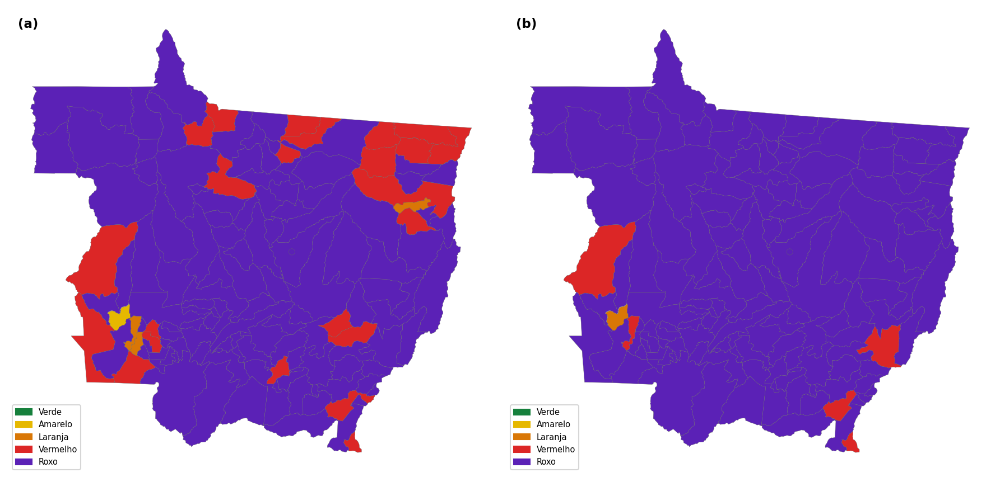

Fonte: ARARAS MT/CIEVS-MT, rodada de 20/09/2026 às 10h51.
Nota: as duas faces usam a mesma escala de classes (verde a roxo) para comparação visual direta.

**Atual.** 138 de 142 (97,2%) vermelho ou roxo.  
**Projeção.** 141 de 142 (99,3%) vermelho ou roxo.  
**Agravamento.** 25 de 142 (17,6%) sobem de classe.

**Mapa 2 – Variação projetada da classificação de risco em aproximadamente sete dias**

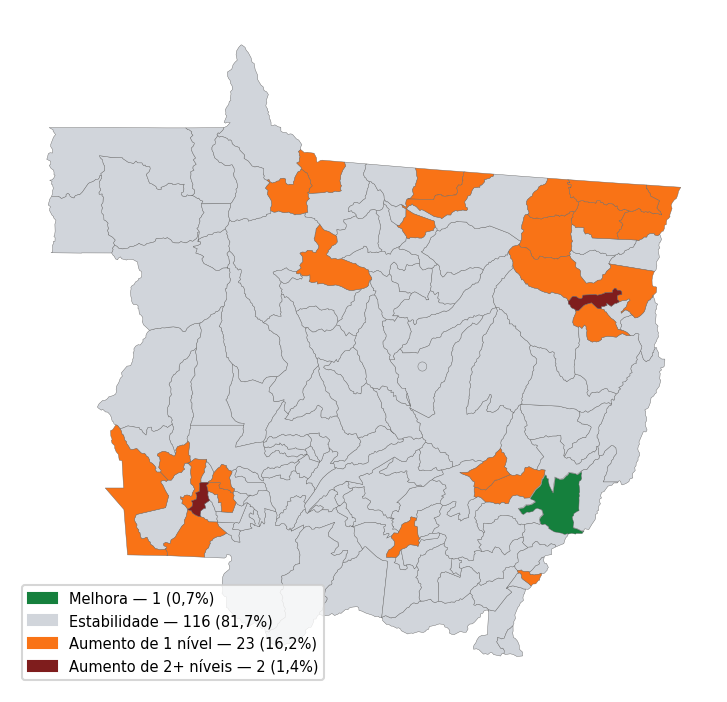

Fonte: ARARAS MT/CIEVS-MT, rodada de 20/09/2026 às 10h51.
Municípios com dados comparáveis: 142 de 142 (100,0%).
- Melhora: 1 de 142 (0,7%)
- Estabilidade: 116 de 142 (81,7%)
- Aumento de 1 nível: 23 de 142 (16,2%)
- Aumento de 2 ou mais níveis: 2 de 142 (1,4%)

### Determinantes do agravamento projetado

A projeção operacional (~7 dias) eleva o território de **138 de 142 (97,2%)** para **141 de 142 (99,3%)** municípios nas classes vermelha ou roxa, com **25 de 142 (17,6%)** municípios comparáveis em elevação de classe. A escalada é puxada pelos **drivers térmicos do modelo** (Tmáx prevista, UTCI, risco cumulativo e onda P95) — sem incorporar EHF, fumaça/PM2,5 ou pressão assistencial. Nowcast ~7d ≠ cenário sazonal ASO/El Niño. **Fonte da predição:** previsão operacional Open-Meteo (grade ~7 dias). **Cobertura de dias futuros:** 100,0% dos municípios. **Mediana estadual de Tmáx máx. 7d:** 36,8 °C.

### A. Drivers que entram no modelo

**Tabela 4 – Determinantes do agravamento projetado em aproximadamente sete dias**

| Driver do modelo | Municípios afetados | Direção |
| --- | --- | --- |
| Tmáx prevista (máx. 7d ≥ 37 °C) | 5 (20,0% dos que agravam) | ↑ aumento |
| UTCI previsto (máx. 7d ≥ 36 °C) | 4 (16,0% dos que agravam) | ↑ aumento |
| Risco térmico cumulativo (máx. 7d ≥ 7 pontos) | 25 (100,0% dos que agravam) | ↑ aumento |
| Onda de calor prevista no horizonte (mediana 2,0 dias) | 20 (80,0% dos que agravam) | ↑ aumento |

Fonte: previsão meteorológica integrada ao ARARAS MT, rodada de 20/09/2026 às 10h51.

**EHF (GeoCalor/Fiocruz) não entra no modelo de classificação projetada** nesta versão; consta só como monitoramento observado (onda EHF ≥ 3 dias), separado da projeção ARARAS ~7d.

### B. Contexto concomitante

Descreve a situação atual dos municípios com mudança de classe (umidade, **PM2,5/fumaça** e focos de calor); **não** constitui contribuição matemática para a projeção nesta versão — são leitura concomitante de exposição, não drivers do modelo.

**Tabela 5 – Contexto ambiental concomitante nos municípios com mudança projetada da classificação**

| Contexto concomitante | Municípios afetados | Leitura |
| --- | --- | --- |
| Umidade relativa ≤ 30% | 0 (0,0% dos que agravam) | Limiar não observado entre os municípios em agravamento nesta rodada. |
| PM2,5 ≥ 25 µg/m³ | 1 (4,0% dos que agravam) | Exposição atual; sem projeção específica de 7 dias |
| Focos de calor (7 dias) | 12 (48,0% dos que agravam) | Detecção atual; sem projeção específica de 7 dias |

Fonte: ARARAS MT/CIEVS-MT, rodada de 20/09/2026 às 10h51.

Nota: Ausência de previsão específica não equivale a estabilidade.

A classe projetada utiliza o maior nível entre intensidade térmica, estresse térmico, persistência e onda de calor, evitando a soma de sinais correlacionados; com freio de escalada sob esfriamento (Δ Tmáx ≤ −2 °C). Classes: 0–24 verde; 25–49 amarela; 50–69 laranja; 70–84 vermelha; 85–100 roxa. Detalhamento dos limiares na seção de notas metodológicas.

**Atual:** verde 0; amarela 1; laranja 3; vermelha 24; roxa 114. `OBSERVADO`

**Projeção ~7 dias:** verde 0; amarela 0; laranja 1; vermelha 5; roxa 136. `PROJEÇÃO ARARAS ~7 DIAS`

**Mudança esperada**
- Aumento de 2+ níveis: 2 municípios
- Aumento de 1 nível: 23 municípios
- Estabilidade: 116 municípios
- Melhora: 1 município

**Legenda:** Verde — situação favorável; monitoramento de rotina. · Amarela — atenção; acompanhar evolução e reforçar comunicação. · Laranja — alerta; preparação proporcional e articulação regional. · Vermelha — alerta elevado; revisar capacidade assistencial e estoques. · Roxa — situação excepcional; mobilização proporcional e validação pela gestão.

---

## 7. Alertas meteorológicos e ambientais — Mato Grosso

Semana **SE 38/2026** (20 a 26 de setembro de 2026). Recorte: **Mato Grosso** (avisos INMET exclusivos de MS excluídos).

**Situação climática de referência (avisos vigentes):** 5 avisos INMET com validade contendo o horário de emissão deste relatório (INMET, 2026).

**Projeção operacional (avisos futuros na semana):** 6 avisos com início posterior à data de referência — leitura de tendência imediata PREVISÃO OFICIAL (INMET, 2026).

**Centro Nacional de Monitoramento e Alertas de Desastres Naturais (CEMADEN):** nenhum alerta aberto em MT na consulta (CEMADEN, 2026).

**Síntese integrada de alertas:** classificação municipal disponível (Secretaria de Estado de Saúde de Mato Grosso (SES-MT); CIEVS-MT, 2026).

### INMET — síntese por fenômeno

**AVISOS VIGENTES NA EMISSÃO**

- **Baixa Umidade** — 2 avisos; severidade Perigo, Perigo potencial; **141** municípios; por regional SES: Rondonópolis (19); Sinop (14); Cáceres (12); Baixada Cuiabana (11); Barra do Garças (10); Pontes e Lacerda (10); +10 regionais. Exemplos: Acorizal, Alta Floresta, Alto Araguaia, Alto Boa Vista, Alto Garças, Alto Paraguai, Alto Taquari, Apiacás ….
- **Tempestade** — 3 avisos; severidade Perigo potencial; **61** municípios; por regional SES: Rondonópolis (17); Cáceres (12); Baixada Cuiabana (9); Tangará da Serra (8); Pontes e Lacerda (7); Barra do Garças (5); +1 regionais. Exemplos: Acorizal, Alto Araguaia, Alto Garças, Alto Paraguai, Alto Taquari, Araguainha, Araputanga, Arenápolis ….
- **Cobertura municipal (união dos avisos acima):** **141** municípios distintos em Mato Grosso.

**AVISOS COM INÍCIO POSTERIOR NA SEMANA**

- **Tempestade** — 6 avisos; severidade Perigo potencial; **116** municípios; por regional SES: Rondonópolis (18); Sinop (14); Cáceres (12); Baixada Cuiabana (11); Pontes e Lacerda (10); Tangará da Serra (10); +8 regionais. Exemplos: Acorizal, Alta Floresta, Alto Araguaia, Alto Garças, Alto Paraguai, Alto Taquari, Apiacás, Araguainha ….
- **Cobertura municipal (união dos avisos acima):** **116** municípios distintos em Mato Grosso.

Consulta: 20/09/2026 às 10h54. Fonte: Alert-AS / INMET (INMET, 2026). Detalhe no painel.

### CEMADEN

_Nenhum alerta aberto do CEMADEN para Mato Grosso nesta consulta._

Fonte: CEMADEN (CEMADEN, 2026). Consulta: 20/09/2026 às 10h54.

### Síntese integrada

- Municípios no recorte: **142**
- Distribuição da classificação ARARAS desta rodada: verde: 0; amarela: 1; laranja: 3; vermelha: 24; roxa: 114

_Fontes: INMET, CEMADEN, solo, hidro e classificação ARARAS (SES-MT; CIEVS-MT, 2026)._

---

## 8. Recursos hídricos / seca / estiagem

- **Limitação dos dados.** A cobertura hidrológica desta rodada corresponde a 10 de 142 (7,0%); os resultados não devem ser extrapolados para todo o estado. No recorte hidrológico disponível, 1 município apresenta sinal de baixa disponibilidade hídrica, 7 apresentam risco elevado de inundação e 2 estão em situação hidrológica habitual. Os sinais de baixa disponibilidade hídrica local **não equivalem** automaticamente à classificação do Monitor de Secas (produto distinto, com outra escala e competência temporal). Índice de saturação do solo: mediana **23/100** (escala normalizada 0–100 a partir de umidade volumétrica Open-Meteo; parâmetro entre ponto de murcha 0,05 e saturação de referência 0,42 m³/m³). **23 pontos** em escala de 0 a 100; sem faixa de interpretação institucional validada nesta rodada.
- Precipitação mediana no dia de referência: **0,2 mm** · sem chuva: 46 de 142 (32,4%).
- Monitor de Secas (jun/2026): MT sem áreas classificadas com seca — produto defasado; cruzar com sinais locais.

---

## 9. Fogo e qualidade do ar

A previsão de risco de fogo para ASO intensifica o alerta alto no Centro-Oeste, especialmente em Mato Grosso, e na maior parte da Região Norte. Para a Amazônia Legal, o análogo Centro Gestor e Operacional do Sistema de Proteção da Amazônia (CENSIPAM) 2023/2024 aponta queimadas intensas em Tocantins, Pará, Maranhão, Mato Grosso e na região AMACRO (Acre, Amazonas e Rondônia).

- Foram registrados 370 focos de calor pelo satélite de referência do Programa Queimadas/INPE (sensor MODIS), utilizado para comparação temporal da série histórica, em 48 de 142 municípios (33,8%) no acumulado de sete dias. O conjunto multi-satélite registrou 28.409 detecções no período; essas detecções não equivalem a 28.409 incêndios ou focos distintos. Luciara concentrou o maior número, com 35 focos no satélite de referência.
- Índice de Qualidade do Ar (IQA): verde: 100; amarela: 33; laranja: 7; vermelha: 2; roxa: 0; cinza: 0
- PM2,5 mediano: **11,3 µg/m³** (mín. 3,4; máx. 65,5 µg/m³). P90 da rodada: 23,0 µg/m³. 9 de 142 (6,3%) apresentaram PM2,5 igual ou superior a 25 µg/m³ (parâmetro operacional de atenção sanitária do painel, alinhado a faixas de qualidade do ar). Cobertura espacial: 142 de 142 (100,0%). Interpretação sanitária: exposição à fumaça/partículas finas, com atenção a agravos respiratórios — associação temporal, sem inferência causal.

Focos + PM2,5 reforçam vigilância respiratória nos prioritários.

---

## 10. Impactos potenciais à saúde

Associação temporal/espacial — **não implica causalidade**.

**Tabela 6 – Impactos potenciais à saúde segundo cenário de exposição**

| Cenário / exposição | Agravos a monitorar | Indicadores | Atendimentos APS |
| --- | --- | --- | --- |
| Seca e estiagem / Baixa disponibilidade hídrica | Desidratação e irritações oculares e respiratórias | UR, Tmáx e atendimentos | Atend. APS 7d **104.845** · 28d **505.037** (APS defasado, ref. 2026-08-07) |
| Incêndios e fumaça / PM2,5 | Agravamento de doenças respiratórias | PM2,5, SRAG e internações | CID resp. 7d **822** · 28d **3.771** · nebulização 7d **0** (APS defasado, ref. 2026-08-07) |
| Calor extremo / Estresse térmico | Desidratação e agravos relacionados ao calor | Tmáx, UTCI e atendimentos | Atend. APS 7d **104.845** · 28d **505.037** (APS defasado, ref. 2026-08-07) |
| Chuva intensa / Inundações | Doença Diarreica Aguda (DDA), leptospirose e traumas | Chuva, alertas e notificações | Atend. APS 7d **104.845** (contexto) (APS defasado, ref. 2026-08-07) |
| Tempestades / Ventos fortes e descargas atmosféricas | Traumas | Avisos do INMET | Atend. APS 7d **104.845** (APS defasado, ref. 2026-08-07) |

Fonte: ARARAS MT/CIEVS-MT, rodada de 20/09/2026 às 10h51.

> **Cenário hidrológico de inundação:** sinal localizado em 7 municípios no recorte hidrológico disponível (cobertura 10 de 142 (7,0%)). Não caracteriza cenário estadual. Se o evento for confirmado, monitorar DDA, leptospirose e traumas.

### Monitoramento epidemiológico — dados observados

- **Respiratórios/fumaça:** 9 de 142 (6,3%) com PM2,5 ≥ 25 µg/m³ em 19/09/2026.
- **Calor/desidratação:** Calor: 25 municípios apresentaram Tmáx ≥ 37 °C; 129 apresentaram UTCI ≥ 32 °C. O indicador combinado de calor seco (Tmáx ≥ 37 °C e UR ≤ 30%) foi observado em 2 de 142 (1,4%).
- **Arboviroses:** 121 casos em 7 dias no recorte com dado (ausência não é zero).
- **Baixa disponibilidade hídrica:** 1 município no recorte hidrológico disponível.
- **Risco elevado de inundação:** 7 municípios no recorte hidrológico disponível.

### Epidemiologia operacional (janela 7 dias)

- **Intoxicação exógena (sinal de fumaça):** 31 notificações; **0** com sinal de fumaça.
- **Internações IndicaSUS (competência 2026-07):** total **11.352** · respiratório/alérgico **11** · desidratação/calor **6**. _Janela de 7 dias sem registros na base; exibido o mês competência disponível._
- **SRAG:** 0 casos na janela · fonte **sivep_local** (preferencial: SIVEP local; DW só se local vazio).
- **Agravos extras clima (SINAN/DW):** indisponível nesta rodada.
- **Malária (SIVEP/DW):** 754 casos em 74 municípios · janela `ano_2017_dw` — base pode estar defasada; não substitui SRAG local.

> **DADO ASSISTENCIAL DEFASADO**  
> Última atualização: **07/08/2026**  
> Não representa a situação corrente da SE em curso.

- **Atenção primária (Centralizador PEC/eSUS):** cadastro **5.402.079** · asma **26.847** · idosos 60+ **727.991** · gestantes **192.553** · **130** municípios classes vermelha e roxa com cadastro.
- Status temporal: **DEFASADO** (última carga **07/08/2026**, atraso **43** dia(s)). Usado só como contexto de vulnerabilidade/cobertura, **não** como pressão assistencial corrente.
- Tabelas detalhadas de atendimento: **anexo técnico / painel**. Ausência de envio = **N/D** (≠ zero clínico).

### Atenção primária (e-SUS APS) — contexto

> **DADO ASSISTENCIAL DEFASADO**  
> Última atualização: **07/08/2026**  
> Não representa a situação corrente da semana epidemiológica em curso (defasagem de **43** dia(s)).

Centralizador e-SUS APS: última carga válida **07/08/2026**, defasagem **43** dias. Dados utilizados apenas como contexto de vulnerabilidade/cobertura, **não** como pressão assistencial atual.

- Cadastro (contexto): asma **26.847** · idosos 60+ **727.991** · gestantes **192.553** · **130** municípios classes vermelha e roxa com cadastro.

Tabelas detalhadas, correlações e top municípios: **anexo técnico / painel**.
Ausência de envio ≠ zero clínico (municípios sem carga na janela: **N/D**).

**Figura 2 – Vulneráveis na APS por classe ARARAS**

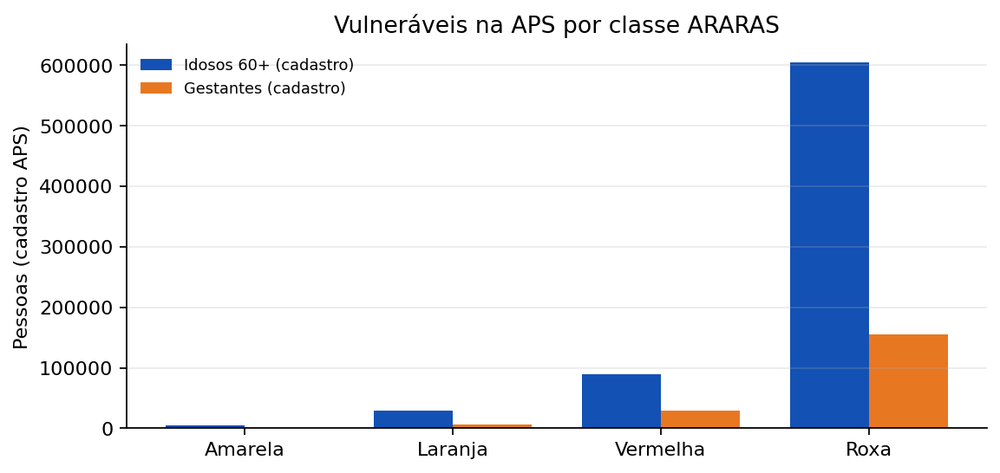

Fonte: e-SUS APS (cadastro) × classe ARARAS da rodada. Status: contexto/DEFASADO se carga atrasada.

### Ondas de calor

Três conceitos distintos: (A) **calor seco combinado** (Tmáx ≥ 37 °C e UR ≤ 30%); (B) **onda de calor EHF observada** (EHF > 0 por ≥ 3 dias); (C) **projeção ARARAS ~7 dias** (componente térmico projetado). **Não substitui** avisos do INMET.

### GeoCalor / EHF

**Método:** GeoCalor / EHF (Fiocruz–LAGAS / Nairn & Fawcett) — evento = ≥ 3 dias consecutivos com EHF > 0; intensidade pela distribuição local dos EHF positivos (EHF85).

- **Janela:** 2026-09-06 a 2026-09-19 · **142** municípios com série EHF.
- **Temporada operacional (série disponível):** 2025-08-21 a 2026-09-25 (mediana de municípios em onda/dia: **0** · P75: **0**).
- **Último dia da série (2026-09-19):** **42** municípios em dia de onda (baixa **38** · severa **4** · extrema **0**).
- **Na janela (série diária):** **48** municípios com ≥ 1 dia de onda.
- **Na janela (eventos reconciliados ≥ 3 dias):** **50** eventos em **48** municípios (baixa **21** · severa **29** · extrema **0**).
- **Cuiabá (EHF):** 0 dia(s) de onda na janela · EHF máx. **-0.77** · pico de intensidade **—** · em onda no último dia da série: **não**.

**Tabela 7 – Eventos com maiores valores máximos de EHF na janela**

| Município | Período | Dias | EHF máx. | Intensidade |
| --- | --- | --- | --- | --- |
| nan | 18/09/2026 a 22/09/2026 | 5 | 5,63 | severa |
| nan | 19/09/2026 a 22/09/2026 | 4 | 4,97 | severa |
| nan | 19/09/2026 a 21/09/2026 | 3 | 4,63 | baixa |
| nan | 19/09/2026 a 22/09/2026 | 4 | 4,43 | severa |
| nan | 19/09/2026 a 23/09/2026 | 5 | 3,83 | severa |
| nan | 19/09/2026 a 22/09/2026 | 4 | 3,66 | severa |
| nan | 18/09/2026 a 22/09/2026 | 5 | 3,59 | severa |
| nan | 18/09/2026 a 23/09/2026 | 6 | 3,28 | severa |

Fonte: cálculo EHF estadual ARARAS (definição GeoCalor / Nairn & Fawcett). Não substitui avisos do INMET.

Nota: A categoria de intensidade é relativa ao limiar local de cada município; valores brutos de EHF não devem ser utilizados isoladamente para ordenar severidade entre municípios. Tabela ordenada pelo EHF máximo bruto.

Nota: Cálculo estadual ARARAS com a mesma definição EHF do GeoCalor. O portal GeoCalor não publica Cuiabá/MT; a série local é derivada da grade municipal. Eventos publicados na janela exigem ≥1 dia de onda na série diária do mesmo período.

**Figura 3 – Municípios em dia de onda (EHF) — canal da temporada operacional e janela do boletim**

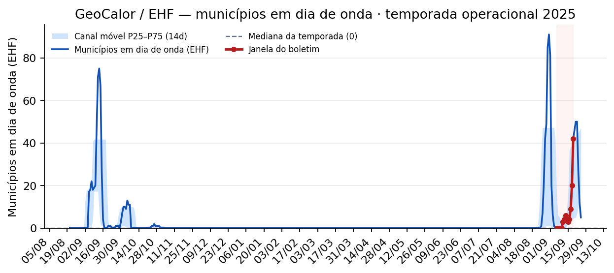

Fonte: cálculo EHF estadual ARARAS (definição GeoCalor / Nairn & Fawcett). Temporada operacional 2025-08-21 a 2026-09-25; janela do boletim destacada 2026-09-06 a 2026-09-19. Canal = P25–P75 móvel de 14 dias sobre a série operacional — não substitui climatologia oficial de longo prazo.

### Operação ARARAS (grade e classes)

- **Picos da janela (2026-09-20 a 2026-09-20):** Tmáx máxima estadual **40,2 °C** · **0 de 142 (0,0%)** ≥ 41 °C · **1 de 142 (0,7%)** ≥ 40 °C · **43 de 142 (30,3%)** ≥ 37 °C.
- **Contexto da grade do dia (rodada):** Tmáx máx. **39,4 °C** em Cocalinho · **25 de 142 (17,6%)** ≥ 37 °C hoje · persistência P95≥2d em **20 de 142 (14,1%)** — distinto do EHF (≥ 3 dias).

**Picos de Tmáx municipal na janela (≥ 40 °C quando houver; senão ≥ 37 °C)**

| Município | Tmáx pico | Data |
| --- | --- | --- |
| Várzea Grande | 40,2 °C | 2026-09-20 |

Fonte: histórico municipal diário ARARAS (grade Open-Meteo). Pico = máxima diária por município na janela.

**Figura 4 – Ranking de picos de Tmáx na janela**

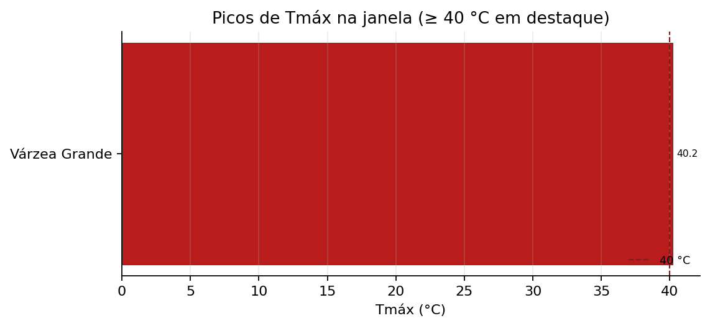

Fonte: ARARAS MT — histórico municipal diário da janela (observado).
- **Cuiabá (grade Open-Meteo):** pico na janela **38,4 °C** em 2026-09-20.
- **classes vermelha e roxa:** **138 de 142 (97,2%)** agora · projeção ~7d **141 de 142 (99,3%)**.

Fonte: ARARAS MT/CIEVS-MT; Open-Meteo Archive (grade). Séries longas (Cuiabá e Tmáx mensal estadual): **anexo técnico**.

### Monitoramento de mortalidade (SIM) — módulo exploratório

Módulo em **validação metodológica**; **não utilizado como gatilho operacional** nesta rodada.

- **Período analisado:** 2024-01–2026-09.
- **Volume estadual consolidado (série):** **15.396** óbitos em grupos de causas **potencialmente sensíveis a extremos térmicos** (capítulos amplos I/J/N/E e calor direto) — leitura ecológica, **sem** estimativa de mortalidade atribuível ao clima.
- Recorte municipal com código IBGE de MT válido: **142** municípios (universo operacional do boletim: 142) · além disso: 1 código(s) de residência desconhecida/agregada.
- Detalhamento de CID, filtros e série completa: **anexo técnico / painel**.

Fonte: SIM/DATASUS via consolidação SES-MT. Associação temporal/espacial ≠ causalidade.

**Leitura epidemiológica**

Associação temporal/espacial ≠ causalidade. Ler sinais com defasagem e cobertura de cada fonte.

---

## 11. Priorização territorial e acesso assistencial

### 11.1 Regionais de Saúde

**Tabela 8 – Regionais de saúde com maior concentração de municípios nas classes vermelha e roxa**

| Regional | Municípios nas classes vermelha e roxa (atual) | Mudança ~7 dias | Tmáx mediana |
| --- | --- | --- | --- |
| Rondonópolis | 19 | ↑ 2 · → 17 | 35,7 °C |
| Sinop | 15 | ↑ 0 · → 15 | 36,2 °C |
| Cáceres | 12 | ↑ 3 · → 9 | 33,7 °C |
| Baixada Cuiabana | 11 | ↑ 0 · → 11 | 36,3 °C |
| Barra do Garças | 10 | ↑ 2 · → 7 · ↓ 1 | 37,3 °C |
| Tangará da Serra | 10 | ↑ 0 · → 10 | 34,5 °C |
| Água Boa | 8 | ↑ 1 · → 7 | 37,5 °C |
| Diamantino | 7 | ↑ 0 · → 7 | 35,7 °C |

Fonte: ARARAS MT/CIEVS-MT, classificação municipal agregada por regional de saúde.

Nota: ↑ indica aumento da classificação; → estabilidade; ↓ redução, considerando todos os municípios da Regional.

**Leitura regional.** A maior concentração nas classes vermelha e roxa está em **Rondonópolis** (19 municípios). O maior número de municípios em aumento de classe na projeção de sete dias concentra-se em **Porto Alegre do Norte** (5 em elevação). A maior mediana regional de Tmáx no recorte é **37,5 °C** (Água Boa).

### 11.2 Índice de prioridade de preparação clima–saúde

Municípios no extremo de atenção. Municípios prioritários para acompanhamento.

**Tabela 9 – Índice de prioridade de preparação clima–saúde (dez municípios)**

| Município | Regional | Atual → ~7 dias | Índice | Faixa | Determinante principal |
| --- | --- | --- | --- | --- | --- |
| São José do Povo | Rondonópolis | Roxa → Roxa | 96,0 | Crítica | exposição ambiental |
| Acorizal | Baixada Cuiabana | Roxa → Roxa | 91,0 | Crítica | exposição ambiental |
| Chapada dos Guimarães | Baixada Cuiabana | Roxa → Roxa | 89,9 | Crítica | pressão assistencial |
| Santo Antônio de Leverger | Baixada Cuiabana | Roxa → Roxa | 85,7 | Crítica | pressão assistencial |
| Barão de Melgaço | Baixada Cuiabana | Roxa → Roxa | 85,2 | Crítica | vulnerabilidade |
| Carlinda | Alta Floresta | Roxa → Roxa | 84,8 | Crítica | pressão assistencial |
| Planalto da Serra | Baixada Cuiabana | Roxa → Roxa | 84,6 | Crítica | prioridade operacional |
| Nova Nazaré | Água Boa | Roxa → Roxa | 83,9 | Crítica | vulnerabilidade |
| Jangada | Baixada Cuiabana | Roxa → Roxa | 83,6 | Crítica | vulnerabilidade |
| Porto Estrela | Tangará da Serra | Roxa → Roxa | 83,5 | Crítica | vulnerabilidade |

Fonte: ARARAS MT/CIEVS-MT, rodada de 20/09/2026 às 10h51.

_O índice combina pressão assistencial, exposição ambiental, vulnerabilidade e prioridade operacional em escala normalizada de 0 a 100. A classe climática atual é contexto territorial e não entra no cálculo. Faixas qualitativas: Acompanhamento (<35); Moderada (35 a <55); Alta (55 a <75); Crítica (≥75). Para os municípios do Top 10, recomenda-se preparação assistencial e intensificação da vigilância, moduladas pelo principal determinante identificado._

---

### 11.2b Ocupação hospitalar (IndicaSUS) × pressão hospitalar (SISREG)

Dois sinais distintos na operação CIEVS:

| Conceito | Fonte | Interpretação |
|---|---|---|
| **Ocupação hospitalar** | IndicaSUS / BdSES (filtros SIEGES) | % de leitos ocupados — só municípios com leitos elegíveis |
| **Pressão hospitalar / regulação** | SISREG | Fila e solicitações — demanda territorial (com ou sem hospital próprio) |

**Rodada atual (ocupação ponderada por leitos)**

- Ocupação estadual: **57,8%** (3424 ocupados / 5920 elegíveis)
- Cobertura: **85** municípios com taxa · **57** sem leitos elegíveis no recorte · 118 unidades
- Pressão SISREG (solicitações no recorte da rodada): **140** municípios · média municipal 5933 · máximo municipal 220602 (métrica de fila/demanda regulada — temporalidade conforme carga da Sala).
- Ocupação calculada segundo filtros assistenciais institucionais do SIEGES/IndicaSUS (detalhamento técnico no painel/anexo).

_Ocupação hospitalar (IndicaSUS, filtros SIEGES) ≠ pressão hospitalar (SISREG). Sem leitos elegíveis no recorte não inventamos %; use SISREG para demanda territorial._

**Ocupação IndicaSUS por regional de saúde**

| Regional | Ocup. ponderada | Leitos ocup./elegíveis | Mun. c/ taxa | Sem leitos | Total mun. |
| --- | --- | --- | --- | --- | --- |
| Baixada Cuiabana | 72,8% | 1519/2086 | 4 | 7 | 11 |
| Sinop | 71,0% | 425/599 | 7 | 8 | 15 |
| Água Boa | 60,4% | 96/159 | 6 | 2 | 8 |
| Tangará da Serra | 57,3% | 169/295 | 7 | 3 | 10 |
| Colíder | 52,5% | 64/122 | 3 | 3 | 6 |
| Rondonópolis | 51,5% | 403/782 | 13 | 6 | 19 |
| Cáceres | 50,4% | 191/379 | 6 | 6 | 12 |
| Juína | 47,0% | 118/251 | 6 | 1 | 7 |
| Peixoto de Azevedo | 44,8% | 78/174 | 4 | 1 | 5 |
| Alta Floresta | 41,2% | 94/228 | 4 | 2 | 6 |
| Porto Alegre do Norte | 38,1% | 37/97 | 3 | 4 | 7 |
| São Félix do Araguaia | 34,2% | 13/38 | 1 | 4 | 5 |
| Juara | 34,1% | 29/85 | 4 | 0 | 4 |
| Barra do Garças | 31,7% | 86/271 | 8 | 2 | 10 |
| Pontes e Lacerda | 30,9% | 64/207 | 5 | 5 | 10 |
| Diamantino | 25,9% | 38/147 | 4 | 3 | 7 |

_Termômetro assistencial: % ponderado por leitos elegíveis (SIEGES). Municípios sem leitos no recorte não entram no denominador do %._

**Municípios com maior ocupação IndicaSUS**

| Município | Ocup. IndicaSUS | SISREG sol. |
| --- | --- | --- |
| Sinop | 85,1% | 107388 |
| Tangará da Serra | 77,1% | 36944 |
| Rondonópolis | 76,9% | 9134 |
| Colíder | 76,2% | 4707 |
| Sorriso | 76,0% | 50179 |
| Aripuanã | 75,8% | 1138 |
| Cuiabá | 73,7% | 220602 |
| Cáceres | 72,4% | 7398 |
| Água Boa | 72,2% | 5562 |
| Primavera do Leste | 69,2% | 18808 |

**Sem leitos elegíveis IndicaSUS — maior pressão SISREG (Sala)**

| Município | Regional | SISREG sol. |
| --- | --- | --- |
| Chapada dos Guimarães | Baixada Cuiabana | 11250 |
| Jangada | Baixada Cuiabana | 1821 |
| Acorizal | Baixada Cuiabana | 1787 |
| Nova Canaã do Norte | Colíder | 1673 |
| Carlinda | Alta Floresta | 1656 |
| Alto Paraguai | Diamantino | 1545 |
| Novo Mundo | Peixoto de Azevedo | 1469 |
| Barão de Melgaço | Baixada Cuiabana | 1279 |
| Denise | Tangará da Serra | 1278 |
| Porto Esperidião | Cáceres | 1221 |

---

### 11.3 Síntese territorial da semana

- Regionais com maior concentração nas classes vermelha e roxa: **Rondonópolis, Sinop, Cáceres, Baixada Cuiabana, Barra do Garças**.
- Maior Tmáx municipal: **Cocalinho** (39,4 °C).
- Maior PM2,5 municipal: **Luciara** — 65,5 µg/m³.
- Maior acumulado no satélite de referência: **Luciara** — 35 focos.
- Persistência: estabilidade de classe em 116 de 142 (81,7%).
- Melhora projetada: 1 de 142 (0,7%).
- Limitação dos dados. Cobertura hidrológica: 10 de 142 (7,0%).

---

### 11.4 Povos indígenas, comunidades quilombolas, idosos, gestantes e acesso assistencial

**Mapa 3 – Classificação de risco climático, aldeias indígenas e municípios com comunidades quilombolas certificadas em Mato Grosso**

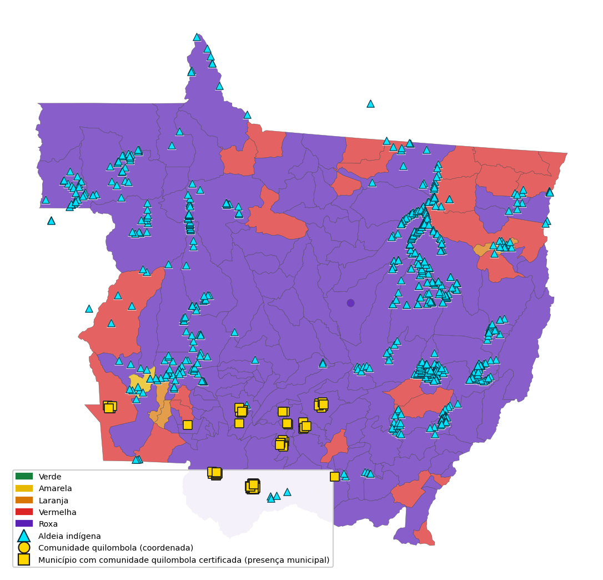

Fonte: ARARAS MT/CIEVS-MT, com dados da Fundação Nacional dos Povos Indígenas (FUNAI) e Fundação Cultural Palmares. Rodada de 20/09/2026 às 10h51.
Nota: Aldeias são representadas por coordenadas georreferenciadas disponíveis. Para comunidades quilombolas sem coordenadas oficiais validadas, a representação indica presença municipal e não localização exata.

**Municípios com aldeias indígenas em classes vermelha ou roxa**

- **Campinápolis** — 75 aldeias — Roxa → Roxa — múltiplas exposições (calor, fogo).
- **Gaúcha do Norte** — 60 aldeias — Roxa → Roxa — múltiplas exposições (calor, fogo).
- **Querência** — 54 aldeias — Roxa → Roxa — fogo.
- **Feliz Natal** — 43 aldeias — Roxa → Roxa — sem exposição específica destacada além do risco integrado.
- **Aripuanã** — 41 aldeias — Roxa → Roxa — fogo.
- **Tangará da Serra** — 37 aldeias — Roxa → Roxa — sem exposição específica destacada além do risco integrado.
- **Brasnorte** — 32 aldeias — Roxa → Roxa — múltiplas exposições (fumaça/PM2,5, fogo).

_Os quantitativos correspondem a aldeias georreferenciadas associadas ao município e não representam estimativa populacional._
A lista completa permanece no painel operacional.

**Comunidades quilombolas certificadas em áreas de risco**

- **Barra do Bugres** — 7 comunidades certificadas em área de risco.
- **Chapada dos Guimarães** — 7 comunidades certificadas em área de risco.
- **Cáceres** — 5 comunidades certificadas em área de risco.
- **Cuiabá** — 4 comunidades certificadas em área de risco.
- **Acorizal** — 2 comunidades certificadas em área de risco.

_Comunidade certificada pela Fundação Cultural Palmares não equivale necessariamente a território delimitado ou titulado._

**Geolocalização, classificação e distância da rede**

O Mapa 3 localiza aldeias (coordenada da aldeia) e municípios com quilombo certificado sobre a classe ARARAS. A tabela de acesso assistencial restringe o recorte a municípios **vermelhos ou roxos** com território longe da Atenção Primária à Saúde (APS) (> 30 km) ou do hospital (> 50 km).

**Tabela 10 – Municípios com maior prioridade combinada de risco e dificuldade de acesso assistencial**

| Município | Classe | Territórios distantes | P90 APS (km) | Máx. APS (km) | Máx. hospital (km) |
| --- | --- | --- | --- | --- | --- |
| Querência | Roxa | 58 | 90 | 96 | 148 |
| Campinápolis | Roxa | 51 | 50 | 54 | 71 |
| Gaúcha do Norte | Roxa | 50 | 94 | 99 | 142 |
| Feliz Natal | Roxa | 44 | 83 | 84 | 144 |
| Aripuanã | Roxa | 38 | 99 | 116 | 234 |
| Tangará da Serra | Roxa | 38 | 77 | 82 | 86 |
| Brasnorte | Roxa | 31 | 54 | 58 | 84 |
| Peixoto de Azevedo | Roxa | 22 | 83 | 128 | 126 |

Fonte: ARARAS MT/CIEVS-MT, com dados do Cadastro Nacional de Estabelecimentos de Saúde (CNES).

Nota: Distância em km até o estabelecimento do CNES com coordenada oficial (trajeto viário quando a rota existe; linha reta se a rota falhar e for validada). Distâncias extremas são submetidas a validação antes de serem utilizadas na priorização. Minutos de viagem não foram validados nesta rodada.

**Leitura combinada.** A tabela do corpo não é o ranking das maiores distâncias. A priorização usa classe atual e projetada, número de territórios distantes, P90 APS e distância hospitalar, somente com rotas já validadas. A lista completa permanece no painel.

9 municípios (rotas validadas) possuem ao menos um território com distância máxima ≥90 km da APS.

**Recomendações desta rodada**
- Secretarias municipais e regionais: articular deslocamento, transporte sanitário e apoio da APS aos territórios listados; não interpretar as classes vermelha e roxa como indicação de proximidade de uma Unidade Básica de Saúde (UBS).
- DSEI/SESAI e SES-MT: priorizar apoio às aldeias em vermelho ou roxo com maior distância até a APS.
- Vigilância em Saúde do Trabalhador: incluir equipes de campo e brigadistas desses municípios no recorte de exposição a calor e fumaça.

### 11.5 Populações prioritárias e Saúde do Trabalhador

**Vulnerabilidade clínica.** Crianças, idosos, gestantes, puérperas e pessoas com doenças crônicas.
- APS: hidratação, sinais de alerta e busca ativa.
- Urgência: fluxos para desidratação, insolação e agravamento respiratório.

**Exposição ocupacional.** Trabalhadores externos, rurais, da construção, saneamento, brigadistas e equipes de campo.
- Centro de Referência em Saúde do Trabalhador (CEREST) e Vigilância em Saúde do Trabalhador (VISAT): orientar setores e monitorar agravos.
- Gestão de pessoas da SES-MT: proteger equipes próprias em campo.

**Vulnerabilidade territorial.** Povos indígenas, comunidades quilombolas e populações do campo, floresta e águas.
- Articular DSEI/SESAI, Secretaria Municipal de Saúde (SMS) e organizações locais.
- Priorizar territórios já classificados em vermelho ou roxo.

**Vulnerabilidade social e institucional.** Pessoas com deficiência, população em situação de rua e pessoas privadas de liberdade.
- Articular assistência social, rede municipal e sistema prisional.
- Manter continuidade do cuidado mesmo sem quantitativo nesta rodada.

**Saúde do Trabalhador e da Trabalhadora**

O Ministério da Saúde reconhece trabalhadores externos urbanos e rurais como particularmente expostos a ondas de calor e eventos climáticos extremos.

> **Limitação:** o boletim ainda não dispõe de estimativa do número de trabalhadores potencialmente expostos.

**Exposições ocupacionais coerentes com o cenário da semana:** calor, radiação solar, fumaça, PM2,5, incêndios e esforço físico ao ar livre. Baixa umidade permanece como risco sazonal a acompanhar.

**Grupos ocupacionais a considerar:** trabalhadores rurais e da construção; serviços urbanos externos; coleta de resíduos e saneamento; transporte e entregadores; agentes comunitários e de endemias; brigadistas, bombeiros e Defesa Civil; equipes de unidades de saúde e ambientais.

**Orientação técnica:** CEREST e VISAT monitoram agravos e orientam setores; Gestão de Pessoas revisa proteção das equipes da SES-MT. Encaminhamento administrativo consta na seção 15.

---

## 12. Orientações operacionais por cenário climático

**CENÁRIO: SECA / ESTIAGEM**
- Situação: 1 município com sinal hidrológico de baixa disponibilidade no recorte disponível.
- Impactos à saúde: Desidratação, irritação ocular/respiratória, agravamento de doenças crônicas em contexto de calor associado.
- Ação municipal: Monitorar notificações de desidratação e arboviroses; acompanhar qualidade da água; reforçar comunicação de risco.
- Ação SES-MT: Consolidar e acompanhar os municípios com sinal de baixa disponibilidade hídrica; apoiar regionais; monitorar disponibilidade estratégica de insumos.

**CENÁRIO: ONDA DE CALOR / CALOR EXTREMO**
- **OBSERVADO — CALOR SECO COMBINADO** — 2 municípios em calor seco combinado (Tmáx ≥ 37 °C e UR ≤ 30%).
- **OBSERVADO — EHF** — EHF observado: 42 municípios em evento/dia de onda (EHF > 0; intensidade relativa ao limiar local).
- **PROJEÇÃO ARARAS ~7 DIAS** — entre os 25 municípios com elevação projetada da classificação, 20 municípios apresentam previsão de componente de onda de calor no horizonte analisado.
- Impactos à saúde: Exaustão pelo calor, desidratação, agravamento cardiovascular e respiratório.
- Ação municipal: Monitorar atendimentos e internações por calor/desidratação.
- Ação SES-MT: Priorizar municípios nas classes vermelha e roxa; apoiar regionais com maior carga térmica.

**CENÁRIO: INCÊNDIOS FLORESTAIS E FUMAÇA / QUALIDADE DO AR**
- Situação: 9 de 142 (6,3%) municípios com PM2,5 ≥ 25 µg/m³.
- Impactos à saúde: Exacerbação de asma, DPOC, SRAG; irritação ocular e respiratória.
- Ação municipal: Monitorar SRAG, internações respiratórias e intoxicação exógena.
- Ação SES-MT: Consolidar municípios com PM2,5 elevado; comunicação de risco estadual.

**CENÁRIO: CHUVA INTENSA / ENXURRADAS / INUNDAÇÕES**
- Situação: foi identificado sinal de risco elevado de inundação em 7 municípios no recorte hidrológico disponível. A cobertura hidrológica corresponde a apenas 10 de 142 (7,0%); portanto, o achado deve ser interpretado como sinal localizado e não permite caracterização do cenário estadual.
- Ação: monitorar o alerta local; articular o município e a Regional de Saúde; se o evento for confirmado, acionar a vigilância de DDA, leptospirose e traumas.

---

## 13. Orientações gerais sobre estoques e insumos

Dados específicos de estoque ainda não validados para esta rodada — as orientações abaixo são de preparação e **não** substituem programação farmacêutica nem prescrição clínica.

Até validação dos dados de estoques estratégicos estaduais, este boletim **não** publica quadro de estoques nem autonomia por item.

Orientações gerais para regionais e municípios sob pressão térmica/fumaça:
- Conferir autonomia de reidratação oral (SRO), soro endovenoso, broncodilatadores e hipoclorito conforme protocolos oficiais (Relação Nacional de Medicamentos Essenciais (RENAME), Protocolos Clínicos e Diretrizes Terapêuticas (PCDT) e notas técnicas do Ministério da Saúde / SES-MT).
- Reportar rupturas e risco de desabastecimento à Regional de Saúde com antecedência.
- Priorizar redistribuição e logística de última milha nos municípios em classes vermelha e roxa.
- **Não substitui** a programação farmacêutica municipal nem a prescrição clínica.

---

## 14. Recomendações oficiais aos estados e municípios `CENÁRIO SAZONAL`

Fonte: Painel El Niño n.º 02 — não são gatilhos automáticos do ARARAS.

- Revisar e atualizar os Planos de Contingência para cenários associados ao El Niño.
- Fortalecer monitoramento, alerta e comunicação de riscos com previsões e avisos oficiais.
- Intensificar a articulação entre Defesa Civil, recursos hídricos, meio ambiente, saúde e assistência.
- Identificar previamente capacidades e recursos, priorizando populações mais vulneráveis.

## 15. Encaminhamentos

Evidência transversal desta rodada: situação atual 138 de 142 (97,2%) nas classes vermelha e roxa; projeção 141 de 142 (99,3%); 25 de 142 (17,6%) em agravamento.

Organizados em três horizontes. Nem todo sinal implica acionamento operacional.

### 24 a 48 horas

**Centro de Informações Estratégicas em Vigilância em Saúde de Mato Grosso (CIEVS-MT)**
- Território: Estado / municípios prioritários
- Ação: Validar a priorização territorial e consolidar o cenário para a Sala de Situação.
- Evidência: Priorização territorial desta rodada.
- Prazo: 24–48 h

**Atenção à Saúde**
- Território: Municípios prioritários
- Ação: Avaliar capacidade assistencial e necessidade de contingenciamento conforme evolução da demanda.
- Evidência: Carga assistencial nos municípios em vermelho e roxo.
- Prazo: 24–48 h

**Assistência Farmacêutica**
- Território: Municípios da base de Assistência Farmacêutica
- Ação: Conferir a autonomia dos itens com cálculo válido e validar a situação no sistema oficial de estoques.
- Evidência: Registros que apresentavam autonomia crítica na última carga disponível, sujeitos à validação no sistema oficial.
- Prazo: 24–48 h

**Comunicação / Vigilância Ambiental**
- Território: Estado
- Ação: Alinhar mensagem de calor e fumaça. Monitorar o alerta hidrológico local; articular município e Regional; se o evento de inundação for confirmado, acionar vigilância de DDA, leptospirose e traumas.
- Evidência: Calor, fumaça e sinal hidrológico localizado no recorte disponível.
- Prazo: 24–48 h

### Até a próxima Sala de Situação

**Vigilância Epidemiológica / Laboratório Central de Saúde Pública de Mato Grosso (LACEN-MT)**
- Território: Regionais de Saúde com maior concentração de municípios em vermelha ou roxa
- Ação: Monitorar SRAG e agravos relacionados ao calor.
- Evidência: SRAG e agravos relacionados ao calor nessas Regionais.
- Prazo: Até a próxima Sala

**Vigilância em Saúde do Trabalhador (VISAT) / Centro de Referência em Saúde do Trabalhador (CEREST) / Gestão de Pessoas**
- Território: Estado
- Ação: Orientar proteção de trabalhadores expostos conforme protocolos vigentes.
- Evidência: Exposição ambiental ocupacional.
- Prazo: Até a próxima Sala

**Gestão Regional / Conselho de Secretarias Municipais de Saúde de Mato Grosso (COSEMS-MT)**
- Território: Municípios estratégicos
- Ação: Articular planos de ação municipais.
- Evidência: Regionais com maior concentração territorial.
- Prazo: Até a próxima Sala

### Próximas semanas

**Vigidesastres / Secretaria de Estado de Meio Ambiente de Mato Grosso (SEMA-MT) / Defesa Civil**
- Território: Estado
- Ação: Manter leitura conjunta clima–desastre–saúde.
- Evidência: Leitura conjunta clima–desastre–saúde.
- Prazo: Próximas semanas

### Articulações intersetoriais recomendadas

- **SEMA-MT** — compartilhar o cenário de qualidade do ar, focos de calor e territórios prioritários para avaliação ambiental integrada (PM2,5 elevado em 9 municípios).
- **Defesa Civil Estadual** — compartilhar municípios classificados em níveis elevados e a projeção para os próximos sete dias.
- **Corpo de Bombeiros Militar** — articular informações sobre incêndios florestais nos territórios prioritários (acumulado de 370 focos no satélite de referência INPE em sete dias; 28.409 detecções multi-satélite).
- **COSEMS-MT / municípios** — pactuar acompanhamento dos planos de ação nos municípios estratégicos.
- **DSEI / SESAI e FUNAI** — articular continuidade do cuidado em territórios indígenas com risco climático elevado.
- **INMET / CEMADEN / INPE / Agência Nacional de Águas e Saneamento Básico (ANA) / Serviço Geológico do Brasil (SGB)** — utilizar apenas produtos oficiais já consultados nesta rodada.

---

## 16. Notas metodológicas e glossário

- **Horizontes:** cenário sazonal (semanas/meses), situação atual (observado), projeção operacional de aproximadamente sete dias (ARARAS).
- **Tratamento de dados ausentes:** valores não disponíveis não são convertidos em zero.
- **Índice de prioridade de preparação:** expressa necessidade de preparação (maior = maior urgência); metodologia resumida abaixo.

**Índice de prioridade de preparação clima–saúde (metodologia resumida)**

- **Componentes:** pressão assistencial, exposição ambiental, vulnerabilidade e prioridade operacional global.
- **Normalização:** cada componente é convertido para escala 0–100 por percentil empírico municipal.
- **Pesos:** prioridade operacional (30%), exposição (25%), pressão assistencial (25%), vulnerabilidade (20%).
- **Índice composto:** média ponderada renormalizada dos componentes disponíveis por município.
- **Faixas:** Acompanhamento (<35); Moderada (35 a <55); Alta (55 a <75); Crítica (≥75).
- **Dados ausentes:** não entram no numerador; pesos são renormalizados entre os componentes válidos.
- **Classe climática ARARAS:** contexto territorial; não entra no cálculo do índice.
- **Medidor de trajetória:** não calculado nesta rodada por insuficiência de série temporal.
- **Série ambiental operacional:** média estadual diária (Open-Meteo / consolidação ARARAS) e qualidade do ar estadual; a comparação usa o **mesmo período do calendário** (mesmos dias MM-DD e/ou o mesmo mês) em anos anteriores da série — não mistura meses diferentes. Não substitui climatologia oficial.
- **Sazonalidade / Odds Ratio:** índice sazonal mensal, OR ecológico 2×2 (exposição climática × desfecho de saúde, limiares por quartil) e lags Spearman 0–14 dias; p<0,05 (Fisher/Spearman) destaca associação no recorte — **não** prova causalidade individual. Detalhe na aba Sazonalidade / OR.
- **GeoCalor / EHF (Fiocruz–LAGAS):** EHIsig = T3d − P95 local; EHIaccl = T3d − T30d; EHF = EHIsig × max(1, EHIaccl); evento ≥ 3 dias consecutivos com EHF > 0; intensidade pela distribuição local dos EHF positivos (EHF85). Cálculo estadual ARARAS para os 142 municípios (o portal GeoCalor não publica Cuiabá/MT).
- **Óbitos SIM sensíveis ao calor/clima:** ver metodologia abaixo e a aba homônima do painel.
- **Figuras e tabelas:** identificação acima e fonte abaixo (NBR 14724 / NBR 10719); referências bibliográficas em NBR 6023.

### Metodologia — mortalidade (SIM) potencialmente sensível a extremos térmicos

**Natureza da análise.** Contagem exploratória de óbitos do Sistema de Informações sobre
Mortalidade (SIM) em grupos de CID-10 amplos, associados na literatura a extremos térmicos.
**Não** constitui estimativa de mortalidade atribuível ao clima nem prova de causalidade
individual.

**Grupos CID (referência operacional)**
- Calor direto: T67, X30
- Desidratação / distúrbio hidroeletrolítico: E86, E87
- Cardiovascular: I00–I99
- Respiratório: J00–J99
- Renal / geniturinário: N00–N99
- Endócrino-metabólico: E10–E14 (quando aplicável)

**Limitações**
- Capítulos I/J/N/E são amplos; o total bruto **não** deve ser lido como óbitos “por calor”.
- Defasagem do SIM é esperada (semanas a meses). Ausência de registro ≠ ausência de óbito.
- Uso na Sala: tendência e vigilância; **não** como gatilho operacional isolado nesta rodada.

### Análise e-SUS APS × clima e classes ARARAS (anexo)

> **DADO ASSISTENCIAL DEFASADO**  
> Última atualização: **07/08/2026**  
> Não representa a situação corrente da semana epidemiológica em curso (defasagem de **43** dia(s)).

Cruzamento ecológico municipal (cadastro/atendimentos da APS com Tmáx, PM2,5 e classe). **Não implica causalidade individual.** Data de referência dos atendimentos: **07/08/2026**.

- **Universo:** 142 municípios · **130** nas classes vermelha e roxa.
- **Cadastro:** asma **26.847** · DPOC **7.375** · idosos 60+ **727.991** · gestantes **192.553** · acamados **17.616**.

**Correlações (Spearman):**
- **Atend. 28d × Tmáx:** não calculada — motivo: erro numérico (No module named 'scipy').
- **CID respiratório 28d × PM2,5:** não calculada — motivo: erro numérico (No module named 'scipy').
- **Idosos 60+ × Tmáx:** não calculada — motivo: erro numérico (No module named 'scipy').

**Top 5 – CID respiratório (28d) na APS**

_Data de referência dos atendimentos: 07/08/2026_

| Município | Classe | CID resp. 28d | PM2,5 | Tmáx (°C) | Atend. 28d |
| --- | --- | --- | --- | --- | --- |
| CUIABÁ | roxa | 551 | 10,4 | 37,0 | 68.748 |
| SINOP | roxa | 286 | 16,2 | 36,0 | 29.899 |
| CÁCERES | roxa | 255 | 11,3 | 35,5 | 14.908 |
| LUCAS DO RIO VERDE | roxa | 191 | 15,5 | 36,8 | 16.525 |
| RONDONÓPOLIS | roxa | 177 | 10,3 | 37,6 | 24.989 |

Fonte: Centralizador PEC/eSUS (agregado municipal) × ARARAS. Ausência de atendimento = **N/D** (não zero clínico).

### Séries climáticas de suporte (anexo técnico)

**Figura 5 – Temperaturas diárias em Cuiabá (1981–2026) — observado**

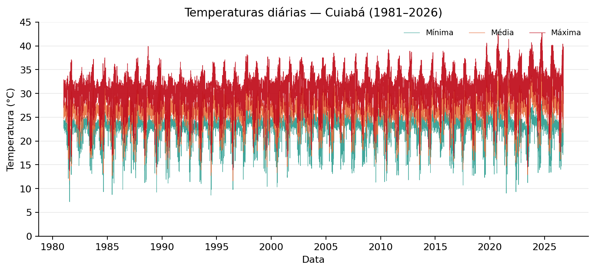

Fonte: Open-Meteo Archive (ponto Cuiabá). Período observado 1981-01-01 a 2026-09-19.

**Figura 6 – Amplitude térmica diária em Cuiabá — observado**

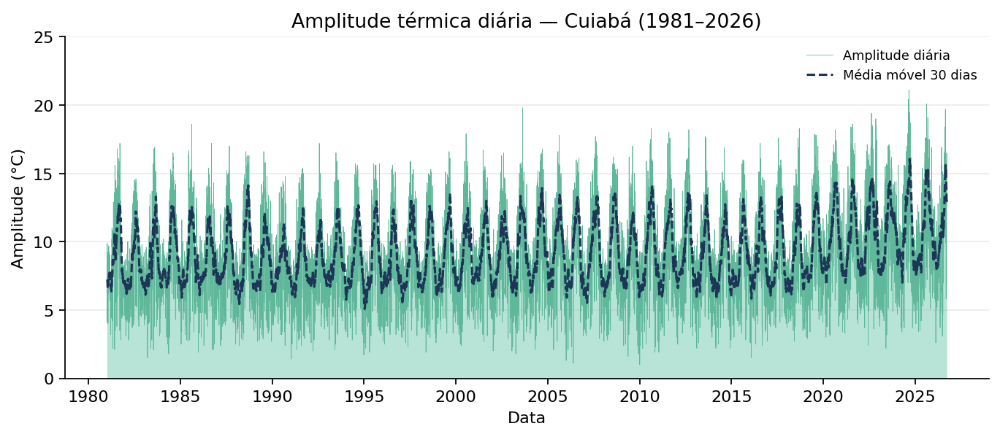

Fonte: Open-Meteo Archive (máxima − mínima diária) com média móvel de 30 dias. Série observada.

**Figura 7 – Série climática operacional estadual (Tmáx mensal, 2021-09-18 a 2026-09-19) — observado**

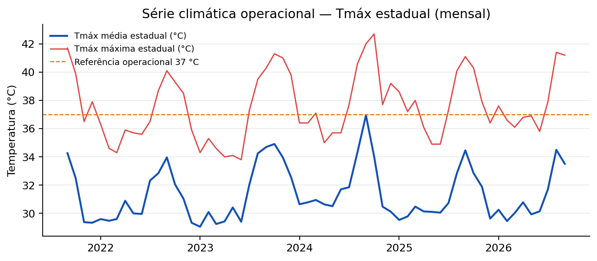

Fonte: grade operacional ARARAS MT. Período observado 2021-09-18 a 2026-09-19.

### Mapa complementar — populações vulneráveis (anexo)

**Mapa 4 – Classificação ARARAS e populações vulneráveis (idosos e gestantes na APS)**

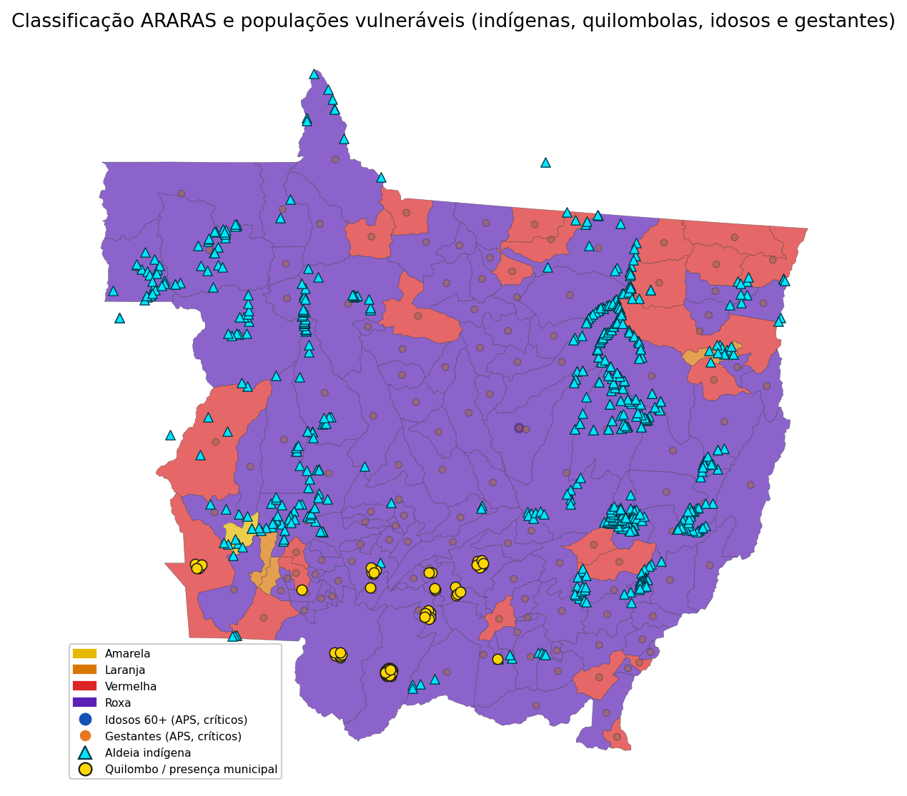

Fonte: ARARAS MT/CIEVS-MT; e-SUS APS. Rodada de 20/09/2026 às 10h51.

### Como a classe projetada é calculada

A projeção operacional de aproximadamente sete dias nesta versão é uma dimensão única de **risco térmico projetado** (0–100), composta por quatro sinais do mesmo fenômeno térmico:

**Tabela 11 – Componentes do risco térmico projetado**

| Componente | Variável | Limiar e pontuação atribuída |
| --- | --- | --- |
| Intensidade | Tmáx máxima prevista na janela | ≥34 °C → 25 pontos; ≥37 °C → 50 pontos; ≥40 °C → 75 pontos; ≥42 °C → 100 pontos |
| Estresse térmico | UTCI máximo previsto | ≥32 °C → 25 pontos; ≥36 °C → 50 pontos; ≥40 °C → 75 pontos; ≥44 °C → 100 pontos |
| Persistência | Risco cumulativo de calor (máx. 7d) | ≥3 pontos → 25 pontos; ≥7 pontos → 50 pontos; ≥12 pontos → 75 pontos; ≥18 pontos → 100 pontos |
| Onda de calor | Dias com onda prevista no horizonte | ≥1 dia → 40 pontos; ≥2 dias → 60 pontos; ≥3 dias → 80 pontos; ≥4 dias → 100 pontos |

Fonte: Elaboração CIEVS-MT/ARARAS MT.

**Composição (anti-redundância):** o risco térmico projetado é o máximo entre intensidade, estresse térmico, persistência e onda de calor — sem soma nem média, para evitar dupla contagem.

**Classes (pelo score):** 0–24 verde; 25–49 amarela; 50–69 laranja; 70–84 vermelha; 85–100 roxa.

**Tendência e freio de escalada:** compara a média de Tmáx dos próximos 3 dias com a dos últimos 3 dias observados. Se a tendência for **esfriamento** (Δ ≤ −2 °C), a classe projetada **não sobe** em relação à classe atual (pode manter ou baixar). O score 0–100 permanece documentado; o freio aplica-se só à classe operacional.

**Fonte:** usa apenas dias futuros da grade Open-Meteo (previsão operacional ~7 dias). Sem previsão futura fresca, a emissão **não** reutiliza os últimos 7 dias observados como se fossem previsão.

**Fora do cálculo da classe nesta versão:** EHF/GeoCalor, fumaça/PM2,5, fogo, hidrologia e pressão assistencial (sem previsão específica no mesmo horizonte); constam como contexto concomitante ou monitoramento observado separado. Para leitura observada multidomínio, ver o **RIT (Risco Integrado Territorial)** — produto paralelo, não substituto desta projeção.

**Distinção:** cenário sazonal ASO/El Niño (previsão oficial) ≠ nowcast operacional ~7 dias (esta regra).

### Como o RIT é calculado

O **RIT (Risco Integrado Territorial)** é um índice **observado** na rodada (0–100), paralelo à projeção térmica ~7 dias.

**Tabela 12 – Componentes do RIT (Risco Integrado Territorial)**

| Domínio | Variável principal | Regra v1 |
| --- | --- | --- |
| Térmico atual | Classe ARARAS / UTCI / Tmáx do dia | Estágio → 0–100 (passo 25) ou limiares UTCI/Tmáx |
| Ar / fumaça | PM2,5 (µg/m³) | ≥25 → 50; ≥50 → 75; ≥75 → 100 |
| Hidrologia | nível alerta hidro / situação | Mapeamento de estágio ou situação seca/cheia |
| EHF observado | ehf_adaptado / EHF | >0 → ≥70; valores altos → 85–100 |
| Pressão assistencial | indice_pressao_saude | 0–100 se carga ≤14 dias; senão omitido |
| Fragilidade de rede | 100 − IRM (CNES) | Capacidade IRM alta → fragilidade baixa; IRM nulo → domínio omitido |

Fonte: Elaboração CIEVS-MT/ARARAS MT. ADR-RIT-multirisco.

**Composição:** máximo entre os domínios válidos (sem soma). Domínios ausentes, pressão defasada (>14 dias) ou IRM nulo (completude < 40% / CNES off) são omitidos e reduzem a completude.

**IRM (capacidade):** `indice_resiliencia_municipal_0_100` é produto próprio da Sala (alto = melhor rede). No RIT entra **só o inverso** (`rit_score_rede`). Alta capacidade **não** eleva o RIT.

**Faixas:** 0–24 verde; 25–49 amarela; 50–69 laranja; 70–84 vermelha; 85–100 roxa.

**Fora do RIT v1 como elevadores:** vulnerabilidade cadastral (idosos, gestantes, asma, povos tradicionais) — narrativa/prioridade apenas. A projeção ~7 dias permanece térmica e **não** usa o RIT.

**Glossário**

**Tabela 13 – Termos utilizados neste boletim**

| Termo | Definição |
| --- | --- |
| Anomalia | Diferença entre o valor observado e a climatologia de referência. |
| Climatologia | Comportamento médio esperado para a região e a época. |
| Odds Ratio (OR) ecológico | Chance relativa do desfecho no grupo de municípios mais expostos vs menos expostos (análise agregada). |
| Índice sazonal | Razão entre a média do mês e a média geral do período (>1 = mês historicamente mais crítico). |
| PM2,5 | Partículas com diâmetro aerodinâmico de até 2,5 µm. |
| Percentil 95 | Valor acima do qual estão cerca de 5% das observações comparáveis. |
| EHF | Excess Heat Factor (Nairn & Fawcett) — índice de onda de calor do GeoCalor/Fiocruz. |
| EHIsig / EHIaccl | Componentes do EHF: significância térmica e aclimatização recente. |
| RIT | Risco Integrado Territorial (0–100): máximo entre domínios observados válidos; paralelo à projeção ~7d. |
| Domínio dominante | Domínio com maior escore no RIT do município. |
| Completude (RIT) | Percentual de domínios com dado válido na rodada. |
| Índice de prioridade de preparação | Score 0–100 (maior = maior urgência de preparação clima–saúde). |
| Índice de prioridade global | Score 0–100 do painel (vigilância, pressão, adaptação, fragilidade, alerta). |

Fonte: Elaboração CIEVS-MT/ARARAS MT.

---

## 17. Conclusão e tendência para a próxima semana

A Semana Epidemiológica mantém cenário de **elevada atenção** em Mato Grosso, com **138 de 142 (97,2%)** municípios nas classes vermelha ou roxa no momento da emissão. O padrão territorial da rodada é marcado por calor e exposição à fumaça/material particulado, em contexto de avisos meteorológicos de baixa umidade emitidos pelo INMET.

Para os próximos sete dias, a projeção indica **agravamento localizado**: **25 de 142 (17,6%)** municípios comparáveis apresentam elevação da classificação, sendo 23 com aumento de um nível e 2 com aumento de dois ou mais níveis. Um município apresenta melhora projetada e 116 permanecem estáveis. Ao final do horizonte projetado, **141 de 142 (99,3%)** estarão nas classes vermelha ou roxa, caso o cenário estimado se confirme. A projeção apresenta elevada concentração nas classes superiores e deve ser reavaliada nas rodadas subsequentes, especialmente diante da ampla influência dos componentes de persistência térmica e onda de calor.

A escalada projetada (~7 dias) é conduzida pelos drivers térmicos do modelo (Tmáx prevista, UTCI, risco cumulativo e onda P95); EHF/GeoCalor permanece monitoramento observado separado. PM2,5/qualidade do ar entra só como **contexto concomitante**. Priorizar povos indígenas, quilombolas, idosos, gestantes e trabalhadores expostos nos municípios vermelhos/roxos.

Alertas oficiais vigentes do Instituto Nacional de Meteorologia (INMET) nesta emissão: 5.

**Tendência: agravamento localizado.**

Limitação: cobertura parcial de hidrologia e defasagem de bases epidemiológicas/assistenciais — não misturar competências sem rotulagem.

Encaminhamento prioritário: validar a lista territorial e os determinantes da projeção na Sala de Situação e articular Assistência Farmacêutica e Vigilância Ambiental nas próximas 24–48 horas.

## REFERÊNCIAS

ASSOCIAÇÃO BRASILEIRA DE NORMAS TÉCNICAS. ABNT NBR 10719: informação e documentação — relatório técnico e/ou científico — apresentação. 2. ed. Rio de Janeiro: ABNT, 2015.
ASSOCIAÇÃO BRASILEIRA DE NORMAS TÉCNICAS. ABNT NBR 14724:2024: informação e documentação — trabalhos acadêmicos — apresentação. Rio de Janeiro: ABNT, 2024.
ASSOCIAÇÃO BRASILEIRA DE NORMAS TÉCNICAS. ABNT NBR 6023:2025: informação e documentação — referências — elaboração. Rio de Janeiro: ABNT, 2025.
CENTRO NACIONAL DE MONITORAMENTO E ALERTAS DE DESASTRES NATURAIS. Painel de alertas. Cachoeira Paulista: CEMADEN, 2026. Disponível em: https://painelalertas.cemaden.gov.br/. Acesso em: 20 set. 2026.
FUNDAÇÃO NACIONAL DOS POVOS INDÍGENAS; FUNDAÇÃO CULTURAL PALMARES; SECRETARIA DE ESTADO DE SAÚDE DE MATO GROSSO. ARARAS MT: base integrada de povos e comunidades tradicionais (aldeias indígenas e comunidades quilombolas certificadas). Cuiabá: SES-MT, 2026. Base de dados institucional.
FUNDAÇÃO OSWALDO CRUZ; SECRETARIA DE ESTADO DE SAÚDE DE MATO GROSSO. Monitoramento de ondas de calor — metodologia GeoCalor / Excess Heat Factor (EHF). Cálculo estadual ARARAS MT. Cuiabá: SES-MT, 2026. Base de dados institucional.
INSTITUTO NACIONAL DE METEOROLOGIA. Avisos meteorológicos — feed RSS Alert-AS. Brasília: INMET, 2026. Disponível em: https://apiprevmet3.inmet.gov.br/avisos/rss. Acesso em: 20 set. 2026.
INSTITUTO NACIONAL DE METEOROLOGIA; INSTITUTO NACIONAL DE PESQUISAS ESPACIAIS; AGÊNCIA NACIONAL DE ÁGUAS E SANEAMENTO BÁSICO; CENTRO NACIONAL DE MONITORAMENTO E ALERTAS DE DESASTRES NATURAIS; SERVIÇO GEOLÓGICO DO BRASIL; SECRETARIA NACIONAL DE PROTEÇÃO E DEFESA CIVIL; CENTRO GESTOR E OPERACIONAL DO SISTEMA DE PROTEÇÃO DA AMAZÔNIA. Painel El Niño 2026–2027: boletim mensal n.º 02 — julho de 2026. Brasília: INMET/INPE, jul. 2026.
INSTITUTO NACIONAL DE PESQUISAS ESPACIAIS. Programa Queimadas / BDQueimadas. Portal de monitoramento de focos de calor. São José dos Campos: INPE, 2026. Disponível em: https://terrabrasilis.dpi.inpe.br/queimadas/portal/. Acesso em: 20 set. 2026.
MATO GROSSO. Secretaria de Estado de Saúde. Portaria n.º 0590/2026/GBSES: dispõe sobre a instituição da Sala de Situação em Saúde para preparação, monitoramento e resposta aos impactos do El Niño 2026-2027 e de eventos climáticos extremos no âmbito da Secretaria de Estado de Saúde de Mato Grosso e define sua composição, governança, competências e produtos. Cuiabá: SES-MT, 2026. Protocolo 1843437.
NATIONAL OCEANIC AND ATMOSPHERIC ADMINISTRATION. Climate Prediction Center. ENSO Diagnostic Discussion. Silver Spring: NOAA, 2026. Disponível em: https://www.cpc.ncep.noaa.gov/products/analysis_monitoring/enso_advisory/ensodisc.shtml. Acesso em: 20 set. 2026.
OPEN-METEO. Weather Forecast API: documentação técnica. 2026. Disponível em: https://open-meteo.com/en/docs. Acesso em: 20 set. 2026.
SECRETARIA DE ESTADO DE SAÚDE DE MATO GROSSO. Assistência Farmacêutica — estoques estratégicos e autonomia de insumos (base operacional ARARAS MT). Cuiabá: SES-MT, 2026. Base de dados institucional.
SECRETARIA DE ESTADO DE SAÚDE DE MATO GROSSO. e-SUS Atenção Primária à Saúde (APS) — centralizador PEC/eSUS. Cuiabá: SES-MT, 2026. Base de dados institucional.
SECRETARIA DE ESTADO DE SAÚDE DE MATO GROSSO. IndicaSUS / SIEGES — ocupação hospitalar e indicadores assistenciais. Cuiabá: SES-MT, 2026. Base de dados institucional.
SECRETARIA DE ESTADO DE SAÚDE DE MATO GROSSO; CENTRO DE INFORMAÇÕES ESTRATÉGICAS EM VIGILÂNCIA EM SAÚDE DE MATO GROSSO. ARARAS MT — Análise, Resposta e Acompanhamento de Riscos, Agravos e Saúde. Cuiabá: SES-MT, 2026. Base de dados institucional.
